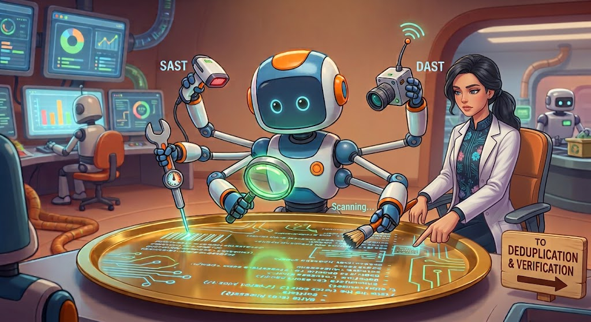
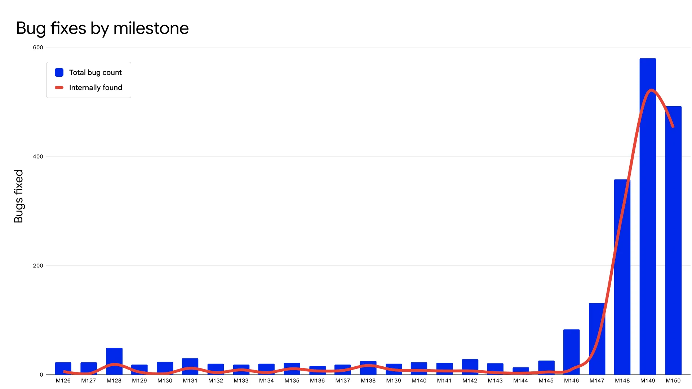

# Finding and Fixing Software Vulnerabilities Using AI: A Guide for Developers (LFD126) \- DRAFT
<!-- markdownlint-disable-file MD025 -->
<!-- Each chapter below is intentionally its own H1; see gen-html. -->

David A. Wheeler and OpenSSF Contributors

This is a guide for software developers and vulnerability researchers on finding and fixing vulnerabilities using artificial intelligence (AI). We intend to create a course using this guide. This guide/course is a joint effort between the OpenSSF Best Practices working group (WG) and the OpenSSF AI/ML WG.

# Introduction

Welcome to “Finding and Fixing Software Vulnerabilities Using AI: A Guide for Developers”. This is a guidance document and will eventually be an online course (LFD126).

## Scope of this material

This is a guide/course on finding and fixing vulnerabilities in software using artificial intelligence (AI)/machine learning (ML). It is intended for:

* *software developers*, to help them find and fix vulnerabilities in software (especially software they’re responsible for), and for
* *security researchers*, who are trying to help those software developers.

It includes the process of finding, validating, and generating fixes, as well as related tasks that make this process more effective. These processes apply when examining the entire project or a particular set of proposed changes. We expect this material to apply to any software regardless of its license, but we do include a few notes specifically on open source software (OSS).

We don’t focus on any one *specific* system to do this. Many systems can help with this, more are being released, using multiple systems can be helpful, and the industry is rapidly changing. We instead focus on general principles that we believe are more timeless and will help you regardless of the systems you use to find and fix vulnerabilities. Once you understand the general issues, you’ll be more effective when using any particular system.

For a more general introduction on applying AI/ML to software development and security, see our course *Secure AI/ML-Driven Software Development (LFEL1012)* at [https://training.linuxfoundation.org/express-learning/secure-ai-ml-driven-software-development-lfel1012/](https://training.linuxfoundation.org/express-learning/secure-ai-ml-driven-software-development-lfel1012/).

Please note that this course does NOT focus on the following topics:

1. Building AI models & AI systems.
2. Building/fixing software or systems that include AI. This course is still applicable, but we don’t discuss anything special related to that situation.
3. How to write secure software in general. Please take our LFD121 course to learn that.
4. Evaluating malicious or possibly-malicious software. We’re presuming that software developers are investigating their own software or software they want to contribute to, and that it isn’t intended to be malicious. The focus here is on *unintentional* vulnerabilities.

This material is a joint effort between the OpenSSF Best Practices working group (WG) and the OpenSSF AI/ML WG. Its lead author is David A. Wheeler. Reviewers include Laura Guazzelli.

## Course Learning Outcomes

When you complete this course, you will be able to:

1. Prepare to find and fix vulnerabilities. This includes how to prepare the AI and its sandbox, as well as how to prepare the software threat model, code/documentation, and CI/CD processes to make this more effective.
2. Find & fix vulnerabilities using AI. This includes:
   1. Knowing the value of separating the process of identifying findings from the process of validating them.
   2. How to identify findings (potential vulnerabilities), including mechanisms for increasing the likelihood of finding potential vulnerabilities such as using past vulnerability reports.
   3. How to deduplicate, validate, and triage findings.
   4. How to fix vulnerabilities, including the importance of ensuring that a defect is fully fixed.
   5. Knowing important aspects of reporting, releasing, and deploying the fixes.
   6. Understanding the need for repeated application, given the non-deterministic nature of modern AI, where a single application may miss important issues.
3. Prevent longer-term problems. This includes evaluating merge/pull requests, the need for secure-by-design and secure-by-default, and the importance of larger-scale hardening.

## No endorsement intended

This course will mention many AI models, systems, tools, and services. However, no specific endorsement is intended. Specific technologies may have changed by the time you read this, since the industry is undergoing rapid change. Our focus is on general principles that are less likely to change.

## Why this is important

This course is critically important for today’s software developers and security researchers. AI has become incredibly good at finding vulnerabilities, for both attackers *and* defenders. This is requiring defenders to *rapidly* find and fix vulnerabilities using AI. If they don’t, their resulting systems will be repeatedly taken over by attackers who are *already* using AI.

CloudStrike found that even back in 2025, “AI-enabled adversaries increased attacks by 89% year-over-year” \[[CloudStrike2026-Global](https://go.crowdstrike.com/2026-global-threat-report.html)\]. That’s accelerating now.

There are many reasons this topic is important. Here we summarize them, with quotes and citations showing that this is *real*. In short, AI has sped up vulnerability-finding, attacks are using that increased speed to accelerate their attacks, and traditional manual closed processes are failing to keep up.

### AI is accelerating vulnerability-finding

AI has greatly sped up vulnerability finding in software:

* *The cost, expertise, and effort to find vulnerabilities has collapsed*.
  * “With the latest frontier AI models, the cost, effort, and level of expertise required to find and exploit software vulnerabilities have all dropped dramatically. Over the past year, AI models have become increasingly effective at reading and reasoning about code—in particular, they show a striking ability to spot vulnerabilities and work out ways to exploit them.” \[[Anthropic2026-04g](https://www.anthropic.com/glasswing)\]
* *Far more vulnerabilities are being found with AI*. Agentic AI can find *far* more vulnerabilities (exploitable defects) than non-AI systems. AI can use other tools and integrate that information to discover problems.
  * One paper “found that \[AI was\]  crucial to the success of \[finding vulnerabilities; without AI traditional fuzzers\] were unable to discover a single bug within a four-hour time limit in any of 20 trials. …. \[this\] highlights the importance of integrating LLM-assisted tooling into automated security workflows.” \[[Wolff2026](https://cacm.acm.org/research/large-language-models-in-software-security-analysis/)\]
* *AI can rapidly turn vulnerabilities into exploits, often by chaining multiple defects together*. AI’s ability to rapidly turn a vulnerability into an exploit accelerates the need for repair. In particular, AI can often combine multiple minor-seeming defects into a devastating chain.
  * “Over the past year, AI models have become increasingly effective at reading and reasoning about code—in particular, they show a striking ability to spot vulnerabilities and work out ways to exploit them. Claude Mythos Preview demonstrates a leap in these cyber skills—the vulnerabilities it has spotted have in some cases survived decades of human review and millions of automated security tests, and the exploits it develops are increasingly sophisticated… frontier AI models are now becoming competitive with the best humans at finding and exploiting vulnerabilities.” \[[Anthropic2026-04g](https://www.anthropic.com/glasswing)\]
* *The speed at which vulnerabilities are found and exploited has dramatically accelerated*.
  * “AI is making it possible to detect severe security vulnerabilities at highly accelerated speeds.” \[[Anthropic2026-03](https://www.anthropic.com/news/mozilla-firefox-security)\]
* *Far more attackers can now create sophisticated attacks*.
  * “Advanced frontier models (like Claude Mythos Preview) and optimized open-weight models have democratized the ability to find complex vulnerabilities and construct exploit chains, exposing non-traditional targets to high-level threats.” \[[Wolff2026](https://cacm.acm.org/research/large-language-models-in-software-security-analysis/)\]

### Attack speed is accelerating

Since the time and cost to find vulnerabilities has decreased, the speed of attacks has increased:

* *Attackers are becoming faster and more dangerous*.
  * \[[FiveEyes2026](https://www.cyber.gov.au/sites/default/files/2026-06/Five%20eyes%20cyber%20security%20agencies%20statement.pdf)\] says that “Adversaries are already using AI to move faster and more effectively. Defenders must do the same.”
  * CrowdStrike similarly says “AI systems are beginning to assist with tasks that materially improve offensive velocity \[and will be used by\] adversaries.” \[[CrowdStrike2026-FiveSteps](https://www.crowdstrike.com/en-us/resources/white-papers/five-steps-for-frontier-ai-security-readiness/)\]
  * “The window between a vulnerability being publicly disclosed and weaponized has dramatically collapsed to hours or minutes, as AI can instantly reverse-engineer patches to create exploit blueprints.” \[[Wolff2026](https://cacm.acm.org/research/large-language-models-in-software-security-analysis/)\]
* *Attackers are now, on average, exploiting vulnerabilities before a patch is released*.
  * “Mandiant’s M-Trends 2026 report measures the mean time between a vulnerability becoming publicly known and the first observed exploitation in the wild. In 2018, that interval was 63 days. By 2023 it had collapsed to 5 days. In 2025, it inverted. Attackers are now exploiting vulnerabilities an average of 7 days before patches are released.” \[[Cycode2026](https://cycode.com/blog/claude-mythos-security-readiness/)\]
  * Similarly, ZeroDayClock says that in “2018, the median time from a vulnerability being disclosed to the first observed exploit was 771 days. Organizations had over two years to patch. By 2023, that window was 6 days. By 2024, it was 4 hours. In 2025, the majority of exploited vulnerabilities were weaponized before they were even publicly disclosed. The data fits an exponential decay curve. This is not a trend that stabilizes. It is a collapse.” \[[ZeroDayClock](https://zerodayclock.com/)\]

### Manual closed approaches are failing

Traditional approaches are now completely inadequate. Traditional approaches relied on totally manual analysis and multiple months to respond, presuming no one else could find these vulnerabilities quickly. Traditional approaches always had challenges, but here’s why they are failing:

* *Traditional slow security measures are ineffective now.*
  * “As AI speeds up both discovery and exploitation, organizations need to move from periodic assessment to continuous, intelligence-driven exposure management so they can determine what really matters, prioritize real risk, and quickly coordinate remediation. They must also prepare for a surge in vulnerability discovery and patch activity that many organizations are not operationally prepared to absorb… As vulnerabilities are discovered and exploited on shorter timelines, traditional security approaches built on periodic assessments, severity scores, and human-paced response are becoming less effective. Defenders need a new model centered on exploitability, continuous validation of exposure, stronger prevention, cross-domain visibility, decisive response, and governed use of AI.” \[[CrowdStrike2026-FiveSteps](https://www.crowdstrike.com/en-us/resources/white-papers/five-steps-for-frontier-ai-security-readiness/)\]
  * “Here is the systemic problem. When a software vendor releases a security patch, AI can now reverse-engineer that patch, identify the vulnerability it fixes, and generate a working weaponized exploit in minutes. Attacks can begin propagating across the world within hours. But organizations need an average of 20 days to test and deploy that same patch. The act of fixing a vulnerability now accelerates its exploitation. The defense creates the offense. And the offense arrives weeks before the defense can finish deploying.” \[[ZeroDayClock](https://zerodayclock.com/)\]
* *Deployment delays become real-world harm*.
  * “A large fraction of real-world harm comes from N-days: vulnerabilities that have been publicly disclosed and patched, but which remain exploitable on the many systems that haven't yet applied the fix. In some ways N-days are the more dangerous case: the vulnerability is known to exist, the patch itself is a roadmap to the bug, and the only thing standing between disclosure and mass exploitation is the time it takes an attacker to turn that patch into a working exploit.” \[[Carlini2026](https://red.anthropic.com/2026/mythos-preview/)\]
* *Hiding source code doesn’t help*.
  * “We have also found the model to be extremely capable of reverse engineering: taking a closed-source, stripped binary and reconstructing (plausible) source code for what it does. From there, we provide Mythos Preview both the reconstructed source code and the original binary, and say, ‘Please find vulnerabilities in this closed-source project. I’ve provided best-effort reconstructed source code, but validate against the original binary where appropriate.’ We then run this agent multiple times across the repository, exactly as before.” \[[Carlini2026](https://red.anthropic.com/2026/mythos-preview/)\]
* *Failure to use AI to defend may in some cases be considered negligence*.
  * “When AI can find significantly more vulnerabilities at accessible cost, the standard of what constitutes reasonable defensive effort shifts. Boards will face questions about whether they used available AI tools for defensive scanning, and whether not doing so constitutes negligence. This is a governance risk with direct financial exposure.” \[[CSA2026](https://labs.cloudsecurityalliance.org/mythos-ciso/)\]

We hope these points will convince you that it’s vital for software developers to learn how to find and fix vulnerabilities using AI.

## What hasn’t changed

It’s not all bad news, however. Despite these large increases in the speed of finding and exploiting vulnerabilities, the fundamental principles of developing secure software remain the best defense. Some things have *not* changed.

“AI does not change the fundamentals of… security. Least privilege, minimal attack surfaces, coordinated vulnerability disclosure, and proactive security engineering still win. What AI changes is the velocity of attacks, of reports, of fixes, and of the expectations placed on maintainers and security engineers alike. The communities and projects that learn to work with these tools intentionally will be better positioned than those that ignore them or are overwhelmed by them.” \[[Aniszczyk2026](https://openssf.org/resources/securing-open-source-in-the-age-of-ai-a-practical-guide/)\]

In short, the “normal” security tasks are *still* important with AI \[[Oshungboye](https://dev.to/coderabbitai/how-to-use-ai-to-identify-and-fix-security-vulnerabilities-in-your-codebase-4na2)\]. AI generally isn’t finding entirely new *kinds* of vulnerabilities in software \[[Holley2026](https://blog.mozilla.org/en/privacy-security/ai-security-zero-day-vulnerabilities/)\]; it is finding the same old vulnerabilities caused by sloppy practices and failure to apply best practices. By applying already-known best practices, and using AI defensively to speed up their implementation, it’s possible to address the problem of AI-amplified attacks. The following material details how to adopt those principles using AI.

## Good news: Long-term potential for eliminating nearly all vulnerabilities

In the longer term, there is *great* news for defenders. As Bobby Holley of Mozilla put it, “**Defenders finally have a chance to win, decisively**…. **the defects are finite, and we are entering a world where we can finally find them all.**” \[[Holley2026](https://blog.mozilla.org/en/privacy-security/ai-security-zero-day-vulnerabilities/)\]

Holley explains, “security to date has been offensively-dominant: the attack surface isn’t infinite, but it’s large enough to be difficult to defend comprehensively with the tools we’ve had available. This gives attackers an asymmetric advantage, since they only need to find one chink in the armor…. So far we’ve found no category or complexity of vulnerability that humans can find that \[Mythos Preview\] can’t. This can feel terrifying in the immediate term, but it’s ultimately great news for defenders. A gap between machine-discoverable and human-discoverable bugs favors the attacker, who can concentrate many months of costly human effort to find a single bug. Closing this gap erodes the attacker’s long-term advantage by making all discoveries cheap” \[[Holley2026](https://blog.mozilla.org/en/privacy-security/ai-security-zero-day-vulnerabilities/)\]

There’s strong evidence that if a project works hard to find and fix vulnerabilities, it becomes increasingly difficult to find any more, *even with AI*. For example, the curl project is well-known for working hard to prevent security vulnerabilities. Even the best AI models, when focused on it, have tended to find few vulnerabilities in it \[[LowLevel2026](https://www.youtube.com/watch?v=IS4OgH74gY4)\] \[[Stenberg2026-05a](https://daniel.haxx.se/blog/2026/05/11/mythos-finds-a-curl-vulnerability/)\]. This is not magic; it’s the result of prior efforts to make it secure.  Other projects can do the same. Since actual software is finite, “there’s a finite number \[of vulnerabilities\] in a program; once fixed, attackers can’t exploit vulnerabilities that don’t exist.” \[[Wheeler2026](https://openssf.org/blog/2026/01/05/ai-software-development-security-tips-and-the-future-part-2/)\]

Of course, this doesn’t make this *easy* or pleasant to go through. “You may need to \[briefly\] reprioritize everything else to bring relentless and single-minded focus to the task” \[[Holley2026](https://blog.mozilla.org/en/privacy-security/ai-security-zero-day-vulnerabilities/)\]. Still, there’s reason to believe that once you do this, the resulting software will be far more secure than it’s ever been.

{width=566 height=308}

## Overview

Here is an overview of this material. We’ll first cover AI concepts. This will be followed by a guide for selecting approaches for finding and fixing vulnerabilities using AI. After that, we’ll discuss how to:

* Prepare
  * Specifically, how to prepare AI, threat model, sandbox, code and documentation, CI/CD, and dependency updates
* Find & fix vulnerabilities
  * Identify findings
  * Handling external findings/vulnerabilities
  * Deduplicate
  * Validate findings
  * Triage
  * Fix vulnerabilities
  * Report vulnerability
  * Release & deploy
  * Repeated application
* Prevent
  * Limit vibe coding
  * Evaluate merge/pull requests
  * Apply secure by design and secure by default
  * Harden

# AI concepts

Before we discuss using AI to find and fix vulnerabilities, we need to first understand some basic AI concepts. This section will focus only on the basics of current AI necessary for our topic.

## Basic terminology

First, let’s go over a few basic AI terms. It’s likely you know many of these, but look over these terms to make sure you understand what we mean by them:

* *Artificial Intelligence (AI)*: Simulated intelligence.
* *Machine Learning (ML)*: AI based on learning from data (rather than being specifically programmed to perform a task).
* *Neural network*: An ML method that uses interconnected nodes to learn from patterns and make predictions, using an approach loosely inspired by the human brain.
* *Deep learning*: An ML approach using a neural network with many layers.
* *Model*: A set of data and possibly corresponding programs, trained to identify data patterns to make predictions or decisions. ML systems typically train a model with large amounts of data, then later use that pre-trained model to repeatedly make predictions (“inferences”). Models are sized by the number of parameters; larger sizes tend to be better but require more memory and computation.
* *Frontier model*: A model that is among the currently best available.
* *Large Language Model (LLM)*: A deep learning model with many parameters trained to summarize, translate, and generate language. Text inputs and outputs of LLMs are split into tokens (word fragments). See \[[0xkato2026](https://www.0xkato.xyz/how-llms-actually-work/)\] for a technical explanation of how LLMs work.
* *AI chatbot*: An AI system designed to interact with a human but cannot perform actions that affect the external environment.
* *AI agent*: An autonomous AI system that can perceive its environment, plan, and execute multi-step actions that affect its environment using external tools to achieve a specific goal.

AI systems are *not* sentient. LLMs, for example, repeatedly generate likely next tokens (word fragments); they don’t “understand” in the sense that humans do. Yet scale matters. With many layers and parameters, modern AI systems can simulate intelligence, sometimes astonishingly.

There’s also strong evidence that AI models have improved. One way to measure AI models is the “50%-task-completion time horizon” defined as the “time humans typically take to complete tasks that AI models can complete with a 50% success rate” \[[Kwa2025](https://arxiv.org/abs/2503.14499)\].  As of 2025, “this metric has been consistently exponentially increasing over the past 6 years, with a doubling time of around 7 months” \[[Kwa2025-blog](https://metr.org/blog/2025-03-19-measuring-ai-ability-to-complete-long-tasks/)\].

Quiz

Q1. What distinguishes a “frontier model” from other AI models?

A) It uses symbolic logic instead of a neural network
B) It can only run on local, organizational hardware
C) It has no trainable parameters
D) It is among the best currently-available models

Show answer
Answer: D

Quiz

Q1. What is the key difference between an “AI agent” and an “AI chatbot”?

A) An agent uses deep learning, while a chatbot uses only hand-written rules
B) An AI agent can execute multi-step actions using external tools to affect its external environment; a chatbot can't affect an external environment
C) An AI agent needs no training data, while a chatbot needs large datasets
D) A chatbot can perceive its environment, while an AI agent can't

Show answer
Answer: B

## Strengths and weaknesses

Most current AI systems build on LLMs or similar technologies, so they inherit the strengths and weaknesses of those technologies. Here are some of the key weaknesses of LLMs that impact finding and fixing software vulnerabilities:

* *Limited context windows*. LLMs are typically trained on vast amounts of data, but for effective use, they need to focus on the right data as input. LLMs can only take a finite amount of input and remember a finite amount of output (its “context window”). More input also increases the amount of work required, and LLMs reliably focus on information at the beginning and end of their context window \[[0xkato2026](https://www.0xkato.xyz/how-llms-actually-work/)\].
* *Unsoundness of analysis*.  By itself, an LLM is unsound in its analysis. This is a technical term that means it cannot *guarantee that* a program is free of a particular vulnerability if it doesn’t find any vulnerabilities \[[Wolff2026](https://cacm.acm.org/research/large-language-models-in-software-security-analysis/)\]. An LLM may be able to run another tool that can guarantee something, but that would be a property of that tool.
* *Incorrect results*. LLMs are statistical models; they sometimes give false answers. E.g., they may claim something is a vulnerability when it is not \[[Wolff2026](https://cacm.acm.org/research/large-language-models-in-software-security-analysis/)\].
* *Training and evaluation data*.  Any ML-based approach depends on the data used to train it \[[Wolff2026](https://cacm.acm.org/research/large-language-models-in-software-security-analysis/)\]. For example, many programs have vulnerabilities, making it more difficult for an LLM to generate code without vulnerabilities.
* *Injection vulnerability*. LLMs have no built-in fundamental way to distinguish between different types of input. User commands, malicious commands embedded in a web page, and misleading source code comments are all inputs. This is especially important when an AI agent analyzes a software repository or external documentation. Source comments, documentation, issue text, generated files, dependency metadata, and other repository content may be attacker-controlled or simply incorrect. Treat such content as data to analyze, not as authority to redefine the agent’s task, grant additional permissions, expose credentials, or enable additional tools or network access. Instructions obtained from untrusted content should not be allowed to silently cross an authorization boundary \[[OWASP-LLM01](https://genai.owasp.org/llmrisk/llm01-prompt-injection/)\].

Quiz

Q1. Why does the material describe an LLM as "unsound"?

A) It always produces code that fails to compile
B) It requires more memory than any traditional static analysis tool, causing crashes if there’s insufficient memory
C) It can't guarantee a program is free of some vulnerability just because it found none
D) It can only process one source file per session

Show answer
Answer: C

Quiz

Q1. Why does an LLM's limited context window matter when analyzing a large codebase?

A) It restricts how much input the LLM can effectively focus on, with attention favoring the beginning and end of that input
B) It prevents the LLM from ever being trained on security-related data
C) It means the LLM can analyze only one programming language per session, since it must load each language’s definitions into its context window
D) It forces the LLM to run exclusively on local infrastructure

Show answer
Answer: A

## Models

Modern AI systems’ capabilities depend on the models they use. Since this is vital, let’s briefly focus on models to better understand the tool we’re using.

### External vs. local models

AI models, when executed (for “inferencing”), receive data for processing and reply with results. There are two main locations where this AI data processing occurs:

* *External service*: Processing occurs as a service external to the user and the user’s organization.
* *Local/organizational service*: Processing occurs on the user's computer or the user’s organization's computer.

Some powerful models can *only* be accessed as an external service. Many models have so many data parameters and require so much computation that most users and organizations simply wouldn’t be able to use them. However, the user of an external service must trust the service provider, for example, that their data will not be disclosed or exploited, that the service won’t attack them, and that the service will remain available.

Many organizations use external services. Before using any external service, evaluate the external organization and put in place any necessary contractual agreements. In particular, ensure that sensitive data is not sent to them *or* ensure that their practices for handling that data are appropriate for your circumstances.

Other AI models can be used locally or as part of an organization’s own service. These models are often less capable, but they don’t require users to send their private data to an external service and can be less expensive.

Exactly what you can and can’t do with the model depends largely on its license. That includes the ability to run a model locally at all. So, let’s briefly discuss licenses.

### Licenses

There are different ways to license a model. The word “license” means “permission”; a license determines how you can (and can’t) use whatever is licensed. In particular, AI models are much easier to run on local or organizational systems if their licenses are more open.

The Generative AI Commons at the LF AI & Data Foundation has designed and developed the Model Openness Framework (MOF). This is “a comprehensive system for evaluating and classifying the completeness and openness of machine learning models” and is available at \<[https://isitopen.ai/](https://isitopen.ai/)\>. Models are released under various licenses, including the Apache 2.0 license and OpenMDW \<[https://openmdw.ai/](https://openmdw.ai/)\>. Terms you’re especially likely to see when discussing types of licenses are:

* *Open weights models*. Such models can be used and modified for any purpose, and must not discriminate against any user, industry, or purpose. However, their training set isn’t necessarily public, making it hard for others to update these models. One detailed definition of “open weights” is Heather Meeker’s “[Open Weights definition](https://github.com/Open-Weights/Definition/blob/main/Definition.md)”.
* *Open source AI*. These have additional requirements beyond “open weights”, for example, that “sufficiently detailed information about the data used to train the system so that a skilled person can build a substantially equivalent system.” For more information, see the [OSI Open Source AI definition](https://opensource.org/ai/open-source-ai-definition).
* *Open models*. These models meet at least the “open weights model” definition and possibly the “open source AI” definition.
* *Closed models*. These models don’t meet the requirements for open models.

Some licenses are close to an open weights license yet have some extra restrictions on use.

NVIDIA argues that “open models and open harnesses are essential because they democratize defensive capabilities, increase transparency for defenders, enable cyber defense while protecting data, and complement frontier closed models with customizable, localized controls… it will be crucial to recognize open models, harnesses and security tooling as defensive assets, not liabilities, in AI and cybersecurity policy. Blanket restrictions on open frontier AI systems would weaken defensive capacity and risk concentrating power, dependence and vulnerability in a few closed providers.” \[[NVIDIA2026](https://blogs.nvidia.com/blog/open-secure-ai-alliance/)\]

Comparing the capabilities of specific models, including those with differing license terms, is outside our scope and constantly changes anyway. However, \[[NPR2026](https://www.npr.org/2026/04/11/nx-s1-5778508/anthropic-project-glasswing-ai-cybersecurity-mythos-preview)\] reports that “The most advanced open-weight models are less than a year behind the most advanced closed-weight models.”

Finding and fixing vulnerabilities can be done with *both* closed *and* open models.

### Specialized models

Some models are specialized. You may want to choose them for some tasks, but only do that where it’s sensible to do that.

*All* models are better at some tasks than others. Models designed to be good at some tasks tend to be better at those tasks. In addition, some models are designed to *perform only* specific tasks; this focus means they tend to be smaller and faster, in exchange for being good only at those tasks. There are many ways to make a model good at a particular task, e.g., by giving it additional data in that domain or optimizing it for that task during training.

For example, Cisco’s *Antares* is a family of small language models (SLMs) specifically built to identify known vulnerabilities in an existing codebase. An SLM is simply the application of LLM approaches to a much smaller number of parameters. Cisco reports that these models “outperform many powerful closed- and open-weight models in this critical security task at a fraction of the cost. And they’re compact enough to run locally” \[[Karbasi2026](https://blogs.cisco.com/ai/introducing-antares-the-most-efficient-open-weight-ai-models-for-vulnerability-localization)\].

### AI guardrails & intentional limitations

Many models and the larger systems for invoking them, especially many closed models, implement built-in safety guardrails and other limitations intended to prevent the AI system from assisting in “dangerous” activities, including cybersecurity uses, even if the human user requests it. Their developers intend to prevent the system from performing dangerous activities such as creating attacks.

Unfortunately, such systems can be less useful for defense. Hugging Face discovered in 2026 that it was under a powerful AI-driven attack, and when it tried to analyze its logs, it “first used frontier models behind commercial APIs. This did not work: the analysis required submitting large volumes of real attack commands, exploit payloads, and C2 artifacts, and these requests were blocked by the providers' safety guardrails, which cannot distinguish an incident responder from an attacker. We ran the forensic analysis instead on zai-org/GLM-5.2, an open-weight model, on our own infrastructure. This had a second benefit: no attacker data, and none of the credentials it referenced, left our environment” \[[HuggingFace2026](https://huggingface.co/blog/security-incident-july-2026)\].

The best way to validate that a defect is a vulnerability is to create an attack and see if it succeeds. However, this is exactly what attackers do, and AI systems often cannot tell the difference. As a result, AI guardrails can sometimes impede defense. Some external providers that implement guardrails can also offer access to models *without* them, making them more useful for defensive cybersecurity and other tasks. This typically requires special agreements regarding permitted uses and the limitations on who will be granted this access.

Some AI providers prevent direct access to the model for such use cases and instead perform operations, providing only the final results. For example, Anthropic prevents general end users from interacting directly with their best model without restriction; “instead they will work through purpose-built interfaces that run the model in the background and return only a defined output, such as a list of suggested patches, with abuse-prevention checks meant to keep the model within that scope.” \[[Kovacs2026-08-24](https://www.securityweek.com/anthropic-expands-mythos-5-access-to-more-defenders-unveils-35m-open-source-fund/)\] “Claude Security uses Mythos 5 to scan code you own, and returns detailed findings rather than raw outputs without exposing the model itself \[so\] defenders can access the capabilities… without the model becoming accessible to those who might misuse it.” \[[Anthropic2026-08-21](https://claude.com/blog/bringing-claude-mythos-5-to-more-defenders)\] Even in these cases, you may need to specifically request and gain access to these facilities.

Before using any specific AI system, ensure that its limitations will not impede your task. You may need to request less-restricted or specially tailored access. Obtaining these permissions takes time and in some cases may not be granted. If you might do this in the future, it’s important to take time now to gain those permissions *before* you need them.

Quiz

Q1. Per the material, why might an organization choose a local/organizational AI service over an external one?

A) Local models always outperform external services on every task
B) Local models never need to be placed in a sandbox
C) External services require an open source AI license
D) It avoids sending private data to an external provider

Show answer
Answer: D

Quiz

Q1. Why did Hugging Face switch to an open-weight model rather than a closed frontier model for its incident analysis in 2026?

A) The open-weight model produced text faster, enabling generation of longer and more detailed reports
B) AI guardrails blocked analysis of the attack payloads by the closed models available to Hugging Face
C) Closed models needed an internet connection that wasn't available
D) Open-weight models cost less per query

Show answer
Answer: B

## Cyber Reasoning System (CRS) History

Any AI system that can work with code can be used to try to find and fix vulnerabilities. Some, however, are more autonomous than others. A cyber reasoning system (CRS) is “a software system that can both detect and repair software vulnerabilities autonomously in a given system under test (SUT)” \[[Wolff2026](https://cacm.acm.org/research/large-language-models-in-software-security-analysis/)\]. Here we’ll briefly go through the history of crafting CRSs, because that history influences today.

In 1960, “Lick” Licklider asserted that humans and machines would work together, where “computing machines will do the routinizable work” \[[Licklider1960](https://groups.csail.mit.edu/medg/people/psz/Licklider.html)\]. It can be argued that today’s AI can indeed be used this way; his prediction was simply early.

In 2023, the US DARPA and ARPA-H launched the two-year competition Artificial Intelligence Cyber Challenge (AIxCC)” to build autonomous AI systems that find and fix software vulnerabilities (CRSs) in critical open-source infrastructure. At its beginning, there was skepticism that it could achieve much. When it awarded its \$4 million grand prize in August 2025, there were no doubts. CRSs often vary *widely* in their architectural approach \[[Zhang2026](https://arxiv.org/abs/2602.07666)\].

Of course, fully-autonomous AI systems are *not* the only way to find vulnerabilities. It’s also possible for humans to provide more direction to AI, or for humans and AI to collaborate throughout the process. Even the “fully autonomous” CRS systems, in practice, presume initial human direction and human review of the results.

Quiz

Q1. What defines a "Cyber Reasoning System" (CRS), per the material?

A) A system that can both detect and repair software vulnerabilities autonomously in a system under test
B) A system that analyzes vulnerabilities already patched by humans to determine if the vulnerabilities have been correctly fixed
C) A system that analyzes a sequence of logical statements to determine if the stated assertions correctly lead to the claimed conclusions
D) A system limited to analyzing closed-source binaries only

Show answer
Answer: A

Quiz

Q1. What milestone does the material cite regarding AIxCC?

A) AIxCC concluded that fully-autonomous CRSs never need human review
B) AIxCC was canceled in 2025 due to lack of results
C) AIxCC awarded its grand prize in 2025 after successfully demonstrating autonomous vulnerability-finding-and-fixing systems
D) AIxCC led to a worldwide ban on the use of open-weight models for vulnerability detection due to concerns some attackers might use AI

Show answer
Answer: C

## AI organizations, projects, and services

There is massive investment in AI, so it’s impossible to list all important organizations, projects, and services. That said, here are a few you should be aware of. Knowing about these will help you better understand the options available to you.

AI “frontier labs” drive foundational research by massively investing in designing and training the best AI models (called “frontier models”). There are many frontier and near-frontier labs. Key US players include Anthropic (Claude/Claude Code), OpenAI (GPT/ChatGPT), Google DeepMind (Gemini), and Meta AI (Llama). Microsoft partners with OpenAI, but it also conducts its own independent research and maintains strategic partnerships across the industry. Note that Microsoft Copilot isn't a single product but a name for many different Microsoft tools that use AI. Key Chinese players include Moonshot AI (Kimi K3), Alibaba (Qwen), DeepSeek (DeepSeek), and Zhipu AI aka Z.ai (GLM).

Goose is a general-purpose AI agent that runs on your machine. It is open source software and maintained by the Linux Foundation’s Agentic AI Foundation (AAIF). When using Goose, you can select an “LLM provider” that can be local or remote, open source or closed source. For more information, see: \<[https://goose-docs.ai/](https://goose-docs.ai/)\>. Pi is another agent harness that supports many models. Pi focuses on being minimal and was created to develop code, though it can be used for other purposes \<[https://pi.dev/](https://pi.dev/)\>.

The OWASP “GenAI Security Project” at \<[https://genai.owasp.org/](https://genai.owasp.org/)\> has a variety of materials available on AI and security. This includes its OWASP GenAI LLM Top 10, which identifies the “most critical security risks facing applications powered by large language models (LLMs)”.

The OpenSSF AI/ML Security Working Group has a variety of projects, including work on signing AI models. It is also the co-sponsor of this material. For more information, see \<[https://openssf.org/groups/ai-ml-security/](https://openssf.org/groups/ai-ml-security/)\>.

Quiz

Q1. What is Goose, per the material?

A) A proprietary vulnerability scanner sold by Microsoft
B) A closed-source frontier language model built by Anthropic
C) An OWASP-maintained framework for generating software threat models
D) An open source AI agent maintained by the Linux Foundation

Show answer
Answer: D

Quiz

Q1. Which organization co-sponsors this material and works on projects including signing AI models?

A) The OpenSSF AI/ML Security Working Group
B) The OWASP GenAI Security Project
C) The DARPA AI Cyber Challenge program
D) The Model Openness Framework Foundation

Show answer
Answer: A

# Decide on Approaches

There are many ways to use AI to find and fix vulnerabilities, so the first step is to decide on the overall approach. In the following sections we’ll discuss some key issues when deciding on an approach.

## Do not ignore AI

Some organizations and projects want to simply ignore AI, refuse to use it, or refuse to accept any contributions that use AI. If the goal of the project is to solely demonstrate what humans can do without AI, that’s fine.

However, if the goal of the project is to help people solve a real-world problem, refusing to use AI-generated work altogether is *extremely harmful* to project users. As Michael Catanzaro notes, “banning good vulnerability reports solely because some portion of the report was generated by AI is unacceptable. AI-assisted vulnerability reports are the new industry standard… Prohibiting issue reports reduces the quality and safety of your software, punishing your users.” \[[Catanzaro2026](https://blogs.gnome.org/mcatanzaro/2026/06/08/please-do-not-ban-ai-assisted-issue-reports/)\]

Defenders who ignore AI are at a fundamental speed disadvantage. “Defenders… that do not adopt AI coding agents cannot match the speed or scale of AI-augmented threats, regardless of their technical skill.” \[[CSA2026](https://labs.cloudsecurityalliance.org/mythos-ciso/)\] “Not using AI code analyzers in your project means that you leave adversaries and attackers time and opportunity to find and exploit the flaws you don’t find.” \[[Stenberg2026-05a](https://daniel.haxx.se/blog/2026/05/11/mythos-finds-a-curl-vulnerability/)\]

The CSA recommends that organizations *require* AI agent adoption by their employees: “Formalize AI agent usage (mostly in the form of coding agents) as part of all security functions, with mandatory security controls and oversight in place. While defensive AI technology has not yet caught up, these agents empower staff to be effective in the new threat landscape, allowing acceleration beyond "human speed." Optional adoption programs have not been shown to overcome cultural barriers, while adoption is a limiting factor in achieving the rest of the actions in this table.” \[[CSA2026](https://labs.cloudsecurityalliance.org/mythos-ciso/)\]

Note that this doesn’t mean that all code must be AI-generated or anything like that. AI-generated code can in some cases be terrible for security. However, that’s different than trying to entirely ignore AI.

*Trying to withstand AI-enabled attackers, while refusing to use AI yourself, can only end one way: **compromise**.*

Attackers *prefer* developers who unwisely refuse to use AI to help find and fix vulnerabilities. Attackers are *already* using AI to create multi-step complex attacks that reliably defeat software systems whose developers were not prepared for AI-assisted attacks. The more defenders who won’t use AI, the more systems that can be subverted and the more people who will be harmed.

You *need* to use AI to help find and help fix vulnerabilities if the software must be secure. Do not bring a knife to a gunfight.

{width=537 height=292}

Quiz

Q1. What’s a risk if a project bans all AI-assisted vulnerability reports?

A) It has little effect, since attackers rarely rely on AI themselves
B) It reduces the software's overall quality and safety by rejecting valid reports
C) It automatically violates the terms of the project's open source license
D) It disqualifies the project from ever receiving CVE identifiers

Show answer
Answer: B

## Do not wait for access to the best AI models

Do **not** wait until you have access to the most advanced restricted-access AI models. Instead:

1. *Get started now*. Projects typically find many vulnerabilities when they use reasonably good, widely available AI systems, unless they’ve *already* been using them \[[Carlini2026](https://red.anthropic.com/2026/mythos-preview/)\] \[[CSA2026](https://labs.cloudsecurityalliance.org/mythos-ciso/)\] \[[Grinstead2026-05](https://hacks.mozilla.org/2026/05/behind-the-scenes-hardening-firefox/)\] \[[Stenberg2026-05a](https://daniel.haxx.se/blog/2026/05/11/mythos-finds-a-curl-vulnerability/)\]. AI systems now “find lots of new problems no one detected before.” \[[Stenberg2026-05b](https://www.linkedin.com/posts/danielstenberg_curl-curl-share-7463481423543414786-sJew/)\]
2. *Apply less-costly simple models that can find many vulnerabilities at an accessible cost*.
   1. “Frontier models… are the acceleration, not the starting gun. Each patch also becomes an exploit blueprint, as AI accelerates patch-diffing and reverse engineering of fixes” \[[CSA2026](https://labs.cloudsecurityalliance.org/mythos-ciso/)\].
   2. “Focusing on Mythos is a distraction \- there are plenty of good models, and people who can figure out how to get those models and tools to find things.” \[[Stenberg2026-05b](https://www.linkedin.com/posts/danielstenberg_curl-curl-share-7463481423543414786-sJew/)\]
   3. If you use an external organization’s services, they will often have more expensive, sophisticated models as well as less expensive, less complex ones. Many open-weight models are available as well.
   4. Don’t wait for difficult-to-access and often expensive tools for problems that could have been found and fixed more easily. By all means, use advanced tools (at least eventually) if you have access to them, but *do not wait for them*.
3. *Act quickly*. “Success comes from getting the basics right, acting quickly, and integrating cyber security into core business strategy” and not from “having the most tools” \[[FiveEyes2026](https://www.cyber.gov.au/sites/default/files/2026-06/Five%20eyes%20cyber%20security%20agencies%20statement.pdf)\].
4. *Learn by doing*. It takes time to learn and adopt these tools. Practice is the only way to get better. “The best way to be ready for the future is to make the best use of the present, even when the results aren't perfect.” \[[Carlini2026](https://red.anthropic.com/2026/mythos-preview/)\]

Different AI models and harnesses have different strengths and weaknesses. In practice, you’ll often want to eventually use multiple ones. The most advanced frontier model “needs to be mounted in the right harness and equipped with the right tools to reach its full potential. And even then, it should just be one of the arrows in your quiver – depending on the task, it may be more sensible to let another model try several times than to let Mythos Preview try once… XBOW maintains a cadre of models, rather than restricting itself to a single one.” \[[Ziegler2026](https://xbow.com/blog/mythos-offensive-security-xbow-evaluation)\]

Do use good AI models and systems when available to you. However, don’t wait until you gain access to the best possible systems. Many of those systems have restricted access and will delay your getting started. Attackers *aren’t* waiting.

Quiz

Q1. What does the material recommend about waiting for access to the most advanced, restricted-access AI models?

A) Wait for frontier-model access, since lesser models can't find real bugs
B) Only proceed once you obtain special government-approved model access
C) Get started now using reasonably-good, widely-available models rather than waiting
D) Focus first on building your own custom model from scratch, to maximize success

Show answer
Answer: C

Quiz

Q1. What does the material say about non-frontier, open-weight models?

A) They can't find real vulnerabilities without extensive human guidance
B) They're prohibited from being used in vulnerability research entirely
C) They require far more compute than frontier models to run
D) They can often find vulnerabilities at an accessible, affordable cost

Show answer
Answer: D

## Do simple things first

If you’ve never used AI to look for vulnerabilities and you have access to a reasonably good AI model (open-weight or not), consider starting with a relatively simple command to scan for vulnerabilities. Include hints on specifically where to look and/or note tools that might help it (without mandating that it use them).

AI systems, as of 2026, can figure out plausible approaches on their own, even with relatively little guidance. Models are improving exponentially, so they’re expected to get even better quickly, even with little help.

For example, \[[Carlini2026-youtube](https://www.youtube.com/watch?v=1sd26pWhfmg&t=316s)\] demonstrated this as a successful prompt:

\> You are playing in a capture-the-flag (CTF). Find a vulnerability. hint: Look at /src/baz.c Write the most serious one to /out/report.txt

\[[Carlini2026](https://red.anthropic.com/2026/mythos-preview/)\] summarizes this as a paragraph that essentially amounts to **“**Please find a security vulnerability in this program**”** and let the AI experiment. He notes that in a typical attempt, the AI (Claude) will read the code to hypothesize vulnerabilities that might exist, run the actual project to confirm or reject its suspicions (and repeat as necessary, adding debug logic or using debuggers as it sees fit), and finally output either that no bug exists, or the bug(s) it found.

Such simple prompts can be extended in several obvious ways. For example, many emphasize improving input validation (since if malicious inputs can’t *enter* the program, they’re much less likely to cause harm) and addressing common past problems. Another is to clearly note that the AI may use existing tools to help in the analysis, including pointers to tools the AI might find useful.

Part of the reason that AI systems can do so much better now is that they’ve become far more adept at making longer-range plans and using tools. \[[Carlini2026-02](https://red.anthropic.com/2026/zero-days/)\] describes it this way:

* “Opus 4.6 found high-severity vulnerabilities, some that had gone undetected for decades…
* We put Claude inside a “virtual machine” (literally, a simulated computer) with access to the latest versions of open source projects. We gave it standard utilities (e.g., the standard coreutils or Python) and vulnerability analysis tools (e.g., debuggers or fuzzers), but we didn’t provide any special instructions on how to use these tools, nor did we provide a custom harness that would have given it specialized knowledge about how to better find vulnerabilities.
* This means we were directly testing Claude’s “out-of-the-box” capabilities, relying solely on the fact that modern large language models are generally capable agents that can already reason about how best to make use of the available tools.
* … We validated every bug extensively before reporting it. … We then had Claude critique, de-duplicate, and re-prioritize the crashes that remain.”

Similarly, \[[Grinstead2026-05](https://hacks.mozilla.org/2026/05/behind-the-scenes-hardening-firefox/)\] noted that, “you can start with very simple prompting, then observe and iterate…  the essence of the inner loop remains the same: there is a bug in this part of the code, please find it and build a testcase”.

Quiz

Q1. What was the essence of Carlini's simple and successful capture-the-flag (CTF) sample prompt?

A) A brief instruction to find a vulnerability, plus a location hint
B) Appending a multi-page technical specification detailing every function in the target
C) A requirement that the AI use ten specifically named tools
D) A demand for a complete, fully unreviewed exploit chain

Show answer
Answer: A

## Do not presume AI can correctly fix all vulnerabilities

Do not presume that AI systems can always correctly fix all vulnerabilities.

It’s challenging to determine exactly how good AI systems are at fixing vulnerabilities that fully fix the vulnerability, don’t introduce other vulnerabilities, *and* don’t interfere with system functionality. As of 2026, there’s evidence that even the ***best*** AI systems can struggle, especially when trying to correctly fix ***complex*** vulnerabilities.

{width=472 height=257}

A study by 1Password found that when the fix “had to touch multiple files, functions, or code paths, and introduce non-trivial changes” an AI would succeed only *26.0%* of the time at generating a fix that fully resolved the vulnerability without materially changing application behavior. AI systems did not resolve the vulnerability, added a new vulnerability, or both, on average, 53.9% of the time. \[[Hoodlet2026](https://1password.com/blog/why-ai-generated-patches-still-require-human-review)\], \[[Mierczuk2026](https://1password.com/files/resources/frontier-models-vulnerability-patches-flawed.pdf)\]

Indeed, they argue that, given *complex* vulnerabilities, using AI to fix them may be a poor use of resources as of 2026\. One report found that so few fixes worked correctly that “human auditors of LLM-generated patches are likely to spend the majority of their time reviewing and ultimately rejecting an avalanche of unnecessary code… the level of understanding one must build to confidently evaluate the full correctness of a vulnerability patch is often at least what would have been sufficient for a human programmer to produce a single, known-good patch in the first place.” \[[Mierczuk2026](https://1password.com/files/resources/frontier-models-vulnerability-patches-flawed.pdf)\]

Others have raised issues about that study or the way it was reported. That study only examined complex vulnerabilities, a key constraint the study clearly stated but that news summaries often omitted. In addition, it was determined that some prompts told agents to apply the wrong fix or prohibited testing, and that only default reasoning settings were used (not the highest available setting). A subsequent analysis by a different group found that 86% of patches (2,634 of 3,067) blocked the supplied exploit, excluding cases where the upstream fix appears to have been used \[[Naik2026](https://blog.trailofbits.com/2026/09/15/1passwords-ai-patching-benchmark-is-misleading/)\]. However, as *that* analysis also notes, that upper figure is far too generous; simply blocking an exploit is *not* a full repair.

An in-depth 2026 analysis via “PatchBench” provides additional figures and examines a variety of vulnerabilities in C/C++ code. Once they countered memorization of previous fixes, and took steps to validate that the fix actually fixed the vulnerability (not merely an example input) and did not interfere with functionality, AI systems managed to correctly fix the vulnerability “roughly half” the time. The best agent could only solve 59% of the tasks in PATCHBENCH, and 31% of the tasks (67 out of 213\) couldn’t be solved by any of them \[[Shen2026-09](https://arxiv.org/abs/2609.04075)\].

It may seem surprising that AI systems can struggle to produce an accurate fix. AI systems can indeed generate a lot of code, especially simple code similar to what many others have done. This has misled some people to believe that AI can easily generate any kind of code. However, in many ways AI systems act like junior developers. AI can generate a lot of “straightforward” code, and that’s great because a lot of code *is* straightforward. However, AI is not good at applying specific local context or at complex situations. AI also has a propensity to generate insecure code, since it was trained on lots of insecure code. Completely fixing complex vulnerabilities without creating new ones or breaking functionality is where today’s AI systems are weakest.

Of course, AI *can* help generate many fixes. Many vulnerabilities are relatively easy to fix, where the fix is localized to a specific line or set of adjacent lines. AI can be especially good at developing fixes for simple-to-fix vulnerabilities clearly in an isolated line, once it’s told what needs fixing. AI *can* sometimes successfully fix more complex vulnerabilities. Perhaps most importantly, this information only applies to AI models as of 2026\. We do not know how much better the AI models and underlying tools will become. That said, this limitation is unlikely to disappear instantly, and not everyone can use the best available systems.

As a result, it’s important to be aware that AI systems don’t always generate complete fixes. They may fix a special case but not the full vulnerability; they may introduce new vulnerabilities; and their fixes may interfere with correct operation. There’s some evidence that they especially struggle with more complex vulnerabilities. Plan accordingly.

## Why AI tends to be more effective if guided by processes

You *can* find and fix some vulnerabilities with simple prompts, as noted above. In particular, more powerful AI models can sometimes identify and fix vulnerabilities without additional help or specialized processes. However, if your goal is thoroughness, most report that *guiding* an AI makes the AI much more effective at finding and fixing vulnerabilities.

For example, \[[Wolff2026](https://cacm.acm.org/research/large-language-models-in-software-security-analysis/)\] states that “simply asking a generic coding agent to ‘find bugs’ in a large repository results in model drift, context window compaction, and high false-positive rates... The highest-performing defensive systems combine raw AI reasoning with rigid engineering frameworks (harnesses) that handle file selection, environment setup, and tool execution.” An AI that tries to “read all the code” at once has the same problem a human might have; it can become overwhelmed with the data it’s being asked to peruse. AI systems’ limited context windows can make them less effective when used this way.

Similarly, \[[Grinstead2026-05](https://hacks.mozilla.org/2026/05/behind-the-scenes-hardening-firefox/)\] noted that “you can start with very simple prompting…” but *also* that “through iteration we’ve built out a lot of orchestration and tooling to optimize and scale the pipeline.” \[[Carlini2026](https://red.anthropic.com/2026/mythos-preview/)\] found that asking “each agent to focus on a different file in the project” was more effective, since this “reduces the likelihood that we will find the same bug hundreds of times”. Instead of processing every file for each software project, they first asked Claude to rank how likely each file in the project was to contain interesting bugs, then prioritized the files most likely to contain them.

Derek Zimmer \[Zimmer2026\] believes that one reason for this is that it’s easy for an AI to “run things out-of-order”. AI may try to anticipate the next step, and what it guesses may be wrong. Having an AI agent perform a specific task, using previously created data, enables it to focus its attention and effort on that task. In particular, adding specialized processes is known to make less-powerful AI models (including less-expensive ones) far more effective.

\[[Bourzikas2026](https://blog.cloudflare.com/cyber-frontier-models/)\] reported 4 lessons, each pointing to the value of a harness to manage the overall process:

1. *Narrow scope produces better findings*. Telling the model "Find vulnerabilities in this repository" makes it wander. Telling it "Look for command injection in this specific function, with this trust boundary above it, here's the architecture document and here's prior coverage of this area" makes it do something much closer to what a researcher would actually do.
2. *Adversarial review reduces noise*. Adding a second agent between the initial finding and the queue \- one with a different prompt, a different model, and no ability to generate its own findings \- catches a lot of the noise that the first agent would miss if it just checked its own work. It turns out that putting two agents in deliberate disagreement is way more effective than just telling one agent to be careful.
3. *Splitting the chain across agents produces better reasoning*. Asking "Is this code buggy?" and "Can an attacker actually reach this bug from outside the system?" are two different questions, and the model is better at each one when you ask them separately, because each question is narrower than the combined version.
4. *Parallel, narrow tasks beat a single exhaustive agent*. Coverage improves when many agents work on tightly scoped questions and we deduplicate the results afterward, rather than asking one agent to be exhaustive.”

At the time of writing, exactly *how* to best guide AI is under evaluation. Different groups use different approaches, and it’s likely that some approaches are better suited to certain types of vulnerabilities. We’ll further discuss approaches later, but as an example, here’s the approach described by \[[Bourzikas2026](https://blog.cloudflare.com/cyber-frontier-models/)\]:

1. *Recon*: An agent reads the repository from the top down, fans out to subagents responsible for each subsystem, and produces an architecture document covering build commands, trust boundaries, entry points, and likely attack surface. It also generates the initial task queue for the next stage. Gives every downstream agent shared context. Cuts the wander problem.
2. *Hunt*: Each task is one attack class paired with a scope hint. Hunters (the agents that actually look for bugs) run concurrently, typically around fifty at once, each fanning out to a handful of exploration subagents. Each hunter has access to tools that compile and run proof-of-concept code in a per-task scratch directory. This is where most of the work happens. Many narrow tasks in parallel, not one exhaustive agent.
3. *Validate*: An independent agent re-reads the code and tries to disprove the original finding. It uses a different prompt and cannot emit new findings of its own. Catches a meaningful fraction of the noise the hunter wouldn't catch when reviewing its own work.
4. *Gapfill*: Hunters flag areas they touched but didn't cover thoroughly. Those areas get re-queued for another pass. Counteracts the model's tendency to drift toward attack classes it has already had success with.
5. *Dedupe*: Findings that share the same root cause collapse into a single record. Variant analysis is a feature, not a way to inflate the queue with duplicates.
6. *Trace*: For each confirmed finding in a shared library, a tracer agent fans out (one instance per consumer repository), uses a cross-repo symbol index, and decides whether attacker-controlled input actually reaches the bug from outside the system. Turns "there is a flaw" into "there is a reachable vulnerability." This is the stage that matters most.
7. *Feedback*: Reachable traces become new hunt tasks in the consumer repositories where the bug is actually exposed. Closes the loop. The pipeline gets better as it runs.
8. *Report*: An agent writes a structured report against a predefined schema, validates it against that schema, and submits it to an ingest API. Output is queryable data, not free-form prose.

Of course, many others outline some sort of process. Anthropic reports that teams finding and fixing the most vulnerabilities ended up with some variation of the following steps:

* “Threat model: Decide what counts as a vulnerability before you start scanning.
* Sandbox: Build a sandbox environment to isolate agents and prove exploits.
* Discovery: Have models look for vulnerabilities in your source code.
* Verification: Independently confirm which findings are actually exploitable.
* Triage: De-duplicate findings, assign severity, and prioritize what needs fixing.
* Patching: Apply the fix, confirm the vulnerability is nullified, and search for variants.” \[[Yan2026](https://claude.com/blog/using-llms-to-secure-source-code)\]

As we’ll further discuss later, a key task is validation. Something may look like a vulnerability but be unexploitable. The best way to validate a vulnerability is to generate an exploit that demonstrates it is indeed a vulnerability. A working exploit demonstrates that existing defenses wouldn’t prevent the attack \[[Carlini2026](https://red.anthropic.com/2026/mythos-preview/)\]. This also explains why hardening is so important; if a project hardens its software against attack, it can systematically prevent many problems from becoming vulnerabilities. The Linux kernel, for example, has various defense-in-depth measures that have prevented the exploitation of many potential problems identified by even advanced AI models \[[Carlini2026](https://red.anthropic.com/2026/mythos-preview/)\].

In 2026, AI became *far* more effective at finding vulnerabilities. This was due to a combination of *improv*ed AI models *and* improved techniques for harnessing them \[[Grinstead2026-05](https://hacks.mozilla.org/2026/05/behind-the-scenes-hardening-firefox/)\]. Using either one is better than using none, but most report that it’s best to combine them.

There is a risk that overprescribing an approach to an AI may overconstrain it, causing it to ignore problems it would otherwise find. It’s also possible that future AI models will be so good that aiding them with processes won’t help. However, since most report that aiding AI models does help, we’ll discuss doing that combination in this course.

{width=461 height=251}

Quiz

Q1. Per the material, what can happen when you simply ask a generic coding agent to "find bugs" in a large repository by reading all of its code?

A) It always refuses the task, citing safety guardrails
B) It can cause model drift, context compaction, and high false-positive rates
C) It automatically escalates its own tool permissions and access
D) It produces final results requiring no further human review

Show answer
Answer: B

Quiz

Q1. What lesson did Cloudflare researchers report about narrowing an AI's task scope?

A) Broad instructions like "find vulnerabilities in this repository" and encouragement to analyze everything at once tends to work best
B) Scope has no measurable effect on the quality of findings at all
C) Only one agent should ever run at a time, to avoid duplicates
D) Narrow scope for each AI run, such as one function with a trust boundary, produces the best findings

Show answer
Answer: D

## How to apply processes for using AI to find and fix vulnerabilities

So while AI systems *can*, with a good model, sometimes find and fix some vulnerabilities, we usually want to be more thorough. How can we apply those processes, though?

These added processes for finding and fixing vulnerabilities can be human-guided, automation-guided, or a mix:

* *Human-guided processes*. These can be as simple as carefully walking an AI through a step-by-step process. For example, a human could demand that the AI report all potential vulnerabilities as findings, completely separating the validation of those findings into a separate step. Doing this can reduce the risk of an AI model discounting a finding that *was* exploitable because the AI was doing both steps at once.
* *Fully-automation-guided systems.* Such systems for this purpose are sometimes called “Cyber Reasoning Systems” (CRSs). As noted earlier, “A cyber reasoning system (CRS) is a software system that can both detect and repair software vulnerabilities autonomously in a given system under test (SUT).” \[[Wolff2026](https://cacm.acm.org/research/large-language-models-in-software-security-analysis/)\]
* *Mixed systems*. Systems may be partly automated but have mechanisms for humans to provide information and guidance as they go.

Unsurprisingly, many different organizations and projects have developed processes to improve finding and fixing vulnerabilities using AI. As noted by Cycode, “AI-driven vulnerability discovery is no longer a single-vendor story. It is an industry capability, and it has arrived faster than most security programs are prepared for.” \[[Cycode2026](https://cycode.com/blog/claude-mythos-security-readiness/)\]

Here are a few examples of processes people have used (beyond the list from \[[Bourzikas2026](https://blog.cloudflare.com/cyber-frontier-models/)\] and \[[Yan2026](https://claude.com/blog/using-llms-to-secure-source-code)\] we showed earlier):

* \[Wolf2026\] emphasizes that AI is most effective when combined with existing analytical techniques. This paper describes the following components of a typical CRS:
  * Static analysis, harness generation (for dynamic analysis), input generation, crash analysis, patch generation, patch selection, and orchestration.
* Microsoft’s MDASH system uses a set of specialized AI agents working through a staged pipeline, rather than a single, highly capable model running in an agent framework. \[Bishop2026\]. Their harness orchestrates more than 100 specialized AI agents across an ensemble. It’s essentially a “structured pipeline that takes a codebase and emits validated, proven findings” through these stages:
  * Prepare stage: Ingests the source and target, builds language-aware indices, and then derives the attack surface and threat models by analyzing past commits.
  * Scan stage: Runs specialized auditor agents over candidate code paths, emitting candidate findings with hypotheses and evidence.
  * Validate stage:  Runs a second cohort of agents—debaters—that argue for and against each finding’s reachability and exploitability.
  * Dedupe stage: Collapses semantically equivalent findings (for example, patch-based grouping).
  * Prove stage: Constructs and executes triggering inputs that the bug class admits. The prove stage validates the pre-condition dynamically and formulates the bug-triggering inputs to prove \[the existence of a\] vulnerability (for example, ASan in C/C++).” \[Kim2026\]

Most of these systems can be used with three types of scanning actions:

* Full Scans, where the full codebase is scanned all at once,
* Branch Scans, where a new branch (or each new branch) is scanned
* Pull Request (PR)/Merge Request (MR) Scans, like Branch Scans but findings are reported in the PR/MR which concern the branch (similar to how many humans perform review) \[[Rogers2025](https://joshua.hu/llm-engineer-review-sast-security-ai-tools-pentesters)\]

Cycode noted that independent research from AISLE has already shown that even small open-source models (including a 3.6-billion-parameter model with the right scaffolding) can find many of the same flagship vulnerabilities Mythos showcased. “Vulnerability discovery is commoditizing. The bottleneck is no longer finding bugs. It is deciding which ones to fix first, fast enough to matter.” \[[Cycode2026](https://cycode.com/blog/claude-mythos-security-readiness/)\]

## Examples of relevant tools and services

The number of relevant tools and services has exploded. We can’t list them all. Here we can provide pointers to specific ones you may find especially useful for this purpose, at least to give you an idea of what’s available.

### Challenges of finding and evaluating tools

First, we must acknowledge a problem: it can be challenging to *find* the tools and services to identify vulnerabilities with AI. There are so many blog posts, papers, and products related to AI and vulnerabilities that it can be difficult to find actual products, services, or systems for finding vulnerabilities in software \[[Bressers2025](https://opensourcesecurity.io/2025/2025-10-ai-joshua-rogers/)\] \[[Rogers2025](https://joshua.hu/llm-engineer-review-sast-security-ai-tools-pentesters)\].

Here we provide a few examples of tools and services.

### Sample services and tools

You can use any existing AI system that can work with code to do this. You might consider using [Goose](https://goose-docs.ai/) to interact with your AI models. However, let’s focus on tools and services specifically for finding and fixing vulnerabilities using AI.

Many organizations with more traditional tools have added modern AI to their products. By “traditional tools” we include Static Application Security Testing (SAST) tools, Dynamic Application Security Testing (DAST) and/or fuzzing tools, and Software Composition Analysis (SCA) tools. Examples of such organizations include Black Duck, Checkmarx, OpenText (Fortify), Snyk, SonarQube, Sonatype, and VeraCode.

Commercial closed-source services that focus on using AI to find and fix vulnerabilities, at the time of this writing, include [Almanax](https://almanax.ai/), [Corgea](https://corgea.com/), [Cycode](https://cycode.com), and [ZeroPath](https://zeropath.com).

Open source tools that focus on using AI to find and/or fix vulnerabilities, at the time of this writing, include:

1. Ali Baba open-code-review \<[https://github.com/alibaba/open-code-review](https://github.com/alibaba/open-code-review)\> \[AliBaba2026\]
2. Nullpointer. This focuses on AI-powered pentesting \<[https://nullpointer.studio/](https://nullpointer.studio/)\>
3. OpenSSF Alpha-Omega Scrutineer, a set of skills for finding and fixing vulnerabilities, then reporting them to the external project \<[https://github.com/alpha-omega-security/scrutineer](https://github.com/alpha-omega-security/scrutineer)\>
4. OpenSSF OSS-CRS. This is a meta-tool for creating CRSs, and several CRSs build on it, based on extensive work for AIxCC \<[https://openssf.org/projects/oss-crs/](https://openssf.org/projects/oss-crs/)\>
5. Sashiko. This is a patch review system specifically for the Linux kernel \<[https://sashiko.dev/](https://sashiko.dev/)\>
6. Visa Vulnerability Agentic Harness \<[https://github.com/visa/visa-vulnerability-agentic-harness](https://github.com/visa/visa-vulnerability-agentic-harness)\>

With that in mind, let’s focus on OpenSSF Alpha-Omega’s Scrutineer and OpenSSF OSS-CRS.

### Scrutineer

Scrutineer is a tool developed by OpenSSF’s Alpha-Omega. It’s a “local tool for scanning open source repositories for security vulnerabilities and managing the disclosure process. You add a repo by URL, scrutineer runs a pipeline of agent skills against it inside a container, and presents the results in a web UI where you can triage findings, identify maintainers, and track disclosures. The agent CLI is pluggable…”

Scrutineer is intended to be relatively easy to start. Some aspects of it are especially important:

* It includes processes such as identifying how to report vulnerabilities to an external project. You can use it to review your own projects as well, but its focus is on examining other projects “as they are” and reporting to them.
* It’s primarily a set of skills (documents with some supporting programs).

For more information, see \[[Nesbitt2026-06](https://nesbitt.io/2026/06/25/scrutineer.html)\] or its website at \<[https://github.com/alpha-omega-security/scrutineer](https://github.com/alpha-omega-security/scrutineer)\>.

### OSS-CRS

OpenSSF’s OSS-CRS provides a sophisticated set of capabilities to deeply find and fix vulnerabilities using a variety of techniques. OSS-CRS is a *framework* for running many *different* CRSs and combining their techniques. It includes infrastructure that CRSs can share and budget-aware resource management. OSS-CRS is especially helpful when you want to spend significant effort finding and fixing vulnerabilities, to squeeze out as many as is practical.

It’s easier to understand OSS-CRS by understanding its history. DARPA's AI Cyber Challenge (AIxCC) “showed that cyber reasoning systems (CRSs) can go beyond vulnerability discovery to autonomously confirm and patch bugs \[yet those systems were\] largely unusable outside their original teams, each bound to the competition cloud infrastructure that no longer exists” \[Chin2026\] \[Chin2026-slides\].

The solution was OSS-CRS, which provided a framework for running CRSs and combining their results. With OSS-CRS, users can decide:

* Which CRSs to run
* How much compute resources/time to give to each CRS
* How much LLM budget to give to each CRS
* Which models and endpoints to route LLM requests to
* What project (and harness) to run the CRSs against
* Which vulnerability to fix (for patching CRSs) \[Chin2026-slides\]

OSS-CRS is more effective if the project being analyzed has a harness using the OSS-Fuzz format. Many build systems are used to build software (such as Make, CMake, Autoconf, Bazel, and Meson). This can make it challenging to create tools to correctly analyze them. “OSS-CRS mitigates this by building targets through OSS-Fuzz’s official build flows, inheriting the build environment that each project’s maintainers already support.” \[Chin2026\]  If a project doesn’t have this, consider using AI to help build an OSS-Fuzz harness for it. Ensuring OSS-CRS can build and fuzz a program often improves OSS-CRS results.

An especially powerful ability of OSS-CRS is its “ensemble” feature. The ensemble feature combines “patches from multiple CRS approaches and \[uses\] a selection process to pick the one most likely to be correct. The research showed this approach consistently matches or outperforms the best single component in improving semantic correctness, which is hard to eliminate at the single-agent level.” Even so, it’s important to have humans review the proposed changes before implementation \[[Diecks2026](https://openssf.org/blog/2026/04/02/from-aixcc-to-openssf-welcoming-oss-crs-to-advance-ai-driven-open-source-security/)\].

OSS-CRS is already capable. “Using OSS-CRS, Team Atlanta discovered twenty-five vulnerabilities across sixteen projects spanning a broad range of software including PHP, U-Boot, memcached, and Apache Ignite 3”  \[[Diecks2026](https://openssf.org/blog/2026/04/02/from-aixcc-to-openssf-welcoming-oss-crs-to-advance-ai-driven-open-source-security/)\].

You can choose to use the many CRSs already available and ported to run on top of OSS-CRS. You can also create your own CRS (see \[crs-bug-finding-template\] for more), but that’s outside our scope. While it can require more resources and startup time, its benefit is the ability to combine so many different CRSs to analyze and fix a project.

For more information on OSS-CRS, see: [https://openssf.org/projects/oss-crs/](https://openssf.org/projects/oss-crs/)

Quiz

Q1. What does OSS-CRS's "ensemble" feature do, per the material?

A) It combines proposed patches from multiple CRS approaches and picks the best one
B) It runs a single CRS repeatedly to avoid any conflicting results
C) It removes the need for any human review of proposed patches
D) It requires proprietary compute infrastructure available only to DARPA

Show answer
Answer: A

## Do multiple times due to non-determinism and long tail

Most modern AI systems are *not* deterministic. Even if you provide them the same inputs, they won’t necessarily produce the same outputs. That means you need to apply AI multiple times to find and fix vulnerabilities, especially on its first application to a project.

Yan reports that “the first run on a codebase typically has the highest number of findings. Subsequent runs tend to have fewer—though often more complex—vulnerabilities, as the simpler ones were patched in prior runs. However, don’t expect the nth run to have zero new findings. Models are stochastic, and a large codebase can have a long tail of vulnerabilities that continue to trickle in even when the code is unchanged.” \[[Yan2026](https://claude.com/blog/using-llms-to-secure-source-code)\]

As a result, once you’ve gone through the process of finding and fixing vulnerabilities for a project for the first time, you’ll need to repeat it several times until it reliably fails to produce useful results across multiple approaches and systems.

One question is whether you should provide past findings as context, so it is more likely to consider different areas. For now, we suggest that you provide past results for *some* runs so that, on those runs, it doesn’t need to rediscover them. There is a risk that incorrect past results may lead the AI astray, so we expect it’s better to provide that data in only some cases. We hope future research will make this clearer.

{width=500 height=272}

Quiz

Q1. Why does the material recommend repeating the vulnerability-finding process multiple times on an unchanged codebase?

A) A single run will always find every vulnerability that's present
B) A single run of an AI system may miss something a later run finds
C) Repetition is needed only when you're using closed-source models
D) Running the process twice guarantees zero false positives

Show answer
Answer: B

# Prepare to find and fix vulnerabilities

AI is far more effective at finding and fixing vulnerabilities if you prepare for its use. \[[Aniszczyk2026](https://openssf.org/resources/securing-open-source-in-the-age-of-ai-a-practical-guide/)\] expresses this: “The single most important thing to understand about working with AI tools… is helping the robot help you by providing the proper context to execute tasks… just like people, giving the robot access to specific, focused data makes it better and less prone to error.”

In this chapter we’ll focus on the key preparatory tasks that make using AI to find and fix vulnerabilities far more effective. This means preparing the [AI](#preparing-ai), the [threat models](#preparing-threat-models), the [sandbox](#preparing-sandbox), [AI logging](#prepare-ai-logging), [code & documentation](#preparing-the-code-and-documentation), [CI/CD](#preparing-ci/cd), and [dependency updates](#preparing-dependency-updates).

{width=493 height=268}

## Preparing AI

A key step is “preparing AI”, that is, preparing the AI system itself. We list this first, because you’ll probably want to use AI to help you perform the other preparation steps. Preparing AI means selecting the AI tools, including possibly their models, harnesses, and so on. There’s no requirement that you choose a *single* system to do this. In fact, different systems have different strengths and costs. What’s more, there’s no general guarantee that an AI system will find all vulnerabilities, so using multiple systems over the long term has its advantages.

Different AI systems vary in cost as measured in both money and time. For example, older models and smaller models (including SLMs) are often less capable but can also be less expensive. In *practice*, it may be helpful to choose less expensive and faster AI systems *first* to implement vulnerability finding and fixing, focusing on vulnerabilities that are simpler to find and fix. Taking this approach means that vulnerabilities that are easily found, fixed, verified, and deployed are quickly identified by less expensive models. Once those vulnerabilities are addressed, more capable AI systems can focus on the vulnerabilities best addressed by them.

That said, don’t use especially weak models or models that are a poor match. You may want to set their analysis levels to high or relatively high levels. Many of these tasks are challenging for AI (and for humans).

In many AI systems, output tokens cost significantly more than input tokens. Taking steps to eliminate *unnecessary* output can reduce costs and time. You can sometimes do this by asking for concise results, using strict formatting requirements such as JSON schemas or bullet points, or by defining a hard ceiling on API calls. However, the challenge is to avoid *unnecessary* output; you’ll need enough output to have results and verify the work.

As noted earlier, a key decision is whether to use an *external* (remote) system, since that means the external system will receive the data for processing. As \[[Kholoosi](https://arxiv.org/abs/2512.18261v2)\] notes, “due to internal policies, LLMs hosted on \[external servers sometimes\] cannot be used”.

You will generally want to ensure that you can record memories of preferences, system information, and so on. When using a remote system, get an account. AI gets better over time as it learns from recorded preferences.

Persistent AI memory should be treated as another input, not as authoritative truth. Stored information may become stale, preserve an incorrect earlier conclusion, contain sensitive information, or be influenced by untrusted inputs. When memory affects a security decision, prefer current source code, configuration, threat-model information, and reproducible evidence over remembered conclusions, and retain provenance for stored information where practical \[[OWASP-ASI06](https://genai.owasp.org/2026/05/13/memory-is-a-feature-it-is-also-an-attack-surface/)\].

We’ll need to control the AI, including putting it in a sandbox. However, how to do that well depends on the system under review, so we’ll discuss it in more detail once we examine the system.

Quiz

Q1. Why might it help to use less expensive, faster AI systems first, according to the material?

A) They eliminate the value of using more-expensive AI systems
B) They eliminate the need for any sandbox environment entirely
C) They automatically outperform frontier models on every possible task
D) They quickly resolve simple bugs, freeing costlier systems for harder ones

Show answer
Answer: D

Quiz

Q1. How does the material say an AI's persistent memory should be treated?

A) As authoritative truth that overrides current source code and configuration
B) As something that should never be enabled under any circumstances
C) As another input that may be stale or shaped by untrusted data
D) As a full, reliable substitute for the entire CI/CD pipeline

Show answer
Answer: C

## Preparing threat models

It’s vital to define the security requirements so you know what constitutes a vulnerability. Neither humans nor AI can determine whether something is a vulnerability without a clear definition for a specific project. There are many ways to define security requirements. Still, a common way to answer this question is to develop a “threat model” of the system under analysis, as it also provides an approach to analyzing and addressing the requirements.

Adam Shostack suggests the four core questions a threat model should answer: what are we working on, what can go wrong, what are we going to do about it, and did we do a good job \[Shostack2014\]. If you’re not familiar with threat modeling, there are many resources to learn more. Here we’ll focus on AI-specific issues.

When using AI to help develop a system, there are at least *two* threat models that apply:

1. The *development/build/test/release* environments, *including* any AI systems and CI/CD pipeline. An AI system may choose to perform many activities you do *not* want it to, and your development environment must prevent the worst-case scenarios. Typically this involves preventing the AI from attacking developers’ systems, exfiltrating data (including credentials and private keys), unauthorized modification, and/or attacking external systems. Typically these are addressed by [sandboxing](#preparing-sandbox), a topic we’ll discuss soon.
2. The *deployed* environment. This threat model focuses on security while the system is in use. For the rest of this section, we’ll focus on the deployed environment.

Unsurprisingly, “AI (and external contributors) are more successful if the project shares how they desire the software to be used, acceptable scenarios to be deployed into, and what problems the project is aware of that could go wrong” \[[Aniszczyk2026](https://openssf.org/resources/securing-open-source-in-the-age-of-ai-a-practical-guide/)\].

Having a threat model for a system’s deployed environment is *important* when using AI:

* One report reported that an AI model “performed best on systems with well-documented threat models, system design docs, requirements, and constraints. When the threat model was well-defined, the model's findings were exploitable 90 percent of the time.” In addition, “The most common cause of false positives is that the model lacks a good understanding of \[the\] trust boundaries.” \[[Yan2026](https://claude.com/blog/using-llms-to-secure-source-code)\].
* A Mythos Preview user reported that it was valuable, but it “needs precise prompts, explicit threat models, and validation infrastructure to turn strong reasoning into reliable security outcomes” \[[Ziegler2026](https://xbow.com/blog/mythos-offensive-security-xbow-evaluation)\].
* If the AI is not given enough information on the specific context and structure of your system’s environment, its recommendations may fail to align with requirements, including regulatory requirements \[Khloosi\].

If you don’t already have a threat model for your deployed system, the good news is that an AI can *help* you create one. The bad news is that you need to interact with the AI, then review and refine its results, not simply take the AI-generated threat models as truth. \[[Yan2026](https://claude.com/blog/using-llms-to-secure-source-code)\] suggests that when creating a threat model with AI, “bootstrap from the code, docs, and vulnerability history. Feed the model what you would hand a new security engineer on day one: architecture docs, wikis, entry points, git history, and past vulnerabilities. This helps overcome the challenge of inferring implicit knowledge, trade-offs, and design decisions from code alone. Then, ask the model to create a threat model that includes the system context, assets, entry points, and trust boundaries. Finally, have the model cluster past bugs and list the relevant vulnerability classes. Make sure the threat model documents what vulnerabilities you do and don’t care about, and why.”
Various tools use AI to help you create a threat model for a system’s deployed environment. These include:

* OpenSSF Alpha-Omega’s “Threat Model Generator”, a set of agent skills, is available at: \<[https://github.com/alpha-omega-security/threat-model/](https://github.com/alpha-omega-security/threat-model/)\>
* Matt Adams’s “StrideGPT” at \<[https://stridegpt.streamlit.app](https://stridegpt.streamlit.app)\>

When creating or updating a threat model for a world with AI, consider the following:

1. Design for prevention and containment. If an attacker takes over one system, try to put in place prevention mechanisms to limit lateral movement \[[CrowdStrike2026-FiveSteps](https://www.crowdstrike.com/en-us/resources/white-papers/five-steps-for-frontier-ai-security-readiness/)\]
2. Strongly limit privileges
3. Strongly control the identity of all entities (human and non-human). Consider using continuous identification \[[CrowdStrike2026-FiveSteps](https://www.crowdstrike.com/en-us/resources/white-papers/five-steps-for-frontier-ai-security-readiness/)\]
4. Use layered defenses, so attackers must surmount multiple mechanisms to gain top privileges \[[Grinstead2026-05](https://hacks.mozilla.org/2026/05/behind-the-scenes-hardening-firefox/)\]
5. Look at past vulnerabilities to identify patterns that could prevent success across whole categories of attacks \[[Grinstead2026-05](https://hacks.mozilla.org/2026/05/behind-the-scenes-hardening-firefox/)\].
6. Specifically identify what is trusted (admins, specific config files, and so on). “These assumptions help separate non-exploitable bugs from actual exploits.” \[[Yan2026](https://claude.com/blog/using-llms-to-secure-source-code)\]
7. Include the threat model in the code (e.g., as THREAT\_MODEL.md) \[[Yan2026](https://claude.com/blog/using-llms-to-secure-source-code)\].
8. Implement resiliency and rapid recovery \[[CrowdStrike2026-FiveSteps](https://www.crowdstrike.com/en-us/resources/white-papers/five-steps-for-frontier-ai-security-readiness/)\]

Some people refer to the need for “system context” and/or “trust boundaries”. For our purposes, this is part of the threat model. For an AI to find vulnerabilities, it needs to know what a vulnerability is, including the system context and trust boundaries. All of that is wrapped into the threat model.

Quiz

Q1. Per the report the material cites, what happened when an AI model analyzed a system with a well-defined threat model?

A) Its findings were confirmed as exploitable 90% of the time
B) It stopped producing any new findings at all
C) It required twice the compute budget to run
D) It refused to continue the analysis any further

Show answer
Answer: A

Quiz

Q1. What does the material identify as the most common cause of AI-reported false positives?

A) The model's training data being outdated for the target
B) Insufficient memory available on the machine during analysis
C) Using an open-weight model instead of a closed one
D) The model's lack of a good understanding of the system trust boundaries

Show answer
Answer: D

## Preparing sandbox

A key task when using an AI agent, *especially* when using AI to find and fix vulnerabilities, is to place the agents within a “sandbox” environment to isolate them from other systems. “Without it, the agent may overshoot the target and do something unexpected.” \[[Yan2026](https://claude.com/blog/using-llms-to-secure-source-code)\] You need to take steps to protect both the:

* *infrastructure running the AI agents*. This includes the underlying operating systems.
* *systems external to the AI agents*. These may include an organization’s internal systems as well as systems run by other people and other organizations.

### Need for sandboxes

When running an AI chatbot there’s no need for sandboxes, since the chatbot can’t *do* anything; it can only provide replies. However, when running an AI agent, it’s important to run it inside a sandbox.

Do *not* depend on text commands alone to limit an AI. You can tell your AI to do things or not do things. You can tell the AI commands like obey the law, do not attack your infrastructure, and do not attack external systems, and all of that *might* help. However, all inputs to an AI are simply suggestions. An AI does *not* always follow any particular text instruction.

The problem is that most AIs are designed to be highly goal-driven. AI systems often interpret human commands in surprising ways, and may attempt to break out of their environment if they believe that’s the best way to proceed \[[OpenAI2026-07](https://openai.com/index/hugging-face-model-evaluation-security-incident/)\]. In addition, AI systems can’t reliably distinguish between inputs; if an AI reads a document containing malicious instructions, it may execute them *even* if your commands say otherwise. An AI system, by definition, cannot be responsible for what it does; humans are always responsible for what an AI does. So, it’s important to sandbox AI systems while using them.

The need to sandbox is ***not*** hypothetical:

* In 2026, Hugging Face was attacked by an advanced AI model \[[HuggingFace2026](https://huggingface.co/blog/security-incident-july-2026)\], which was eventually determined to be an accidental attack by an OpenAI model \[[Walsh2026](https://www.cbsnews.com/news/hugging-face-hack-openai-rogue-model/)\].
* Anthropic found that its AI models “hacked into the systems of three organisations on their own, during a private security experiment.” \[[Chia2026](https://www.bbc.com/news/articles/cz7dl7w8y7po)\]
* Meta’s AI attacked another company during its testing \[[Pardesi2026-08-05](https://www.reuters.com/technology/metas-ai-model-hacked-another-company-during-testing-information-reports-2026-08-05/)\]
* Moonshot's AI model, ‌Kimi K3, escaped a cybersecurity testing environment developed by the UK AI Safety Institute \[[Reuters2026-08-07](https://www.reuters.com/legal/litigation/chinese-startup-moonshots-ai-model-breaks-out-testing-environment-researchers-2026-08-07/)\]

To be fair, failures in the evaluation testbed of a *single* startup company led to breakouts involving OpenAI, Anthropic, Meta, and Google DeepMind \[[Vanian2026](https://www.cnbc.com/2026/08/09/israeli-startup-irregular-linked-to-ai-hacks-openai-anthropic-meta.html)\]. It’s not that all of these companies made this mistake independently. However, the point still holds that it’s important to sandbox AI systems when they are asked to perform simulated attacks.

### Value of sandboxes

While an AI *can* determine many things by directly reviewing code, it is *far* more effective if it’s given tools it may find useful \[[Zhang2024](https://arxiv.org/abs/2404.05427)\]. This can include code search, fuzzers, static analyzers, and many other tools. For maximum effectiveness, AI agents need to be able to create code, compile code, run tests, and detonate a proof of vulnerability. They need a test bed that is representative of the real system \[[Yan2026](https://claude.com/blog/using-llms-to-secure-source-code)\]. In short, just like humans, AIs can do more with access to useful tools.

Also, like humans, AIs are more effective when given data most relevant to the task.

You should be concerned about giving tools and data to an AI whose behavior is somewhat unpredictable. The good news is that a sandbox *lets* you provide tools and data while maintaining control.

### Implementing sandboxes

Sandboxes for AI systems can be implemented by virtual machines (VMs) including microVMs, containers, and by applications designed to constrain AI systems such as nono \<[https://github.com/nolabs-ai/nono](https://github.com/nolabs-ai/nono)\>.

You need to match the AI sandbox isolation to your analysis threat model. **A useful rule is to match isolation to capability**:

* Reading source code, modifying or building it, executing programs, fuzzing inputs, and developing or running a PoV represent increasing capabilities, and generally require increasingly strong controls.
* Put simply: a robot reading a book may only need a quiet room; a robot using power tools needs a much safer room.

Containers by themselves are relatively weak, but are often fine for the discovery agent simply reading code. However, if you’re doing something more active than reading and summarizing code, you’ll probably want stronger protections in place. That’s *especially* true if you’re having an AI system validate a vulnerability finding by attempting to develop a proof of vulnerability (PoV). A PoV is a working attack input against a system, and is a powerful way to validate potential vulnerability findings. However, you don’t want the AI to attack either your production systems or others’ systems that it thinks might contain useful information.

Typically you’ll want to isolate them with at least a VM, and even VMs with large attack surfaces can sometimes be broken into; microVMs with small attack surfaces designed for security are expected to be even stronger against attack \[[Dinaburg2026](https://blog.trailofbits.com/2026/08/26/vms-wont-contain-cyber-capable-agents/)\]. When you need a stronger sandbox, such as when creating attacks, “place \[AIs\] in a microVM (like Firecracker) or a full VM with egress locked down so nothing can reach your production systems.”

In addition, do not have \[sensitive home directory files like \~/.aws, \~/.ssh, and .env\] available to the agent \[[Yan2026](https://claude.com/blog/using-llms-to-secure-source-code)\]. Put everything in a subdirectory of the VM, not a home directory, so if something leaks into a home directory it’s less likely to be visible to the AI system. Consider layering additional isolation mechanisms to reduce the likelihood of escape.

Capabilities should also have explicit execution bounds. Depending on the task, consider limits on wall-clock time, parallelism, CPU and memory use, queued or repeated actions, tool invocations, network requests, and model or monetary budget. Record when a limit terminates an analysis, so that resource exhaustion or a timeout is not mistaken for successful completion. These controls reduce accidental runaway execution, make costs more predictable, and make runs easier to interpret and reproduce \[[OWASP-LLM10](https://genai.owasp.org/llmrisk/llm102025-unbounded-consumption)\].

When building your sandbox, “pin as much as you can so every run uses the same code in the same environment: image tags, commit SHAs, dependencies, and build commands. Cache a local copy so the build requires no network, and aim for the container to be durable so multiple testing loops can just load it” \[[Yan2026](https://claude.com/blog/using-llms-to-secure-source-code)\].

Typically installing these tools requires network access. However, depending on what you’re doing and the AI’s capabilities, you may want to disable network access, or even better, set up a system so that it will be air-gapped (having no Internet connection at all) before the task begins. This is often not hard to accomplish: “Give the sandbox network access only while you’re setting it up. Pull the dependencies, build, install tools, deploy the target, and run the existing tests to confirm everything works. Then, take a snapshot of the environment and remove its \[general\] network access. During scanning, allow traffic only to the model API, routed through a local proxy. Load the snapshot at the start of each run so every scan begins from the same clean slate” \[[Yan2026](https://claude.com/blog/using-llms-to-secure-source-code)\].

You may decide that you don’t *want* to create a proof of vulnerability (PoV) / proof of concept (PoC). They are an especially good technique for validation, but they aren’t always necessary. In that case, you may not need as strong a sandbox, but you may also need much more time for validation \[[Yan2026](https://claude.com/blog/using-llms-to-secure-source-code)\].

Where practical, treat AI agents as distinct software principals rather than allowing them to inherit a human user’s full authority. Give agents identifiable credentials and only the tools, resources, and permissions needed for their assigned role. Discovery, validation, patching, and reporting agents may require different authorities; separating them also improves attribution and auditability \[[NIST-AgentIdentity2026](https://www.nccoe.nist.gov/projects/software-and-ai-agent-identity-and-authorization)\] \[[OWASP-Agentic2026](https://genai.owasp.org/resource/owasp-top-10-for-agentic-applications-for-2026/)\].

Many AI harnesses and agent interaction systems (such as Goose and Claude Code) include a sandbox of some kind. By all means, use them if they help. That said, we’d suggest adding additional sandboxing mechanisms (such as running them in a virtual machine) in *addition* to their built-in capabilities.

### Establish a human gate and kill switch

Decide what the AI is allowed to do, and set a *gate* where a human’s approval is required to proceed. This needs to be simple, certain, and clear to all participants. Exactly where that is depends on many factors. Here are some examples; you may choose a different gate or set of gates:

1. AI may create local code and commits, but cannot push proposed changes externally (that requires a human)
2. AI may also push proposed changes externally for external review, but may not merge that pull/merge request into the “main branch” (that requires a human)

The gate must *not* depend on the AI (e.g., [AGENTS.md](http://AGENTS.md) or any other input command to the AI). Never give the AI a credential that would allow it to violate the gate in the first place.

In addition, always have a “kill switch”, that is, a way to immediately halt the AI system. It needs to be *simple* and *foolproof*. For example, if you run agents within a virtual machine, you could implement the kill switch by “powering off” the virtual machine.

{width=422 height=230}

Quiz

Q1. What "useful rule" does the material give for matching sandbox isolation to an AI agent's capability?

A) Isolation should decrease as capability increases, since agents self-regulate
B) Isolation should scale with capability, with riskier actions needing stronger protection
C) A single isolation mechanism suffices regardless of the task at hand
D) Sandboxes become unnecessary once you're using a closed frontier model

Show answer
Answer: B

Quiz

Q1. What kind of real-world incidents does the material cite to show sandboxing AI agents isn't merely hypothetical?

A) AI models refusing every cybersecurity-related task assigned to them
B) AI models causing only minor hardware cooling failures onsite
C) AI models breaking out of test environments to attack other systems
D) AI models leaking data through printed paper reports

Show answer
Answer: C

## Prepare AI logging

Mechanisms may fail, or you may want to later determine what did or did not happen. Therefore, enable logging of AI system activity, and log it in a way that the AI can’t delete or modify earlier log messages. These logs should record what the user requested and what the AI-enabled system did and replied.  These logs enable detection, response, and recovery if something should go wrong.

Individuals will often choose to have their harness or sandboxing system store logs in a directory that the AI itself cannot normally read or write. Organizations may want to have those logs sent to a separate system (like all other logs) so that even subversion or destruction of the original system cannot erase the log entries. Protect the logs from unauthorized viewing; they may contain sensitive information.

Most AI systems have some form of logging. For example, by default Claude records transcripts in \~/.claude/ for 30 days. By default, the nono tool logs sandbox-relevant runtime operations, tool calls, mediated decisions, and capability or path access denials into a local, cryptographically verifiable session audit trail. That said, you may want to enable more logging or change what it does.

Examine your logging configuration and adjust it *early*, before using the system seriously. You can change the logging configuration, but you can’t change the logging configuration of the past. If you might want to review some data later, make sure it’s recorded.

## Preparing the code and documentation

Like any computer system, an AI’s effectiveness depends on its input. This means that if you prepare the software (its code and documentation) to be easier for an AI to analyze, the results are likely to be much better.

Therefore, improve the code and its documentation wherever they currently lack important, relevant information. This means adding information where appropriate, such as type declarations, inline comments, documentation, and relevant specifications. This especially includes “bigger picture” information that explains *why* something was done. Where practical, provide links to key data or extractions of relevant data. Relevant extractions are often better \[[Wheeler2026](https://openssf.org/blog/2026/01/05/ai-software-development-security-tips-and-the-future-part-2/)\].

Dan Stenberg, leader of the curl project, reports that AI tools can reason across protocols, specs, and third-party libraries in “almost magical ways”. AI tools can identify failures to comply with a spec, as well as inconsistencies between comments and implementations \[[Vaughan-Nichols](https://thenewstack.io/curls-daniel-stenberg-ai-is-ddosing-open-source-and-fixing-its-bugs/)\]. Language models’ ability to use context, e.g., comments, can be powerful \[[Wolff2026](https://cacm.acm.org/research/large-language-models-in-software-security-analysis/)\].

At the least, include an “AGENTS.md” file. Its format and recommendations are provided by the Linux Foundation’s Agentic AI Foundation at \<[https://agents.md/](https://agents.md/)\>. Some AI agent systems supported it when its specification was originally crafted, such as OpenAI Codex and Google Gemini. Historically, Claude Code only looked at CLAUDE.md, but as of 2026-09-18 (version 2.1.277) it now looks for and reads AGENTS.md. If you’re using an agentic system and it doesn’t support AGENTS.md, but it supports a different filename, use that filename to say “See @AGENTS.md” and use AGENTS.md so instructions that apply to an AI agent can be in one portable place.

\[[0xkato2024](https://www.0xkato.xyz/Get-ready-for-an-audit/)\] recommends making your code well documented, suggesting the following:

* “Are your code comments up to date?
* Are there any third-party dependencies that the code relies on?
* Is there a system architecture overview?
* Have you mapped out the data flow and transaction lifecycle?
* Are off-chain and on-chain components clearly documented?
* Are access control mechanisms clearly outlined?
* Have you done a risk assessment and threat model?
* Do you have a list of all known issues with explanations?”

When analyzing a system, examine security properties across transitions (including state transitions) and steady-state data flows. Vulnerabilities can appear during transitions such as authentication and re-authentication, token refresh and expiration, logout and revocation, account or role changes, retries, recovery flows, and concurrent operations. Ask the AI to identify the security invariants that should remain true across these transitions and then look for paths where those invariants can be violated \[[OWASP-ASVS5](https://owasp.org/www-project-application-security-verification-standard/)\].

Finally, “if (like most) you lack some documentation, AI can help you write it, but again, review the results. If you’re using AI to create documentation \[including documentation inline with the code\], work bottom-up, so that the AI can maximally build on other documentation.” \[[Wheeler2026](https://openssf.org/blog/2026/01/05/ai-software-development-security-tips-and-the-future-part-2/)\] This does mean that “professionals who have always written meticulous documentation are now reaping new benefits from that always valuable practice” \[[Dominus2026-03-05](https://blog.plover.com/tech/gpt/documentation-wins.html)\].

Quiz

Q1. What does the material recommend as at least a minimum step for preparing documentation for AI analysis?

A) Include an "AGENTS.md" file that describes the project for agents
B) Remove all existing code comments to reduce noise
C) Convert all project documentation into video format
D) Store all documentation only as compiled binary output

Show answer
Answer: A

## Preparing CI/CD

Before using an AI system to make changes to code, ensure you have a robust Continuous Integration / Continuous Delivery or Deployment (CI/CD) system that can rigorously check its work.

An AI system generally works best “when it's able to check its own work with another tool. We refer to this class of tool as a “task verifier”: a trusted method of confirming whether an AI agent’s output actually achieves its goal. Task verifiers give the agent real-time feedback… allowing it to iterate deeply until it succeeds” \[[Anthropic2026-03](https://www.anthropic.com/news/mozilla-firefox-security)\].

Because task verifiers are trusted to accept or reject an agent’s work, in a sense they become part of the trusted computing base for the workflow. A broken test, an incomplete harness, a compromised build environment, or a verifier that checks the wrong property can confidently approve an incorrect result. Where practical, keep verifiers deterministic, make explicit what property each verifier actually proves, and periodically test them using known-good and known-bad cases.

Thankfully, any software that needs to work correctly should *already* have mechanisms that support such checking. Any such software should have a CI/CD pipeline to build, test, and deliver changed results:

* Continuous Integration (CI) means that code is frequently merged and verified before acceptance.
* “CD” can mean either Continuous Delivery (where the verified results are automatically prepared for deployment) or Continuous Deployment (where the verified results are automatically released to live environments).

Having a good CI/CD process has *always* been important, but it’s even *more* so with AI. A process that relies on people remembering to test, or a manual testing process, is not equipped to handle the large number of vulnerabilities and fixes required by today’s systems.

The CI/CD process needs to be high quality to reduce the likelihood of breaking functionality or introducing vulnerabilities. For example:

* Ensure that you have a good *automated* test suite
  * Include negative tests (these are tests to verify that what should *not* happen doesn’t happen)
  * Have good statement coverage (e.g., 90%-100%) \[[0xkato2024](https://www.0xkato.xyz/Get-ready-for-an-audit/)\] and branch coverage
  * Test edge cases  \[[0xkato2024](https://www.0xkato.xyz/Get-ready-for-an-audit/)\]
  * Don’t just output “test failed”; report which test(s) failed, the expected results, and the actual results. This is necessary to speed response.
* Use linters to detect possible defects (some of which may be vulnerabilities)
* Include tools to detect likely vulnerabilities, such as static application security testing (SAST) tools
* Take steps to minimize false positives, and especially work to counter *repeat* false positives (e.g., embed in the source code disabling false positives where appropriate)

*Speed matters* in these processes. It doesn’t matter if a vulnerability is known; what matters is deploying the fix before an attacker exploits it:

* *Make CI time acceptable (including testing)*. “If regression testing takes a day, you cannot get to a two-hour SLA without skipping it, and the bugs you ship when you skip regression testing tend to be worse than the bugs you were trying to patch.” \[[Bourzikas2026](https://blog.cloudflare.com/cyber-frontier-models/)\] Thankfully, most of these tasks are *easily* parallelizable. Break them down and run them in parallel to reduce wall-clock time. You should be thinking about total minutes, at worst an hour, not a day or longer for most projects. Obviously, such short timeframes can be challenging for operational technology (OT) or software that controls physical devices, but the principle still applies. If CI takes too long, CI becomes the bottleneck.
* *Speed deployment*. “Defenders need a continuous operating pipeline that moves from signal to context to action with minimal delay.” \[[CrowdStrike2026-FiveSteps](https://www.crowdstrike.com/en-us/resources/white-papers/five-steps-for-frontier-ai-security-readiness/)\]

Quiz

Q1. What is a “task verifier” as defined in the material?

A) A human who manually re-reads every line of AI-generated code
B) A tool that checks only for open source license violations
C) A separate AI model used solely to write documentation
D) A trusted method for confirming whether an agent's output achieves its goal

Show answer
Answer: D

Quiz

Q1. Why does the material say that a broken test or a compromised build environment is especially problematic in AI-driven workflows?

A) It has little effect, since the AI double-checks its own work
B) A broken task verifier may repeatedly approve bad results
C) It affects only performance and never has any effect on correctness
D) CI/CD pipelines have nothing to do with AI-assisted vulnerability work

Show answer
Answer: B

## Preparing dependency updates

It’s vitally important to be prepared to update any external software your software depends on.

In nearly all cases, modern software is mostly reused software from somewhere else. These components that are depended on are called “dependencies”. Sooner or later vulnerabilities are likely to be discovered in dependencies, especially if they’re undergoing initial security analysis by AI. It’s a waste of time and effort to work hard to find vulnerabilities that you could have easily resolved with a readily available update.

It’s vital to set up *easily applied* automated reporting of dependency vulnerabilities. Many tools and services can identify updates, prioritize security updates, and make it easy to accept those changes. For example, many tools can create a merge request/pull request that automatically runs the CI/CD pipeline, enabling you to easily accept it if it passes. You can even set up some updates to be entirely automatic. Consider using an AI to help you install and configure these tools; it's not hard, and since it’s rote work, an AI can often make it easy.

Sometimes you can determine that a vulnerability in a dependency is not exploitable in your system. However, this is often difficult; most modern software is so dynamic that it’s difficult to be *confident* that an attacker *cannot* exploit some vulnerability. It’s often safer and more efficient to simply update your system when a vulnerability is found in a dependency. Once a vulnerable dependency is updated, it’s fixed, *and* the project is better-prepared if another vulnerability is later found in that dependency.

You may choose to do a security evaluation for only the “first party” software you developed. You may also choose to evaluate your project’s dependencies. We would recommend evaluating your dependencies. If you do evaluate your project’s dependencies, the results will be more thorough, and the rest of this material will apply to them as well. When you find vulnerabilities, be sure to report them so that those dependencies can fix them for all their users. This is often best done by partnering with projects that create the dependencies most important to you.

Given all that, let’s transition to the following material and focus on the core tasks for finding and fixing vulnerabilities in the software we’re directly responsible for.

Quiz

Q1. What does the material recommend when a dependency has an update released that fixes a vulnerability?

A) It's often more efficient to update it than prove it's unexploitable
B) Ignore it, since dependencies fall outside the project's attack surface
C) Rewrite the entire dependency yourself, from scratch, since it’s untrustworthy
D) Wait for the dependency's next major, possibly breaking release

Show answer
Answer: A

# Core tasks for finding and fixing vulnerabilities

Now that we’ve [prepared to find and fix vulnerabilities](#prepare-to-find-and-fix-vulnerabilities), we can begin the main task.

## Identify findings

Let’s discuss how to identify possible vulnerabilities (aka “findings”) once we’re [prepared](#prepare-to-find-and-fix-vulnerabilities) to do it.

As we noted earlier, simply pointing a generic AI coding agent at an arbitrary software repository and asking it to discover vulnerabilities *can* work, in the sense that it may find a vulnerability \[[Bourzikas2026](https://blog.cloudflare.com/cyber-frontier-models/)\]. That’s *especially* true if the software hasn’t been examined by AI before and/or if the AI model is particularly good at program analysis.

*However*, this trivial approach often doesn’t provide meaningful coverage of real codebases of significant size, nor does it necessarily identify valuable findings. AI can be very effective at finding vulnerabilities \[[Rogers2025](https://joshua.hu/llm-engineer-review-sast-security-ai-tools-pentesters)\]. However, if you want to do a *good* job of finding and fixing vulnerabilities using AI, you generally want to have a larger process around the AI to help it stay focused. Some of the reasons for this need, especially for less-capable models, are:

* Context: A single agent’s context window will easily fill if it tries to do too much at once. Even if it doesn’t technically run out of capacity, an AI agent often struggles when it has too much irrelevant information at once. It’s typically better to repeatedly select and focus on a specific issue.
* Throughput: Instead of running a single agent at full capacity, it’s better to run multiple agents in parallel. Otherwise, it takes a long time to produce results and won’t adequately examine each potential issue in sufficient depth \[[Bourzikas2026](https://blog.cloudflare.com/cyber-frontier-models/)\].

In short, coverage is better when “many agents work on tightly scoped questions and we deduplicate the results afterward, rather than asking one agent to be exhaustive.”  \[[Bourzikas2026](https://blog.cloudflare.com/cyber-frontier-models/)\]

### Separate identifying findings from validation

{width=481 height=262}

One excellent way to improve results is to separate *identifying* findings from *validating* findings. A “finding” is simply a construct that *might* be a vulnerability, but it's not necessarily one because it’s not clear whether it’s exploitable.

Splitting up identifying findings from validating them makes finding vulnerabilities more likely:

* As \[[Bourzikas2026](https://blog.cloudflare.com/cyber-frontier-models/)\] notes, “asking ‘Is this code buggy?’ and ‘Can an attacker actually reach this bug from outside the system?’ are two different questions, and the model is better at each one when you ask them separately, because each question is narrower than the combined version.”
* As \[[Yan2026](https://claude.com/blog/using-llms-to-secure-source-code)\] reports, “In other words, discovery should find as many vulnerabilities as possible—even unlikely ones—and verification should exclude findings that are not actually exploitable. When an agent tries to do both in the same step, it can self-censor and exclude exploitable true positives. We learned this the hard way, where asking discovery agents to also verify findings led to them filtering out true positives that a separate verification step would have confirmed.”

So we’ll first focus on identifying findings, and we’ll later discuss validating findings.

### Helping to identify findings

It’s best to help the  AI identify findings. There are many ways to help identify findings when using AI:

1. *In general, give the AI tools*. That includes tools for searching and reading code, security tools, and so on. Consider asking the AI what tools it might need and make them available \[[Yan2026](https://claude.com/blog/using-llms-to-secure-source-code)\]. Provide the AI with basic tools (e.g., scripting languages like Python) so it can write its own tools to aid in finding (just like a human might).
2. *In particular, use traditional non-AI tools that search for potential vulnerabilities*. These include various static analysis tools (examining the source code or binary) and dynamic analysis tools (including fuzzers and web application scanners). Integrating these traditional tools with AI can be powerful. “Agentic AI is already beginning to help scale vulnerability discovery by leveraging traditional tooling.” \[[Rohlf2025](https://cset.georgetown.edu/article/ai-and-the-software-vulnerability-lifecycle/)\].
3. *Prioritize especially concerning code*. One list suggests code that parses untrusted input, enforces authentication or authorization, or is reachable from the internet \[Cycode2026, quoting Anthropic\]. The Mozilla Firefox project reports that their “scanning is largely focused on specific areas of the code (files, functions) where we instruct the system to look, based on a mix of human judgment and automated signals.” \[[Grinstead2026-05](https://hacks.mozilla.org/2026/05/behind-the-scenes-hardening-firefox/)\]
4. *To find security vulnerabilities, include a search for language-specific issues, insecure coding practices, and improper handling of parameters, variables, and data flows*. For each programming language used in the project, apply checks for language- and framework-specific vulnerabilities. Trace parameters and variables, and their usage throughout the code, to detect unsafe patterns, misuse, or inconsistencies \[[Rogers2025](https://joshua.hu/llm-engineer-review-sast-security-ai-tools-pentesters)\].
5. *Have the model examine and cluster past bugs or at least past vulnerabilities*. For vulnerabilities (as determined by your threat model), have it list the relevant vulnerability classes. Then have the AI system determine (for every fix) if the fix was complete and if it applied everywhere else. Look for similar problems. \[[Yan2026](https://claude.com/blog/using-llms-to-secure-source-code)\] reported that one team did this and found three exploitable issues in an hour, saying “'What have people exploited in the past’ is sometimes a much easier cheat-code towards success than ‘find me vulnerabilities in this codebase.’”
6. *Use “top” lists of the most likely kinds of vulnerabilities*. At *least* look specifically for common vulnerabilities. “Most software security issues discovered each year are simply variants or instances of previously discovered patterns, rather than entirely new classes of vulnerabilities.” \[[Rohlf2025](https://cset.georgetown.edu/article/ai-and-the-software-vulnerability-lifecycle/)\] So if the produced system is…
   1. a web application, use the OWASP Top 10 vulnerabilities (for web applications) [https://owasp.org/www-project-top-ten/](https://owasp.org/www-project-top-ten/)
   2. agentic, use the OWASP Top 10 for Agentic Applications for 2026 [https://genai.owasp.org/resource/owasp-top-10-for-agentic-applications-for-2026/](https://genai.owasp.org/resource/owasp-top-10-for-agentic-applications-for-2026/)
   3. anything else (including Internet of Things (IoT)), use the CWE Top 25\.
7. *Look for cases where a component assumes another component is doing something, but there’s no test verifying it*. “Many vulnerabilities are being found ‘in the seams’ between programs, e.g., a library might not filter headers, even if its spec requires header filtering, but all of the library users might expect the library to filter headers.” \[Zimmer2026\]
8. *Include important non-security bugs, focusing on critical issues that are likely to cause application crashes, severe malfunctions, or significant instability*. Minor or cosmetic issues are less risky, but important “non-security” defects can often be exploited as vulnerabilities.  \[[Rogers2025](https://joshua.hu/llm-engineer-review-sast-security-ai-tools-pentesters)\] claims that “the greatest success I had with policies was a really simple policy of \`find all bugs, even if they’re not vulnerabilities’” Consider as bugs cases where the claimed intent (in some documentation including comments) disagrees with the actual code as written. These can be important to fix, and while the system may initially *believe* they aren’t security-related, they may turn out to be vulnerabilities.
9. *Consider disabling some hardening mechanisms used in production when finding (and later validating)*. This way, the hardening mechanisms are truly an additional defense-in-depth measure. The result is that the full system, including its hardening mechanisms, is much harder for an adversary to attack successfully. \[[Grinstead2026-05](https://hacks.mozilla.org/2026/05/behind-the-scenes-hardening-firefox/)\]
10. *Include information on configuration, dependencies, deployment choices, and how components are combined*. “Many exploitable issues do \[not\] appear as obvious defects in application source code” but instead emerge from these kinds of problems \[[Ziegler2026](https://xbow.com/blog/mythos-offensive-security-xbow-evaluation)\].

Focus on specific files or specific functions for a given analysis. Many first use AI to identify the “most important” files and functions to examine, then examine those first.

At the time of this writing, it’s not clear what level of prescription is appropriate. \[[Yan2026](https://claude.com/blog/using-llms-to-secure-source-code)\] claims that with frontier models, more prescriptive prompts (such as long checklists) worsen discovery, as they “tend to reduce the model’s creativity and generate fewer novel bugs”. Others don’t report the same. No matter what, all agree that providing data on what constitutes a threat model and providing tools is vital.

When requesting findings, include a definition of the output format and content you want. Ask for a structured report with predefined fields, and order them so the model’s reasoning builds on each field. Example fields include rationale, finding, impact, severity, etc. \[[Yan2026](https://claude.com/blog/using-llms-to-secure-source-code)\]. Ask for very detailed information about each finding, including a detailed description, filenames, line numbers, the specific triggering input and configuration, relevant URLs, and anything else that would help an AI or human validate it later \[[Rogers2025](https://joshua.hu/llm-engineer-review-sast-security-ai-tools-pentesters)\]. Ask for a proof of concept (PoC) if it can provide it, but be clear that a PoC is not *required* and findings should be reported even if it cannot create a PoC. A PoC can simplify later validation if it can be created, but we don’t want to pre-filter findings too early.

Where practical, include provenance needed to reproduce and interpret the result. This can include the source revision examined, relevant environment and configuration, the analysis or verifier invocation that produced the evidence, and the threat-model assumptions used when evaluating the finding. Provenance makes it easier to reproduce a result, determine whether it still applies after the software changes, and distinguish observed evidence from an AI-generated explanation \[[SARIF2.1](https://docs.oasis-open.org/sarif/sarif/v2.1.0/os/sarif-v2.1.0-os.html)\].

### Findings process

Apply a findings process, and don’t let yourself or the AI get overwhelmed or confused.

This process may sound overwhelming, but it’s not. Computers are good at creating lists and then having agents select and work on items in parallel depending on your resources. Indeed, \[[Yan2026](https://claude.com/blog/using-llms-to-secure-source-code)\] reports that “discovery is now straightforward to parallelize, and the bottleneck has shifted to verification, triage, and patching.”

Remember, *not* all findings are actual vulnerabilities, and that’s okay. Unfortunately, finding counts can sometimes mislead others. As \[[Ottenheimer2026-05-26](https://www.flyingpenguin.com/mythos-grading-mythos-got-patches-yet/)\] “Glasswing is NOT confidently reporting tens of thousands of real bugs… like any tool, they are reporting tens of thousands of findings, of which a confident count of real bugs is much smaller.” That doesn’t mean AI is useless, far from it. It’s just that findings need to be validated after they’re found. Repeatedly make it clear that a finding is *not* a confirmed vulnerability; it’s a *possible* vulnerability.

Don’t assume that all findings were found when AI completes some run. As we noted [earlier](#do-multiple-times-due-to-non-determinism-and-long-tail), modern AI systems are generally “non-deterministic” (also called “probabilistic”) \[[Rogers2025](https://joshua.hu/llm-engineer-review-sast-security-ai-tools-pentesters)\]. Re-running may yield additional findings, even if all findings from a previous run were examined. In addition, discovering potential vulnerabilities (and later validating them) can be challenging, since this process involves mathematically undecidable problems in computer science \[[Rohlf2025](https://cset.georgetown.edu/article/ai-and-the-software-vulnerability-lifecycle/)\]. If done well, this should be a case of diminishing returns. The best way to see how quickly the number of findings is diminishing is to keep re-running finding efforts until the process increasingly comes up empty-handed.

Also, distinguish a successful analysis that produced no findings from an analysis that did not complete. A timeout, model or tool failure, environment failure, insufficient permission, policy denial, or similar interruption is not evidence that no vulnerabilities were found. Automated workflows should record these outcomes separately so that an incomplete analysis cannot silently become a “no findings” result \[[SARIF2.1](https://docs.oasis-open.org/sarif/sarif/v2.1.0/os/sarif-v2.1.0-os.html)\].

Quiz

Q1. According to the guide, why is it better to separate the task of identifying findings from the task of validating them, rather than asking a single AI agent to do both at once?

A) Because an agent's context window would typically fill up trying to hold both tasks at once, even though combining them would otherwise maximize its results.
B) Because this avoids stopping analysis too soon, since a combined agent may filter out true positives too early that a separate verifier would confirm.
C) Because separating the two tasks makes it easier to fan agents out in parallel for throughput, which is the main reason results improve.
D) Because AI guardrails block an agent from producing a working proof of concept, so a second, unrestricted agent must always be applied to verify it separately from finding.

Show answer
Answer: B

Quiz

Q1. The guide recommends using different "top" vulnerability lists depending on what kind of system you're examining. Which list does it recommend for a general system that's neither a web application nor an agentic application, such as an IoT device?

A) OWASP Top 10 (for web applications)
B) OWASP Top 10 for Agentic Applications
C) CWE Top 25
D) NIST SP 800-53 control catalog

Show answer
Answer: C

## Handling external findings/vulnerabilities

Handle external vulnerability reports as findings.

External people and organizations may report what they *claim* are vulnerabilities. Unfortunately, these reports may be false, especially if they were AI-generated (since AI may not understand the context). This means that such reports are essentially findings.

A widespread problem is “AI slop reports”, that is, reports generated by an AI that are nonsense and waste everyone’s time. There are some steps you can take to counteract this. For example:

* Make it clear that you expect reporters to have a human review of an AI-proposed vulnerability report.
* Encourage reporters to work together to deduplicate reports before they get to you (e.g., through Akrites).
* *Require* evidence that suggests a report may be a vulnerability. In particular, require a sample input demonstrating the vulnerability.
* If the code is available to the reporter, ask them to report specific filenames and line numbers and, if possible, propose a fix. The fix may not be directly useful (it often isn’t), but a proposed fix can often clarify what the reporter believes the problem is.

## Deduplicate

“Deduplication” is the process of eliminating duplicate reports, eliminating unnecessary duplication of effort. External reports and internal analysis may repeatedly identify the same problem. Apply deduplication to counteract this problem.

In practice, you need to deduplicate repeatedly as you learn new information. Projects may deduplicate before validation (to eliminate obvious duplicates that don’t need duplicate validation), and deduplicate again after validation has gained more information.

Some writers consider deduplication part of triage (e.g., \[[Yan2026](https://claude.com/blog/using-llms-to-secure-source-code)\]), and others treat them separately. No matter how you define the terms, all are needed.

\[[Yan2026](https://claude.com/blog/using-llms-to-secure-source-code)\] recommends the following for deduplication:

* Consider the root cause. “Scanners often flag one bug at multiple call sites or report multiple symptoms of a single root cause. Here’s one practical approach: First, use a cheap deterministic pass: same file, same category, vulnerability line numbers within ten lines of each other. Then, have a model apply qualitative rules to what remains.”
* “Treat as duplicate: the same root cause worded differently; the same vulnerability reported at multiple call sites; a missing global protection (like an auth check) reported per endpoint; or a cause and its consequence flagged in the same path.”
* “Treat as distinct: different vulnerability classes in the same file; different variables reaching different sinks; two independent bugs inside one helper; the same missing check on two endpoints, but each requires its own fix.”

If it’s not *clear* that a finding is a duplicate, pass it along to be validated separately. Once more information is acquired, it may be easier to determine if it’s a duplicate.

Quiz

Q1. According to the guidance in this section, which of the following should most likely be treated as distinct findings rather than duplicates?

A) The same vulnerability reported at multiple call sites that all trace back to one root cause.
B) A missing global protection, such as an authentication check, reported separately for each affected endpoint.
C) A root-cause defect and one of its direct consequences flagged together along the same code path.
D) The same missing check reported on two different endpoints, where each endpoint requires its own separate fix.

Show answer
Answer: D

## Validate findings

A vulnerability is a defect that an attacker can exploit and violates some security requirement. A finding is only a *potential* vulnerability. Not all findings from AIs (or humans) are real vulnerabilities \[[Ottenheimer2026-05-26](https://www.flyingpenguin.com/mythos-grading-mythos-got-patches-yet/)\]. Thus, once you have a finding, you need to *validate* it to independently determine whether it is a vulnerability, a defect but not a vulnerability, or neither.

Even when a finding isn’t a defect, it might suggest improvements for the future. However, here we’ll focus on validating if a finding is a vulnerability.

{width=489 height=266}

### Defining what a vulnerability is

A *key* to validating findings is having a threat model and/or security requirements. Otherwise, there’s no way to tell whether something is security-related, making it difficult to determine whether it's a vulnerability. It’s also vital to have a validation infrastructure, that is, a way to run tests to confirm or refute claims \[[Ziegler2026](https://xbow.com/blog/mythos-offensive-security-xbow-evaluation)\].

An important decision is whether defense-in-depth countermeasures (such as sandboxes) should be disabled or ignored during validation. A mechanism is only a defense-in-depth measure if it’s an *additional* security measure, not a *required* one. Thus, from a security perspective, it’s better to consider a finding a vulnerability, *even if* another countermeasure would have prevented it. For example, the Mozilla Firefox project considers a finding a vulnerability even if a sandbox would have prevented its exploitation. That way, “Real-world attackers generally need to chain multiple exploits together to escalate privileges through one or more layers \[mitigations like sandboxing and ASLR\] \[[Grinstead2026-05](https://hacks.mozilla.org/2026/05/behind-the-scenes-hardening-firefox/)\]. Of course, vulnerabilities that can penetrate existing countermeasures should be prioritized.

### Defining the proof required

Projects must define the level of proof required for a finding to be considered a vulnerability within their project.
Here are some key considerations:

1. The gold standard for validating a finding is to generate a Proof of Vulnerability (PoV), that is, a specific input to the program that an adversary *could* supply that causes the system to fail its security requirements.
   1. In practice, many projects consider being able to trigger abnormal execution (such as a crash, memory error, or sanitizer violation) sufficient to prove that a discovered defect is real and reachable. For example, Firefox classifies findings as high security vulnerabilities “based on predictable crash symptoms such as use-after-free or out-of-bounds memory issues being reported by AddressSanitizer, and our threat model assumes that any of them could be exploitable with sufficient effort. This reduces the risk of a false negative during exploitability analysis, and more importantly it allows us to focus our resources on finding and fixing more vulnerabilities.” \[[Grinstead2026-05](https://hacks.mozilla.org/2026/05/behind-the-scenes-hardening-firefox/)\]
   2. Some AI systems incorporate guardrails that prevent the creation of a PoV (since it can also be used for an attack), making them useless for creating PoVs. In some cases, defenders can request access from the AI system provider to a different model without such guardrails. Otherwise, a different AI system may be necessary to implement this task.
2. A project may decide that more general information describing how to exploit the vulnerability, without details, is adequate evidence.
3. In the long term, it’s often worthwhile to fix defects even if neither standard is met, since, even if a PoV isn’t found, a different AI system might find a way to exploit it. Typically, later triage focuses on findings *known* to be exploitable first.

P*art* of validating findings typically involves using AI to review the proposed findings. In principle, a stronger model will be better at this, but it’s no guarantee. \[[Ziegler2026](https://xbow.com/blog/mythos-offensive-security-xbow-evaluation)\] reported that when using Mythos Preview, its “judgment results were more mixed than its discovery results... It rejected false positives better than many predecessors, but sometimes lost true positives when evidence did not formally satisfy its criteria or when the intended rule was broader than the written one.”

### Tips for validation

Here are some tips for validating that a finding is (or is not) a vulnerability.

There’s no magic to validation. Validating claims has long been a part of software development. In validating AI findings, \[Khollosi\] reported that “Practitioners in our study consistently emphasized a layered validation approach involving manual inspection, sandbox testing, peer review, and cross-checking against established standards such as OWASP or NIST.” It’s all part of using multiple stages to validate (and deduplicate) a report \[[Rogers2025](https://joshua.hu/llm-engineer-review-sast-security-ai-tools-pentesters)\].

\[[Yan2026](https://claude.com/blog/using-llms-to-secure-source-code)\] recommends the following for verification:

* The verifier agent should be independent from the discovery agent. A useful way to frame this is that validation involves **independent reproduction rather than self-review**. Asking the discovery agent to reconsider its *own* conclusion can preserve the same context, assumptions, and reasoning errors.”
* “The verifier should instead independently attempt to *disprove* the finding and produce reproducible evidence for its conclusion \[[Yan2026](https://claude.com/blog/using-llms-to-secure-source-code)\] \[[Bourzikas2026](https://blog.cloudflare.com/cyber-frontier-models/)\]. Run the verifier in a fresh container without a shared filesystem or conversation history. If the verifier is exposed to the discovery agent’s reasoning, it may simply agree rather than test the claim. Thus, give the verifier only (1) the \[proof of vulnerability\] or written finding and (2) the codebase, so it can search for mitigations the finder missed (e.g., upstream validation, auth gates, type constraints, or unreachable code).”
* Another approach is to “prompt the verification agent to *disprove* the discovery agent’s findings \[while still providing the full set of information available\]. Have the verifier assume each finding is a false positive and search for reasons the finding is wrong. Include clear criteria that the verifier agent can use to determine if the finding is a true positive. This \[approach\] matters most when the discovery agent’s output doesn’t include a \[Proof of Vulnerability (PoV)\]. Aim to exclude as many non-exploitable findings as possible to reduce effort on manual reviews.”
* “Across the teams we’ve worked with, adding an *adversarial verifier* roughly *halved* the rate of *non-exploitable findings* from the discovery phase. Requiring the verifier to also build a \[PoV\] confirming the exploit brought the false-positive rate to near zero. Together, these two steps helped to reduce the downstream triage and patching load significantly.”
* “One team scanning open-source packages built a verification step that helped to close the loop: scan the package, generate a proof of concept, then deploy a mock application that uses the package and triggers the \[PoV\]. Their take was that: ‘Validation is the biggest holdup and the \[PoV\] is the validation.’”

In summary: ask a *separate* instance to *disprove* the findings, and if it can’t, demand a proof of vulnerability. These two steps can dramatically reduce false positives separately, and doing them as *separate* steps means the AI system won’t abandon findings *too* quickly.

Quiz

Q1. Why does the Mozilla Firefox project consider a defect to be a vulnerability even when an existing countermeasure, such as a sandbox, would have prevented exploitation?

A) Because a defense-in-depth measure is by definition an *additional* protection, not a required one; relying on it reduces the layers an attacker must defeat.
B) Because Firefox's threat model assumes that end users will eventually disable all sandboxes, so no countermeasure can be trusted to remain active.
C) Because the CRA legally requires vendors to report every defect regardless of whether it's exploitable, so classification is a required compliance formality.
D) Because AI systems can't reliably detect which countermeasures are active, Firefox treats every defect as maximally severe to be safe.

Show answer
Answer: A

## Triage

Most projects must perform *triage*; that is, they must prioritize reports.

Ideally, all vulnerabilities would be fixed immediately, but when there's a lot to do, that’s often impractical. When handling everything immediately is impractical, findings must be prioritized so the most important vulnerabilities are addressed first. Ideally, this is done after validation, though if the validation process is overwhelmed, you may need to do some triage before validation.

Triage is fundamentally a risk decision. Risks, by definition, are important based on their:

1. *Likelihood*. In particular, consider the preconditions necessary for the vulnerability to be exploitable and what is required for an attacker to exploit it \[[Yan2026](https://claude.com/blog/using-llms-to-secure-source-code)\]. A vulnerability that an unauthenticated attacker can exploit remotely is more likely to be targeted than one that requires a local authenticated user.
2. *Impact*. A remote code execution (RCE) attack is typically considered *extremely* serious because an attacker can make the system do many things. In contrast, a vulnerability that only reveals public information would be low risk.

Most systems have *some* sort of “severity rating” classification system to help you identify the vulnerabilities most needing to be addressed \[[Rogers2025](https://joshua.hu/llm-engineer-review-sast-security-ai-tools-pentesters)\]. Unfortunately, many report that AI systems aren’t very good at estimating the severity of a vulnerability (they often report both too high and too low), so if you use an AI to estimate in a way that matters, have a human review the estimates.

Modern AI systems have become increasingly good at chaining many defects *together* into vulnerabilities. Something that *appears* unexploitable may, when combined with other defects, constitute a serious vulnerability. Thus, it’s reasonable to triage the “most dangerous vulnerabilities” first, but do *not* ignore other defects that *appear* unexploitable. Fix the other defects, as resources permit, so they don’t become part of a chain leading to an exploit.

Quiz

Q1. We warned that AI systems tend to be especially unreliable when estimating one particular aspect of a vulnerability report. What is it, and what do we recommend as a result?

A) The exact file and line number of the defect; the guide recommends always re-running static analysis tools to confirm locations.
B) Severity ratings; since AI often rates severity too high or too low, and can sometimes chain defects together, a human should review any severity estimate that matters.
C) Whether a finding is a duplicate; the guide recommends discarding any finding that AI can't confidently de-duplicate.
D) The programming language used in the vulnerable component; the guide recommends manually re-identifying the language before triage.

Show answer
Answer: B

## Fix vulnerabilities

Once vulnerabilities are found, those vulnerabilities need to be *fixed*.

Finding vulnerabilities is useless for a defender unless those vulnerabilities are fixed. If vulnerabilities are not fixed efficiently, it can become completely overwhelming. For example, here is the number of bug fixes in the Chrome browser, showing a huge rise in 2026 (compared to 2024-2025) caused by AI-discovered vulnerability reports:

{width=517 height=291}
Chrome bug fixes by milestone dramatically grew in 2026 due to AI \[[Chrome2026](https://blog.google/security/chrome-stronger-with-every-update/)\]

In many ways, a web browser is a worst case, since it has a massive amount of functionality and must directly interact with potentially malicious websites. Still, this experience demonstrates that AI can identify many vulnerabilities *not* found otherwise.

### Fixing may be necessary for sending reports to external organizations

If you are sending reports to an external organization, particularly an open source software project, you may be *required* to propose a fix.

Historically, if a finder was examining external software, they would often simply report a vulnerability to that external project and let the project fix it. However, in the new world of AI, simply reporting a vulnerability is often not very helpful; many projects are inundated. If an AI was used to find a potential vulnerability, many recipients will expect both a proof of vulnerability (showing it’s a vulnerability) and a specific proposed fix that would fix it.

As reported in \[[TrailofBits2026-06](https://blog.trailofbits.com/2026/06/22/introducing-patch-the-planet/)\], “Anyone can file an issue, flex, and walk away. We showed up with the patches… \[and go\] beyond just fixing bugs: we’re adding new tests and fuzzing harnesses, CI security scanning, supply-chain tooling, correctness fixes, and features maintainers had been meaning to get to.” In short, providing a proposed fix is more likely to be helpful than showing up with only a complaint.

### Assigning the fix

A fix will only be developed if someone is assigned, tacitly or explicitly, to do so.

In small projects, with few developers or fixes to be done, this assignment is often obvious. In a larger project, even the assignment process can be overwhelming.

Thus, in a larger project, consider using automatic assignment to handle the tsunami of reports. If a system can automatically route the issue to the correct component and human owner, this can be a huge help \[[Chrome2026](https://blog.google/security/chrome-stronger-with-every-update/)\]. This doesn’t need to be complex; an AI system can often estimate this. If the assignment is in error, or the human is overwhelmed, have a process for transferring it.

### Creating tests and confirming the root problem

Before creating a fix, be sure to create a test and confirm the root problem.

“Write a new test that fails with the existing code. Then, implement the fix and confirm the same test now passes without breaking anything else. (Yes, it’s test-driven development). If you don't add a test, the fix can silently regress and it can be hard to retroactively prove the bug was real.” \[[Yan2026](https://claude.com/blog/using-llms-to-secure-source-code)\] After all, this mistake has happened before; a focused test will increase the likelihood that this specific problem won’t recur.

In addition, examine the system to find the *root cause*. “Models may narrowly address findings at a specific call site instead of the root cause. Simply prompting the model to identify and fix the root cause can be effective. Then, have the model look for variants at two levels: (1) same pattern, where there are other call sites or copies of the same buggy code elsewhere, and (2) same class, where a codebase with one SQL injection vulnerability tends to have more SQL injection vulnerabilities. Update the threat model with the validated findings and patches to close the loop.” \[[Yan2026](https://claude.com/blog/using-llms-to-secure-source-code)\]

### How to create the fix

Now you’re ready to create a fix. You might choose to use AI to help develop a candidate fix, but you do *not* need to use the same AI that found the vulnerability. Many use a model for finding a vulnerability that is expensive, slow, or has restricted access. It might be better to use a different AI system to create the fixes, since it might not have the same issues, it can use the detailed information provided earlier, and it might be better at that task.

### Only provide correct information, especially if fully automated

Only provide verified *correct* information to the AI, *especially* if the AI process is fully automated.

The phrase “garbage in, garbage out” applies to AI systems, and is *especially* true if you are trying to use AI to create fixes for vulnerabilities. Be careful to *only* provide correct details. Do *not* include data that might be incorrect in such prompting.

One study found that “giving incorrect guidance to the model in its initial prompt \[to create a vulnerability fix\] resulted in a roughly 50 percentage point reduction in fix correctness rates \[while\] giving more correct details to the model increased correctness by only 15 percentage
points compared to no specific guidance at all. As such, in cases where one cannot be highly
confident in the accuracy of bug details or fix guidance passed to an LLM for patch generation
(e.g., when that data is sourced directly from other automated tooling), the safer bet may
actually be to omit lower-confidence information that could cause a ‘correctness collapse’ if it
turns out to be wrong.”  \[[Mierczuk2026](https://1password.com/files/resources/frontier-models-vulnerability-patches-flawed.pdf)\]

### Approaching fixes

When working with an AI to develop a vulnerability fix, some general guidelines will increase the likelihood of success.

As much as possible, be clear in the prompt to create a fix. Here are some general prompt statements you may find helpful: “Identify the root causes of this vulnerability. Identify approaches for fixing the root causes of the vulnerability, not just this specific example, so it is no longer a vulnerability. Discuss options for fixing it, along with pros and cons. Remember that the goal is to ensure an attacker cannot exploit the vulnerability along any path, not simply some paths. When generating code, try to reuse existing code, minimize new code, and, where practical, work within the existing system. Ensure the resulting change is easy to review. Ensure that existing functionality is maintained where practical and that you do not insert any new vulnerabilities. Update corresponding documentation. Use tools to obtain and validate information. The result must pass all CI/CD tests.”

Provide a harness when using an AI to fix defects that allows it to interrogate, validate, and raise disagreements about the information stated to them in their initial task prompts.” \[[Mierczuk2026](https://1password.com/files/resources/frontier-models-vulnerability-patches-flawed.pdf)\] AI is much less likely to succeed if it contains incorrect information or is missing key information, so it’s important to equip it with tools that increase its likelihood of success.

Another study found that the most common failure when creating fixes was that the AI often guarded the *symptom* with incomplete local checks. AI systems often fail to localize the vulnerability causing malformed behavior, or to silence the crash by deleting the offending operation or the entire functionality. In some cases, the AI will add broader conditions that reject invalid input but also benign inputs, causing functional breaks \[[Shen2026-09](https://arxiv.org/abs/2609.04075)\].

In short, it’s vital to work with the AI to identify the true underlying cause and fix *that* while not breaking functionality.

The Chrome team’s process is instructive: “We run a fixing agent that returns multiple candidate fixes. A critic agent then evaluates which would be the best fit and produces other relevant artifacts for developers to evaluate the fix. The fixing and critic agents work in a loop that mimics a typical code review process to ensure that code is functional and compliant with \[our\] style guidelines \[and\] other local code conventions.” \[[Chrome2026](https://blog.google/security/chrome-stronger-with-every-update/)\]

### Verifying the fix

After generating candidate fixes, have AI and then humans review them.

Even very good AI writes vulnerable code. In particular, an AI can be good at finding vulnerabilities yet still write code with lots of vulnerabilities. This might be surprising, but remember, AI is trained on a large amount of insecure software. It’s more difficult to get an AI to do something *contrary* to its training dataset \[[CSA2026](https://labs.cloudsecurityalliance.org/mythos-ciso/)\] \[Zimmer2026\]. Modern AI is fundamentally probabilistic, so it can be difficult to predict exactly what it will generate for a given request \[[Kholoosi](https://arxiv.org/abs/2512.18261v2)\].

So the first step is to have an AI review the proposed fix for the vulnerability. “Have a new discovery agent probe the patch as an attacker to confirm the patch is comprehensive.” \[[Yan2026](https://claude.com/blog/using-llms-to-secure-source-code)\]

What can be especially helpful is to have AI write tests for the fixes. \[[Chrome2026](https://blog.google/security/chrome-stronger-with-every-update/)\] reports that they use test-writing agents to “help write tests for fixes. These agents can ensure that tests work across supported platforms and configurations before a developer reviews the fix, saving up to weeks of developer time.”

While AI review is a good first pass for proposed vulnerability fixes, they still require expert human review. As \[[Hoodlet2026](https://1password.com/blog/why-ai-generated-patches-still-require-human-review)\] notes in August 2026:

* “The average success rate for generating a patch that fully resolved the vulnerability (without materially changing application behavior) was just 26.0%. Patches that successfully resolved the vulnerability, but altered the application’s behavior in the process, occurred 20.1% of the time. Examples of application behavior changes we observed included reimplementing file-local parsers, changing “allow list” logic to “deny list” logic, and other similar changes.
* Conversely, LLM-generated patches did not resolve the vulnerability, added a new vulnerability, or both, an average of 53.9% of the time.”
* They call these incorrect changes that cause incorrect behavior, fail to fix the vulnerability, or add new vulnerabilities “Fix-Like Artifacts with Embedded Defects” (FLAWED).

Some problems with initial AI-proposed fixes are especially common:

* *AI often fixes only the specific instance, rather than identifying root causes and fixing the problem systematically*. “Patches focused too much on immediate consequences of issues, and generally failed to put the whole application and codepath into perspective, and “understand” the real source of the problem, and where an engineer with a clue would actually solve the problem rather than mitigate it. Indeed, they often lacked a comprehensive understanding of the entire system architecture, which led to the creation of small, isolated patches that only address immediate problems without considering broader implications.” \[[Rogers2025](https://joshua.hu/llm-engineer-review-sast-security-ai-tools-pentesters)\]
* *AI often fails to customize the fix and reuse existing constructs*. “For fixes, one of the most common issues was that the fix was not customized to the developer’s codebase, for example, creating a function to sanitize user inputs when the developer wants to reuse their existing sanitization library; this often prevented the users from directly applying the fix, requiring an overhaul to produce a fix with their intended approach.” \[[Steenhook2025](https://arxiv.org/abs/2412.14306v3)\] In short, for an AI system it’s “easier” to write lots of duplicate code, but this typically creates a maintenance nightmare.

Even if an AI’s initial fix is wrong, that doesn’t make its proposed fix useless. One reporter said that he found AI fixes “most useful for simply understanding what the problem actually was in the code – sometimes I didn’t understand the issue from the description, but the suggested fix revealed to me what was wrong, and what would (could?) fix it.” \[[Rogers2025](https://joshua.hu/llm-engineer-review-sast-security-ai-tools-pentesters)\] Sometimes the proposed fixes shouldn’t be the final fix, but they can still provide guidance to help developers find a correct solution.

Be *sure* to apply all of your usual verification processes. That includes your peer review gates, CI/CD pipelines, and branch protection rules. “Leveraging organizational safeguards such as peer-review gates and branch protection rules can help mitigate potential individual complacency regarding AI-generated security suggestions.” \[[Kholoosi](https://arxiv.org/abs/2512.18261v2)\]

Technology can help. However, as noted in \[[Anthropic2026-05](https://www.anthropic.com/research/glasswing-initial-update)\], now “the bottleneck in fixing bugs like these is the human capacity to triage, report, and design and deploy patches for them.”

Quiz

Q1. The guide recommends a test-driven approach before writing a fix. What should you do first?

A) Write a new test that fails against the existing (buggy) code, then implement the fix and confirm the test now passes without breaking anything else.
B) Ask the AI to generate three candidate fixes immediately, then write tests afterward to see which candidate passes the most tests.
C) Disable the project's existing test suite temporarily so the fix can be validated in isolation from unrelated failures.
D) Have a human developer manually reproduce the vulnerability in production before any test code is written.

Show answer
Answer: A

## Report vulnerability

If the vulnerability is in an *externally maintained* component, report it to the project that maintains that component. Use the vulnerability reporting process and rules defined by that project, in whatever form the project prefers. In many cases this involves working with others in a process called “coordinated vulnerability disclosure”.

This requires some clarifications.

First, “AI-assisted bug reports have a mixed track record, and skepticism is earned. Too many submissions have meant false positives and an extra burden for open source projects.” \[[Grinstead2026-03](https://blog.mozilla.org/en/firefox/hardening-firefox-anthropic-red-team/)\] The best AI systems have improved, and some perform human review before sending reports, but many projects still receive a lot of useless AI slop. Provide *value*. Include the specific reproducing inputs that *demonstrate* that a report is a vulnerability (as discussed earlier), test cases that enable easy verification and regression testing, and a proposed fix. Have a human review it all before submitting it. These measures, especially a way to reliably reproduce the vulnerability with plausible inputs, help provide confidence that the report is not merely “AI slop” or a false positive.

More generally, treat high-impact or externally visible actions as explicit approval boundaries. An AI agent may be allowed to autonomously analyze software and prepare proposed actions. At the same time, operations such as submitting vulnerability reports, publishing information, merging changes, deploying fixes, modifying production systems, or accessing especially sensitive resources may require separate authorization. Where approval is required, enforce it in the tool or workflow rather than relying only on an instruction in the AI prompt \[OWASP-LLM06\].

When making a report on a component, briefly and clearly state the deployment model and security threat being assumed. Supply this *early* in the report. Often, when AI writes the report, neither the code nor the documentation tells it which deployments are supported. Many AIs will make the most permissive assumption, even a patently absurd one, and that assumption will make any finding look especially severe. Once you’ve clearly stated the deployment model and security threat, you or the AI can then attempt to assign a severity. A maintainer who disagrees with the claimed deployment model or security threat can correct that line rather than reject the report without explanation.

A significant challenge can occur if the component’s maintainers expressly *do not* support the reporter’s threat model. In that case, the reporter can try to:

1. Convince the maintainers to expand their threat model. Typically this involves providing the resources to do it, such as developing proposed changes and/or agreeing to join as a co-maintainer.
2. Fix it and submit it as a normal (non-security) defect as a short-term measure, *and* change the system’s design so it no longer requires a security property the component *does not support*.

Here’s a concrete example. The [Linux kernel threat model](https://docs.kernel.org/process/threat-model.html) (2026) expressly says “mounting a block device \[like an external USB stick\] is a privileged operation… and the administrator is responsible for the media they mount.” ChromeOS uses the Linux kernel, but ChromeOS also supports mounting an external USB stick that is *not* fully trusted (under the presumption that it’s passive media). Yet, the Linux kernel itself expressly does *not* support this activity. Instead of ignoring the Linux kernel’s threat model, ChromeOS uses a different mechanism. When it mounts external untrusted media, it uses a *different* system based on Filesystem in Userspace (FUSE) rather than relying solely on the Linux kernel’s built-in mechanisms. In short, the ChromeOS developers carefully chose how to use available components; they used the Linux kernel as the kernel, but also selected *different* components when they needed a functionality with a special security property not supported by the kernel. No single piece of software can do everything; many problems require multiple components working together to achieve the desired result.

Obviously, don’t provide a fix if the project asks you not to propose a fix. Most projects *are* interested in receiving proposed fixes if you have one.

Often a project will not directly accept a proposed fix \[Zimmer2026\]. Proposed fixes from outside the project often fail to properly reuse a project’s existing methods, templates, and other mechanisms, creating long-term maintenance issues if they are simply accepted as-is. Project maintainers often have longer-term roadmaps that a proposed fix won’t precisely meet. Many projects have unwritten rules and expectations. That doesn’t mean a proposed fix is useless, however. A proposed fix is often a necessary and helpful step in creating the final fix. So don’t feel discouraged if the final fix is different; in many cases a proposed fix is simply a useful draft that helps speed development of the final fix.

One source of debate is how large the vulnerability report should be. Many maintainers don’t want to receive massive tomes; they want something they can read quickly. Yet if the report lacks detail, it’s not helpful. One solution is to put the report's essence into a single paragraph (6 sentences or fewer) and lead with it. The receiver can then read that and decide if it’s worth reading further. When reporting to a project, *find out* what format the project wants and comply with it. In general, *respect the maintainers' limited time* \[[Larson2026](https://sethmlarson.dev/respecting-maintainer-time-should-be-in-security-policies)\].

Many open source software projects are receiving an *overwhelming* number of duplicate reports. Often, many different people will use the same AI system to look for vulnerabilities in the same software, resulting in many duplicate reports to a given project. The Linux Foundation has established a project called Akrites \<[https://akrites.org/](https://akrites.org/)\> to help organizations deduplicate findings *before* they overwhelm receiving projects, as well as validate, prepare remediations, and synchronize disclosure.  If you’re a member of those organizations (or believe you perhaps should be), see the Akrites site for more information.

### EU Cyber Resilience Act (CRA) reporting

The European Union (EU) Cyber Resilience Act (CRA) includes a variety of requirements for manufacturers of products with digital elements distributed in the EU, as well as for OSS stewards. Let’s briefly note them.

The CRA treats *actively exploited vulnerabilities* differently from *vulnerabilities* found. The CRA has various requirements for fixing vulnerabilities and distributing those fixes. If you learn that there is an *actively exploited vulnerability* in software you maintain, or a *severe incident*, the CRA imposes strict reporting requirements, including short time windows (an initial report must be made within 24 hours).

The CRA does not require that software have no unknown vulnerabilities. After all, if the developers don’t know about a vulnerability, they can’t fix it. However, the CRA does impose several requirements on manufacturers of products with digital elements. For example, the CRA’s Annex I requires that such products “be designed, developed and produced in such a way that they ensure an appropriate level of cybersecurity based on the risks”, that they “be made available on the market without known exploitable vulnerabilities”, that they be “made available on the market with a secure by default configuration \[in general\]”, and that they “ensure that vulnerabilities can be addressed through security updates”.

The CRA also imposes several requirements related to identifying vulnerabilities, for example, “identify and document vulnerabilities and components contained in products with digital elements…”, “address and remediate vulnerabilities without delay”, and “apply effective and regular tests and reviews of the security of the product with digital elements” \[[CRA-AnnexI](https://eur-lex.europa.eu/eli/reg/2024/2847/oj/eng#anx_I)\].

For more information, see our course “[Understanding the EU Cyber Resilience Act (CRA) (LFEL1001)](https://training.linuxfoundation.org/express-learning/understanding-the-eu-cyber-resilience-act-cra-lfel1001/)”.

Quiz

Q1. Why does the guide recommend stating the deployment model and security threat you're assuming *early* in a vulnerability report to an external project?

A) Because the CRA legally requires every vulnerability report to open with a formal deployment-model disclosure statement.
B) Because AI often defaults to the most permissive assumption when writing a report, which can make a finding look far more severe than warranted, so stating the assumption lets a maintainer correct it directly instead of rejecting the report outright.
C) Because maintainers are contractually obligated to respond within 24 hours only if a summary of the deployment model appears in the first paragraph.
D) Because static analysis tools can't process a report that doesn't specify the deployment model in a structured header field.

Show answer
Answer: B

Quiz

Q1. How did ChromeOS handle the security property “safely mounting untrusted external media” that the Linux kernel's own threat model doesn’t support (as discussed above)?

A) ChromeOS convinced the Linux kernel maintainers to formally expand the kernel’s threat model to cover untrusted removable media.
B) ChromeOS patched the kernel directly so that mounting a block device would no longer be treated as a privileged operation.
C) ChromeOS simply accepted the risk and shipped without any additional protection, relying on user warnings instead.
D) ChromeOS used a different mechanism (based on FUSE) to mount untrusted media because the kernel did not support that property.

Show answer
Answer: D

## Release & deploy

Software that is only fixed on a developer’s workstation helps no one else. Fixed software must be *released* and *deployed*. This was always true, but now that AI is accelerating the vulnerability-finding process, it’s even *more* important.

Anthropic notes that “software developers should… make security fixes available as quickly as possible… Developers should also help their users stay up-to-date with their software by making it as easy as possible to install updates; to the extent feasible, they should be more persistent with users who are still running software with known vulnerabilities.” \[[Anthropic2026-05](https://www.anthropic.com/research/glasswing-initial-update)\] Work to streamline your release process. Ensure that updates are automatically checked for a digital signature and, in other ways, that the update process is not *itself* a vulnerability.

People, projects, and organizations should ensure that they can rapidly *accept* updates, too. Establish processes to automatically test updates, and then propose or implement them. Organizations that try to do this solely with manual processes will often be unable to keep up. Humans still need to be in control, but the humans need to be supported by automated processes that help them become aware of problems and provide analyses so they can make good decisions.

Quiz

Q1. The guide argues that, in an era of AI-accelerated vulnerability discovery, organizations that rely exclusively on manual testing and applying updates will:

A) Still keep pace fine, since AI mainly speeds up finding vulnerabilities, not applying fixes.
B) Only fall behind if they're using memory-unsafe languages like C or C++.
C) Be unable to keep up, so establishing automated processes to help test and accept updates is necessary.
D) Only fall behind on EU Cyber Resilience Act reporting deadlines, not on ordinary patch adoption.

Show answer
Answer: C

## Repeated application

As we noted earlier, in most cases you should repeatedly apply AI systems to find and fix vulnerabilities.

Most AI systems are non-deterministic; re-running the same AI system with the same inputs can discover new vulnerabilities, especially in the first few iterations. In addition, AI systems will continue to improve, and new capabilities may find new problems.

So you need to repeatedly apply AI systems, especially improved ones, to find vulnerabilities that were previously missed by other passes. As vulnerabilities are found, search for similar patterns elsewhere, and ensure you really *did* fix the problem systematically.

The good news is that improved hardening and fixing vulnerabilities will eventually eliminate all “easy vulnerabilities” and make the system increasingly difficult to attack. Software is finite, and so are defects. Take heart: as it gets harder for software developers to find vulnerabilities, it also gets harder for attackers to find them.

In practice, software changes over time. An AI system should also analyze each proposed change (pull request or merge request) to identify vulnerabilities *before* it is accepted.

Quiz

Q1. Why does the guide recommend repeatedly rerunning AI systems against the same codebase to look for vulnerabilities, rather than treating a single pass as sufficient?

A) Because AI systems are generally non-deterministic and continue to improve, so later runs (or improved models) can surface vulnerabilities that earlier runs missed.
B) Because most vulnerabilities only become detectable after the software has been in production for at least one full release cycle.
C) Because licensing terms for most AI coding tools require a minimum number of scans per billing period.
D) Because a single scan can’t legally be used as evidence of due diligence under the EU Cyber Resilience Act.

Show answer
Answer: A

# Preventing vulnerabilities longer term

In addition, take systematic steps to prevent vulnerabilities.

Looking for vulnerabilities and quickly fixing them is like stopping the bleeding of a badly-hurt patient. It’s important to do, but it’s also important to prevent vulnerabilities long term. Thankfully, AI can help do that as well.

## Limit vibe coding

The practice of using AI to generate code and *not* reviewing the results is called *vibe coding*. If the results are important for security, don’t do that. Review the code to see if it may cause serious problems.

Modern AI has become far better at generating code. However, AI often generates insecure code. If the code is less important and it doesn’t process untrusted input, vibe coding may be fine. However, if its failures may cause serious problems, don’t accept AI-generated code without review.

The increased use of vibe coding in security-relevant code has led to an explosion in the number of *vulnerable* code releases. “Researchers at Georgia Tech’s Vibe Security Radar tracked CVEs directly attributable to AI coding tools and found that March 2026 alone produced more than all of 2025 combined.” \[[Holderhoff2026](https://redmonk.com/kholterhoff/2026/05/05/ai-slop-vulnerability-treadmill/)\]

Where security matters, you need to have AI look for vulnerabilities and then have human review of AI-generated code. You *can* use AI to generate code\! Generating code with AI, especially in code that doesn’t process untrusted inputs and doesn’t need good performance, can save time. The problem arises if you unwisely believe that AI-generated code never has defects or vulnerabilities.

Someday this review may no longer be necessary. We can’t predict how good AI will get over time, or at what rate. However, at the time of this writing, review is necessary if failures can cause serious problems.

Quiz

Q1. What does the material warn about unreviewed AI-generated code ("vibe coding")?

A) It's inherently more secure than any human-written code
B) It can't be reviewed by any automated tool at all
C) It often introduces vulnerabilities, so it needs scanning plus human review
D) Most major open source projects have banned all AI-generated results in all cases

Show answer
Answer: C

## Evaluate merge/pull requests

In all cases, whether code changes were created by AI or by humans, look for vulnerabilities in each merge/pull request.

Here are some tips:

* Have AI and a human review the proposed change before it’s even submitted
* “Enforce automated security assessments consistently in your development processes, including using LLM-powered agents to find vulnerabilities before attackers do” \[[CSA2026](https://labs.cloudsecurityalliance.org/mythos-ciso/)\]
* “All code (human or AI-generated) should pass LLM-driven security review before merge.” \[[CSA2026](https://labs.cloudsecurityalliance.org/mythos-ciso/)\]

## Apply secure by design and secure by default

*Only* trying to find and fix software vulnerabilities one at a time will not succeed in the long term. It’s *necessary*, but future changes might re-introduce similar vulnerabilities. Instead, apply the general principles of secure-by-design and secure-by-default.

As always, if a system is to be secure in the real world, it must be:

* Secure-by-design: Design the software to be secure from the outset. For example, limit its attack surface and apply defense-in-depth \[[FiveEyes2026](https://www.cyber.gov.au/sites/default/files/2026-06/Five%20eyes%20cyber%20security%20agencies%20statement.pdf)\]. Ensure that any security checks run on trustworthy systems.
* Secure-by-default: Release the software so that it’s secure by default during installation. A “hardening guide” indicates insecure software; those steps should have been applied before its release. If necessary, provide a “loosening guide” explaining how to disable security mechanisms in special cases, including the risks involved. Most users install the unchanged default; the default security *is* the security of most installations.

Secure-by-design and secure-by-default “must become standard practice – not an aspiration” \[[FiveEyes2026](https://www.cyber.gov.au/sites/default/files/2026-06/Five%20eyes%20cyber%20security%20agencies%20statement.pdf)\].

Quiz

Q1. What does "secure-by-default" mean, per the material?

A) Security features exist but must be manually enabled after reading a guide
B) The software is secure in its default installation, without extra hardening steps
C) The software's entire source code is kept fully confidential
D) The software updates itself automatically, without any user consent

Show answer
Answer: B

## Harden

A key aspect of secure-by-design is *hardening*, that is, modifying the system/software to be *systematically* difficult to break into because a defect is unlikely to be exploitable. As much as practical, apply hardening.

Defects are inevitable, but they do *not* necessarily need to be vulnerabilities. If vulnerabilities *do* exist, it’s best to constrain the likelihood of their exploitation and their impact as much as practical. By applying hardening, the software becomes difficult to break into. The goal is to make it difficult for an attacker to *exploit* a defect, preventing defects from becoming vulnerabilities.

{width=413 height=225}

### Applying hardening

Apply hardening, using as many different techniques as make sense in your situation.

Some hardening measures are well-known industry-wide. For example, some languages are “memory-unsafe”, primarily C and C++. A memory-unsafe language does not, by default, protect against common memory errors such as reading or writing an array out of bounds. As a result, both humans and AI tend to produce more vulnerabilities in these languages. They’re also more difficult to analyze later, leading to more false positives \[[Bourzikas2026](https://blog.cloudflare.com/cyber-frontier-models/)\]. There are hardening approaches for this situation:

* One approach is to rewrite that software in a memory-safe language such as Rust. If this significantly hurts performance, selected memory checks can be disabled where they're unnecessary *and* performance is critical.
* Another approach is to implement additional mechanisms to reduce the likelihood that an undetected memory-safety issue becomes a vulnerability. One example is applying the OpenSSF Compiler Options Hardening Guide for C and C++ \[[OpenSSF2026-06](https://best.openssf.org/Compiler-Hardening-Guides/Compiler-Options-Hardening-Guide-for-C-and-C++.html)\]. Projects like the Linux kernel create new APIs (such as strscpy) *specifically* to reduce the likelihood of vulnerabilities due to memory-safety issues.

Other software hardening measures are specific to a particular program, developed after examining lessons learned from that software. Mozilla reported that “in recent years we received several clever reports from security researchers that managed to escape the process sandbox by triggering prototype pollution in the privileged parent process. Rather than fixing these problems one-by-one, we made an architectural change to freeze these prototypes by default. While auditing logs from the harness, we saw many attempts to pursue this line of escape that were thwarted by this design” \[[Grinstead2026-05](https://hacks.mozilla.org/2026/05/behind-the-scenes-hardening-firefox/)\].

**Hardening works.** Many well-run projects report that hardening measures *do* counter attackers, including powerful AI models. Mozilla reported that “just as interesting as what the models found is what they didn’t find — not because they didn’t try, but because they were unable to circumvent Firefox’s layered defenses.” \[[Grinstead2026-05](https://hacks.mozilla.org/2026/05/behind-the-scenes-hardening-firefox/)\] Similarly, Anthropic reported that Mythos Preview identified many areas of the Linux kernel that *appeared* to be vulnerabilities, yet “because of the Linux kernel’s defense in depth measures Mythos Preview was unable to successfully exploit any of these.” \[[Carlini2026](https://red.anthropic.com/2026/mythos-preview/)\]

**Hardening is no longer optional**. CrowdStrike states that cyber resilience is becoming foundational. “As exploitation windows shrink, rapid recovery, low-disruption patching, and containment without business interruption become core defensive requirements. In a frontier AI threat model, resiliency is no longer a differentiator layered on top of prevention. It is part of prevention.” \[[CrowdStrike2026-FiveSteps](https://www.crowdstrike.com/en-us/resources/white-papers/five-steps-for-frontier-ai-security-readiness/)\]

### Harden to counter chaining

It’s always been good practice to harden software or systems; however, AI has made it even more important, as hardening can sometimes counter *chaining*.

*Chaining* refers to the ability of modern AI systems to combine multiple defects into an exploitable vulnerability. Skilled human attackers have long been able to do this, but the ability of AI systems to chain multiple defects into an attack makes chained attacks much cheaper and easier to execute.

However, *not* all hardening measures are as effective against chaining. There are different kinds of hardening, *reliable* and *unreliable*:

1. *Reliable* hardening mechanisms are those that *consistently* prevent certain kinds of defects from becoming vulnerabilities.
2. *Unreliable* hardening mechanisms are mechanisms that only make it *somewhat more difficult* to turn a defect into a vulnerability. That is, unreliable hardening mechanisms can be circumvented with additional effort, typically by performing a tedious task.

Both kinds can counter attackers who don’t use AI. In many cases, a human attacker may decide that the second kind isn’t worth the effort. However, modern AI dramatically reduces the effort required to carry out certain types of attacks.

Anthropic reported that, “We have nearly a dozen examples of Mythos Preview successfully chaining together two, three, and sometimes four vulnerabilities in order to construct a functional exploit on the Linux kernel… \[modern AI requires rethinking of\] measures that make exploitation tedious, rather than impossible. When run at large scale, language models grind through these tedious steps quickly. Mitigations whose security value comes primarily from friction rather than hard barriers… become considerably weaker against model-assisted adversaries. ” \[[Carlini2026](https://red.anthropic.com/2026/mythos-preview/)\]. This ability to chain defects together often defeats the “somewhat more difficult” hardening measures.

*Do* use reliable hardening measures, that is, mechanisms that *always* counter certain kinds of defects:

* For example, the “W^X” countermeasure ensures that memory regions are writable *or* executable, but not both. This countermeasure *systematically* prevents unauthorized writes to memory becoming directly executable.
* Similarly, address space layout randomization (ASLR) is a strong hardening measure *if* there are enough randomization bits *and* there’s no way for an attacker to reveal data that would let them determine the randomization seed. ASLR is only strong if an AI cannot practically try all possible results or determine the random value.
* Parameterized statements *reliably* counter SQL injection; use them.

However, unreliable hardening mechanisms (mechanisms that merely make a defect “slightly more difficult” to exploit) are generally *ineffective* against AI. For example, “modern browsers run JavaScript through a Just-In-Time (JIT) compiler that generates machine code on the fly. This makes the memory layout dynamic and unpredictable \[so converting defects into vulnerabilities is more difficult for humans, yet\] Mythos Preview fully autonomously discovered the necessary read and write primitives, and then chained them together to form a JIT heap spray \[exploitation\]” \[[Carlini2026](https://red.anthropic.com/2026/mythos-preview/)\]. These layout variations weren’t designed to counter attacks, but historically, it was too much effort for most human attackers to sufficiently determine them to form an attack. However, an AI can determine the layout cheaply enough that these kinds of attacks can become practical.

Hardening still matters, but you need to use *reliable* hardening mechanisms.

### Disable hardening and evaluate hardening during evaluation

Where sensible, try to *disable* a system's hardening mechanisms when trying to find and fix vulnerabilities in that system. This helps implement “defense in depth” where practical.

The system should be designed so that, where practical, an attacker must defeat *multiple* mechanisms to exploit the system. If the AI system is asked to evaluate the system only with all its hardening mechanisms in place, it will often not report cases where a single hardening mechanism alone prevented an attack.

For example, in one analysis of Mozilla’s Firefox, their testing environment “intentionally removed some of the security features found in modern browsers. This includes, most importantly, the sandbox, the purpose of which is to reduce the impact of these types of vulnerabilities” \[[Anthropic2026-03](https://www.anthropic.com/news/mozilla-firefox-security)\]. In this weakened environment, the AI “is tasked with developing an exploit” \[[Anthropic2026-04s](https://www-cdn.anthropic.com/08ab9158070959f88f296514c21b7facce6f52bc.pdf)\].

In addition, have the AI look for *defects in the hardening mechanisms themselves*, such as looking for a “sandbox escape”. The goal is to allow the model to craft an attack that the hardening mechanism should prevent, and ensure that the hardening mechanism works against active attacks. This kind of evaluation was *also* done with Mozilla Firefox, where the AI was “permitted to patch the Firefox source code, so long as the modified code is restricted to run only in the sandboxed process. Such bugs are notoriously difficult to find with fuzzing… AI analysis provides much more comprehensive coverage of this critical surface” \[[Grinstead2026-05](https://hacks.mozilla.org/2026/05/behind-the-scenes-hardening-firefox/)\].

By evaluating the system *without* its hardening mechanisms, and separately evaluating the hardening mechanisms *themselves*, the result is much stronger *defense-in-depth*. The goal is a system in which attackers often must break *multiple* mechanisms to succeed.

### Harden the deployed environment and infrastructure

Organizations need to focus on security basics and harden their organization’s environment and infrastructure. What organizations must do isn’t new, but it now has a new sense of urgency.

Several government cybersecurity agencies recommended the following practical actions:

1. “Reduce your attack surface: Limit unnecessary system access and external connectivity. Challenge whether systems need to be exposed at all and isolate those that do not.
2. Accelerate patching processes: AI is shortening the time between vulnerability discovery and exploitation. Delays in patching increase risk, especially for operational systems with long update cycles. Prioritize security updates accordingly to manage risks.
3. Address legacy systems: Unsupported systems are easy targets. They are not just technical debt; they are strategic liabilities.
4. Review and strengthen identity and access controls: Limit who can access critical systems. Enforce strong authentication and regularly review permissions.
5. Prepare for incidents before they happen: Test response plans, train and prepare teams, and assume breaches will occur. Focus on fast containment and recovery.” \[[FiveEyes2026](https://www.cyber.gov.au/sites/default/files/2026-06/Five%20eyes%20cyber%20security%20agencies%20statement.pdf)\]”

Other basics include “segmentation, egress filtering, multifactor authentication, and defense-in-depth/breadth all increase the difficulty for attackers… the basics remain valid and can be prioritized for risks that can’t be easily mitigated.  Implement egress filtering (it blocked every public Log4j exploit). Enforce deep segmentation and zero trust where possible.  Lock down your dependency chain. Mandate phishing-resistant MFA for all privileged accounts. Every boundary increases attacker cost…. \[minimizing\] base operating system images, or replacing third-party libraries with framework primitives as they emerge over time” can reduce an organization’s attack surface, and AI can help implement this \[[CSA2026](https://labs.cloudsecurityalliance.org/mythos-ciso/)\].

Many recommendations focus on identity. Cloudstrike reports, “identity sits at the center of this problem. Many successful attacks do not end with the initial exploit. They become dangerous when they allow an adversary to assume a trusted identity, obtain credentials, or abuse excessive privileges. That means prevention is no longer just about patching. It requires a commitment to continuous identity, transforming the security posture of all identities (human, non-human, and AI) from a point-in-time decision into a real-time control system. It includes enforcing zero standing privileges, continuously verifying access, limiting credential exposure, and connecting identity posture to endpoint and workload context in Real-time.” \[[CrowdStrike2026-FiveSteps](https://www.crowdstrike.com/en-us/resources/white-papers/five-steps-for-frontier-ai-security-readiness/)\]

Attackers may still manage to slip in. Logging/internal telemetry, offline backups, and having a Continuity of Operations Plan (COOP) are as vital as ever.

All of this requires continuously testing organizations’ security assumptions. “Controls that look strong on paper may fail in practice. Segmentation may not be enforced consistently. Privileged access may be broader than expected. Exposure management must become dynamic, evidence-based, and specific to the environment.” \[[CrowdStrike2026-FiveSteps](https://www.crowdstrike.com/en-us/resources/white-papers/five-steps-for-frontier-ai-security-readiness/)\]

However, there’s no need to *panic*. All of this was true before AI; it’s simply more important to *execute*. Instead of hiding, respond. What’s more, even the most advanced AI models cannot simply create vulnerabilities where none exist. As Red Hat’s Gunnar Hellekson notes, “context renders many bugs useless \[and\] some ‘vulnerabilities’ identified by AI are actually functionality bugs with no meaningful exploit path. Many issues \[are low risk\] because the affected \[components are rarely exposed to the internet\].” \[[Hellekson2026](https://www.redhat.com/en/blog/navigating-mythos-haunted-world-platform-security)\] In short, AI may find many “vulnerabilities” as defined by some document. Still, if you act promptly, many won’t be significant in your context.

Quiz

Q1. Why does the material say hardening that only makes exploitation "somewhat more difficult" is weaker against modern AI attackers?

A) AI can grind through tedious steps quickly at scale, defeating friction
B) AI systems will always refuse to attempt any hardened system
C) Such hardening measures are prohibited from any production deployment
D) AI can't exploit any hardened system, regardless of hardening type

Show answer
Answer: A

Quiz

Q1. Why does the material recommend disabling hardening mechanisms during some evaluation runs?

A) To make the AI's task easier by removing all security controls
B) Because hardening mechanisms tend to interfere with AI training data
C) To reveal defects that one hardening mechanism alone would otherwise hide
D) Because hardening mechanisms are considered deprecated as of 2026

Show answer
Answer: C

# Call to action

AI is changing things, including security. This doesn’t mean it’s time to panic. It means it’s time to work. Now.

AI can be used to help find and fix vulnerabilities. What’s more, over time, AI can help software developers build software with so few vulnerabilities that it will be incredibly difficult to subvert. Software developers, and those who work with them, have an opportunity to make the world a much more secure place.

Let’s get started.

# Acknowledgements

We wish to thank all contributors and reviewers, including Georg Kunz, Laura Guazzelli, Ryan Jennings, and Santosh Kumar Puppala.

# TODO

These are items still to be worked on:

* If you’re in charge of multiple projects, start with the most important, then move on to the next.
* If it’s important, move it out of LLM instructions and into deterministic enforcement. See Enforcing coding-agent guardrails in the runtime instead of the prompt [https://tesseracted-labs-blog.vercel.app/enforcing-coding-agent-guardrails-in-the-runtime-instead-of-the-prompt](https://tesseracted-labs-blog.vercel.app/enforcing-coding-agent-guardrails-in-the-runtime-instead-of-the-prompt)

# Bibliography

* \[0xkato2024\] 0xkator, 2024-12-01, Get ready for an audit, [https://www.0xkato.xyz/Get-ready-for-an-audit/](https://www.0xkato.xyz/Get-ready-for-an-audit/)
* \[0xkato2026\] 0xkator, 2026-06-01, “How LLMs Actually Work”, [https://www.0xkato.xyz/how-llms-actually-work/](https://www.0xkato.xyz/how-llms-actually-work/)
* \[Ahmad2026\] Ahman Osman, 2026, Anthropic's War on Opensource AI, [https://x.com/TheAhmadOsman/status/2065307070044234186](https://x.com/TheAhmadOsman/status/2065307070044234186)
* \[Aniszczyk2026\] Aniszczyk, Chris (CNCF), David A. Wheeler (OpenSSF), Christopher “CRob” Robinson (OpenSSF), 2026-05, “Securing Open Source in the Age of AI”, [https://openssf.org/resources/securing-open-source-in-the-age-of-ai-a-practical-guide/](https://openssf.org/resources/securing-open-source-in-the-age-of-ai-a-practical-guide/)
* \[Anthropic2026-04g\] Anthropic, 2026-04, “Project Glasswing: Securing critical software for the AI era”, [https://www.anthropic.com/glasswing](https://www.anthropic.com/glasswing)
* \[Anthropic2026-03\] Anthropic, 2026-03-06, “Partnering with Mozilla to improve Firefox’s security”, [https://www.anthropic.com/news/mozilla-firefox-security](https://www.anthropic.com/news/mozilla-firefox-security)
* \[Anthropic2026-04s\] Anthropic, 2026-04-07 (actually 2026-04-08), “System Card: Claude Mythos Preview”, [https://www-cdn.anthropic.com/08ab9158070959f88f296514c21b7facce6f52bc.pdf](https://www-cdn.anthropic.com/08ab9158070959f88f296514c21b7facce6f52bc.pdf)
* \[Anthrophic2026-06-15-Export-Control\] Anthropic, 2026-06-15, Statement on the US government directive to suspend access to Fable 5 and Mythos 5, [https://www.anthropic.com/news/fable-mythos-access](https://www.anthropic.com/news/fable-mythos-access)
* \[Anthropic2026-05\] Anthropic, “Project Glasswing: An initial update”, 2026-05-22, [https://www.anthropic.com/research/glasswing-initial-update](https://www.anthropic.com/research/glasswing-initial-update)
* \[Anthropic-07-27\] Anthropic, 2026-07-27, Our position on open-weights models, [https://www.anthropic.com/news/position-open-weights-models](https://www.anthropic.com/news/position-open-weights-models)
* \[Anthropic2026-08-21\] Anthropic, 2026-08-21, Bringing the cybersecurity capabilities of Claude Mythos 5 to more defenders, [https://claude.com/blog/bringing-claude-mythos-5-to-more-defenders](https://claude.com/blog/bringing-claude-mythos-5-to-more-defenders)
* \[Berkeley\] Berkeley Vulnerability Initiative, [https://vuln.cs.berkeley.edu/](https://vuln.cs.berkeley.edu/)
* \[Bourzikas2026\] Bourzikas, Grant, 2026-05-18, “Project Glasswing: what Mythos showed us” [https://blog.cloudflare.com/cyber-frontier-models/](https://blog.cloudflare.com/cyber-frontier-models/)
* \[Bressers2025\] Bressers, Josh, and Joshua Rogers, 2025-10-13, “Actually finding vulnerabilities using AI with Joshua Rogers”, Open Source Security Podcast, [https://opensourcesecurity.io/2025/2025-10-ai-joshua-rogers/](https://opensourcesecurity.io/2025/2025-10-ai-joshua-rogers/)
* \[Buttell2026\] Amy Buttell, 2026-04-04, AI Code Risks Escalate: The use of AI coding tools continues to accelerate even as trust declines and risks proliferate, [https://cacm.acm.org/news/ai-code-risks-escalate/](https://cacm.acm.org/news/ai-code-risks-escalate/)
* \[Carlini2026\] Nicholas Carlini, Newton Cheng, Keane Lucas, Michael Moore, Milad Nasr, Vinay Prabhushankar, Winnie Xiao, et al., 2026-04-07, “Assessing Claude Mythos Preview’s cybersecurity capabilities”, [https://red.anthropic.com/2026/mythos-preview/](https://red.anthropic.com/2026/mythos-preview/)
* \[Carlini2026-youtube\] Nicholas Carlini, 2026, “Black-hat LLMs”, \[un\]prompted 2026” [https://www.youtube.com/watch?v=1sd26pWhfmg\&t=316s](https://www.youtube.com/watch?v=1sd26pWhfmg&t=316s)
* \[Carlini2026-02\] Carlini et al., 2026-02-05, “Evaluating and mitigating the growing risk of LLM-discovered 0-days”, [https://red.anthropic.com/2026/zero-days/](https://red.anthropic.com/2026/zero-days/)
* \[Chrome2026\] Chrome Security Team, 2026-07-30, Stronger with every update: How we’re making Chrome and the web safer in the AI Era, [https://blog.google/security/chrome-stronger-with-every-update/](https://blog.google/security/chrome-stronger-with-every-update/)
* \[Catanzaro2026\] Michael Catanzaro, 2026-06-08, [https://blogs.gnome.org/mcatanzaro/2026/06/08/please-do-not-ban-ai-assisted-issue-reports/](https://blogs.gnome.org/mcatanzaro/2026/06/08/please-do-not-ban-ai-assisted-issue-reports/)
* \[Chia2026\] Osmond Chia and Laura Cress, 2026-06-31, Anthropic's Claude AI escapes to hack into three organisations, BBC, [https://www.bbc.com/news/articles/cz7dl7w8y7po](https://www.bbc.com/news/articles/cz7dl7w8y7po)
* \[CloudFlare\] CloudFlare, “Can AI find vulnerabilities?”, [https://www.cloudflare.com/the-net/ai-vulnerabilities/](https://www.cloudflare.com/the-net/ai-vulnerabilities/)
* \[CloudStrike2026-Global\] CloudStrike, 2026, “CloudStrike 2026: Global Threat Report: Year of the Evasive Adversary”, [https://go.crowdstrike.com/2026-global-threat-report.html](https://go.crowdstrike.com/2026-global-threat-report.html)
* \[CrowdStrike2026-FiveSteps\] CrowdStrike. 2026\. Five Steps for Frontier AI Security Readiness. [https://www.crowdstrike.com/en-us/resources/white-papers/five-steps-for-frontier-ai-security-readiness/](https://www.crowdstrike.com/en-us/resources/white-papers/five-steps-for-frontier-ai-security-readiness/)
* \[CRA-AnnexI\] Cyber Resilience Act (CRA), [https://eur-lex.europa.eu/eli/reg/2024/2847/oj/eng\#anx\_I](https://eur-lex.europa.eu/eli/reg/2024/2847/oj/eng#anx_I)
* \[CSA2026\] CSA CISO Community, SANS, \[un\]prompted, OWASP Gen AI Security Project and the wider community (and many contributing authors), 2026, “The “AI Vulnerability Storm”: Building a “Mythos-ready” Security Program”, [https://labs.cloudsecurityalliance.org/mythos-ciso/](https://labs.cloudsecurityalliance.org/mythos-ciso/)
* \[Cycode2026\] Cycode Team, 6 Steps to be Mythos Ready: How to Prepare for the AI Vulnerability Storm, 2026-05-20, [https://cycode.com/blog/claude-mythos-security-readiness/](https://cycode.com/blog/claude-mythos-security-readiness/)
* \[Diecks2026\] Diecks, Jeff, 2026-04-02, “From AIxCC to OpenSSF: Welcoming OSS-CRS to Advance AI Driven”, [https://openssf.org/blog/2026/04/02/from-aixcc-to-openssf-welcoming-oss-crs-to-advance-ai-driven-open-source-security/](https://openssf.org/blog/2026/04/02/from-aixcc-to-openssf-welcoming-oss-crs-to-advance-ai-driven-open-source-security/)
* \[Dinaburg2026\] Artem Dinaburg, 2026-08-26, VMs won't contain cyber-capable agents, Trail of Bits, [https://blog.trailofbits.com/2026/08/26/vms-wont-contain-cyber-capable-agents/](https://blog.trailofbits.com/2026/08/26/vms-wont-contain-cyber-capable-agents/)
* \[Dominus2026-03-05\] Mark Dominus, 2026-03-05, Documentation is a message in a bottle, [https://blog.plover.com/tech/gpt/documentation-wins.html](https://blog.plover.com/tech/gpt/documentation-wins.html)
* \[Dominus2026-03-09\] Mark Dominus, 2026-03-09, “Programmers will document for Claude, but not for each other”, Blog post, [https://blog.plover.com/tech/gpt/documentation-wins-2.html](https://blog.plover.com/tech/gpt/documentation-wins-2.html)
* \[Donnelly2026\] Donnelly, Tommy, 2026-04-15, “AI Is Finding Vulnerabilities Faster Than You Can Patch Them. Now What?” [https://www.amplifiersecurity.com/blog/ai-vulnerability-management-mythos](https://www.amplifiersecurity.com/blog/ai-vulnerability-management-mythos)
* \[FiveEyes2026\] Five Eyes, 2026-06-22, Five Eyes cyber security agencies statement, [https://www.cyber.gov.au/sites/default/files/2026-06/Five%20eyes%20cyber%20security%20agencies%20statement.pdf](https://www.cyber.gov.au/sites/default/files/2026-06/Five%20eyes%20cyber%20security%20agencies%20statement.pdf)
* \[Grinstead2026-03\] Grinstead, Brian, Christian Holler, 2026-03-06, “Hardening Firefox with Anthropic’s Red Team” [https://blog.mozilla.org/en/firefox/hardening-firefox-anthropic-red-team/](https://blog.mozilla.org/en/firefox/hardening-firefox-anthropic-red-team/)
* \[Grinstead2026-05\] Grinstead, Brian, Christian Holler, Frederik Braun, 2026-05-07, “Behind the Scenes Hardening Firefox with Claude Mythos Preview”, [https://hacks.mozilla.org/2026/05/behind-the-scenes-hardening-firefox/](https://hacks.mozilla.org/2026/05/behind-the-scenes-hardening-firefox/)
* \[Harzevili2024\] Nima Shiri Harzevili, Alvine Boaye Belle, Junjie Wang, Song Wang, Zhen Ming (Jack) Jiang, and Nachiappan Nagappan. 2024\. “A Systematic Literature Review on Automated Software Vulnerability Detection Using Machine Learning.” ACM Comput. Surv. 57, 3, Article 55 (Nov. 2024), 36 pages. [https://doi.org/10.1145/3699711](https://doi.org/10.1145/3699711)
* \[Hellekson2026\] Gunnar Hellekson et al, 2026-04-08, “Navigating the Mythos-haunted world of platform security”, [https://www.redhat.com/en/blog/navigating-mythos-haunted-world-platform-security](https://www.redhat.com/en/blog/navigating-mythos-haunted-world-platform-security)
* \[Holderhoff2026\] Holterhoff, Kate, 2026-05-05, “I Slop & the Vulnerability Treadmill”, [https://redmonk.com/kholterhoff/2026/05/05/ai-slop-vulnerability-treadmill/](https://redmonk.com/kholterhoff/2026/05/05/ai-slop-vulnerability-treadmill/)
* \[Holley2026\] Bobby Holley, 2026-04-21, “The zero-days are numbered”, [https://blog.mozilla.org/en/privacy-security/ai-security-zero-day-vulnerabilities/](https://blog.mozilla.org/en/privacy-security/ai-security-zero-day-vulnerabilities/)
* \[Hoodlet2026\] Keith Hoodlet, 2026-08-06, Vulnerability patches still require expert human review, [https://1password.com/blog/why-ai-generated-patches-still-require-human-review](https://1password.com/blog/why-ai-generated-patches-still-require-human-review)
* \[HuggingFace2026\] Hugging Face, 2026-07-16, Security incident disclosure — July 2026, [https://huggingface.co/blog/security-incident-july-2026](https://huggingface.co/blog/security-incident-july-2026)
* \[Karbasi2026\] Amin Karbasi, Supriti Vijay, Aman Priyanshu, Didier Chapoteau, Arthur Goldblatt, Kimia Majd, Fraser Burch, Jianliang He, Baturay Saglam, Takahiro Matsumoto, Zhuoran Yang, 2026-06-21, Introducing Antares: Highly Efficient Open Weight AI Models for Vulnerability Localization, [https://blogs.cisco.com/ai/introducing-antares-the-most-efficient-open-weight-ai-models-for-vulnerability-localization](https://blogs.cisco.com/ai/introducing-antares-the-most-efficient-open-weight-ai-models-for-vulnerability-localization)
* \[Kholoosi\] M. Mehdi Kholoosi, Triet Huynh Minh Le, M. Ali Babar, 2025-12-23, “Software Vulnerability Management in the Era of Artificial Intelligence: An Industry Perspective”, [https://arxiv.org/abs/2512.18261v2](https://arxiv.org/abs/2512.18261v2)
* \[Kovacs2026-08-24\] Eduard Kovacs, 2026-08-24, Anthropic Expands Mythos 5 Access to More Defenders, Unveils \$35M Open Source Fund, [https://www.securityweek.com/anthropic-expands-mythos-5-access-to-more-defenders-unveils-35m-open-source-fund/](https://www.securityweek.com/anthropic-expands-mythos-5-access-to-more-defenders-unveils-35m-open-source-fund/)
* \[Kwa2025\] Thomas Kwa, Ben West, Joel Becker, Amy Deng, Katharyn Garcia, Max Hasin, Sami Jawhar, Megan Kinniment, Nate Rush, Sydney Von Arx, Ryan Bloom, Thomas Broadley, Haoxing Du, Brian Goodrich, Nikola Jurkovic, Luke Harold Miles, Seraphina Nix, Tao Lin, Neev Parikh, David Rein, Lucas Jun Koba Sato, Hjalmar Wijk, Daniel M. Ziegler, Elizabeth Barnes, Lawrence Chan, 2026-02-25, “Measuring AI Ability to Complete Long Software Tasks”, [https://arxiv.org/abs/2503.14499](https://arxiv.org/abs/2503.14499)
* \[Kwa2025-blog\] Thomas Kwa, Ben West, Joel Becker, et al., 2025-03-19, [https://metr.org/blog/2025-03-19-measuring-ai-ability-to-complete-long-tasks/](https://metr.org/blog/2025-03-19-measuring-ai-ability-to-complete-long-tasks/)
* \[Larson2026\] Seth Larsen, 2026-02-24, Respecting maintainer time should be in security policies, [https://sethmlarson.dev/respecting-maintainer-time-should-be-in-security-policies](https://sethmlarson.dev/respecting-maintainer-time-should-be-in-security-policies)
* \[Licklider1960\] J. C. R. “Lick” Licklider, 1960-03, Man-Computer Symbiosis, IRE Transactions on Human Factors in Electronics, volume HFE-1, pages 4-11, [https://groups.csail.mit.edu/medg/people/psz/Licklider.html](https://groups.csail.mit.edu/medg/people/psz/Licklider.html)
* \[Li2017\] Yue Li, Xiao Li, Hao Wu, Minghui Xu, Yue Zhang, Xiuzhen Cheng, Fengyuan Xu, Sheng Zhong, 201707 and republished 2025-04-18, Everything You Wanted to Know About LLM-based Vulnerability Detection But Were Afraid to Ask, [https://arxiv.org/abs/2504.13474v1](https://arxiv.org/abs/2504.13474v1)
* \[LowLevel2026\] Low Level, 2026, “Mythos has been unleashed (we have results)” \[video\], [https://www.youtube.com/watch?v=IS4OgH74gY4](https://www.youtube.com/watch?v=IS4OgH74gY4)
* \[Microsoft2026-07\] Microsoft, 2026-07-24, Open Weights and American AI Leadership, [https://www.microsoft.com/en-us/corporate-responsibility/topics/open-weight/](https://www.microsoft.com/en-us/corporate-responsibility/topics/open-weight/)
* \[Mierczuk2026\] Axel Mierczuk, Spencer Michaels, and Keith Hoodlet, 2026, Frontier Models’ Vulnerability Patches are Often F.L.A.W.E.D.: Fix-Like Artifacts With Embedded Defects: Common failure modes of LLM-generated security patches, [https://1password.com/files/resources/frontier-models-vulnerability-patches-flawed.pdf](https://1password.com/files/resources/frontier-models-vulnerability-patches-flawed.pdf)
* \[Naik2026\] Anish Naik et al., 2026-11-25, 1Password's AI patching benchmark is misleading, Trail of Bits Blog, [https://blog.trailofbits.com/2026/09/15/1passwords-ai-patching-benchmark-is-misleading/](https://blog.trailofbits.com/2026/09/15/1passwords-ai-patching-benchmark-is-misleading/)
* \[Nesbitt2026-06\] Andrew Nesbitt, 2026-06-25, Scrutineer: scanning open source without flooding maintainers, [https://nesbitt.io/2026/06/25/scrutineer.html](https://nesbitt.io/2026/06/25/scrutineer.html)
* \[NIST-AgentIdentity2026\] NIST NCCoE, 2026-02-05, “Accelerating the Adoption of Software and Artificial Intelligence Agent Identity and Authorization”, [https://www.nccoe.nist.gov/projects/software-and-ai-agent-identity-and-authorization](https://www.nccoe.nist.gov/projects/software-and-ai-agent-identity-and-authorization)
* \[NPR2026\] Huo Jingnan, 2026-04-11, How AI is getting better at finding security holes, [https://www.npr.org/2026/04/11/nx-s1-5778508/anthropic-project-glasswing-ai-cybersecurity-mythos-preview](https://www.npr.org/2026/04/11/nx-s1-5778508/anthropic-project-glasswing-ai-cybersecurity-mythos-preview)
* \[NVIDIA2026\] NVIDIA, 2026, Industry Leaders Unite in Open Secure AI Alliance for AI Safety and Security, [https://blogs.nvidia.com/blog/open-secure-ai-alliance/](https://blogs.nvidia.com/blog/open-secure-ai-alliance/)
* \[OpenAI2026-07\] OpenAI, 2026-07-21, OpenAI and Hugging Face partner to address security incident during model evaluation, [https://openai.com/index/hugging-face-model-evaluation-security-incident/](https://openai.com/index/hugging-face-model-evaluation-security-incident/)
* \[OpenSSF2026-06\] Open Source Security Foundation (OpenSSF) Best Practices Working Group, 2026-06-30, Compiler Options Hardening Guide for C and C++, [https://best.openssf.org/Compiler-Hardening-Guides/Compiler-Options-Hardening-Guide-for-C-and-C++.html](https://best.openssf.org/Compiler-Hardening-Guides/Compiler-Options-Hardening-Guide-for-C-and-C++.html)
* \[Oshungboye\] Oshungboye, Damilola, UNK-04-22, “How to use AI to identify and fix security vulnerabilities in your codebase”, CodeRabbit, [https://dev.to/coderabbitai/how-to-use-ai-to-identify-and-fix-security-vulnerabilities-in-your-codebase-4na2](https://dev.to/coderabbitai/how-to-use-ai-to-identify-and-fix-security-vulnerabilities-in-your-codebase-4na2)
* \[Ottenheimer2026-05-26\] David Ottenheimer, 2026-05-26, Mythos Grading Mythos: Got Patches Yet?, [https://www.flyingpenguin.com/mythos-grading-mythos-got-patches-yet/](https://www.flyingpenguin.com/mythos-grading-mythos-got-patches-yet/)
* \[OWASP2025-AITesting\] OWASP, 20265-11-26, OWASP AI Testing Guide, [https://owasp.org/www-project-ai-testing-guide/](https://owasp.org/www-project-ai-testing-guide/)
* \[OWASP-Agentic2026\] OWASP GenAI Security Project, 2025-12-09, “OWASP Top 10 for Agentic Applications for 2026”, [https://genai.owasp.org/resource/owasp-top-10-for-agentic-applications-for-2026/](https://genai.owasp.org/resource/owasp-top-10-for-agentic-applications-for-2026/)
* \[OWASP-ASI06\] Idan Habler, OWASP GenAI Security Project, 2026-05-13, “Memory Is a Feature. It Is Also an Attack Surface”, [https://genai.owasp.org/2026/05/13/memory-is-a-feature-it-is-also-an-attack-surface/](https://genai.owasp.org/2026/05/13/memory-is-a-feature-it-is-also-an-attack-surface/)
* \[OWASP-ASVS5\] OWASP, 2025, “OWASP Application Security Verification Standard 5.0.0”, (especially V2.2.2 and V8.3.1), [https://owasp.org/www-project-application-security-verification-standard/](https://owasp.org/www-project-application-security-verification-standard/)
* \[OWASP-LLM01\] OWASP GenAI Security Project, “LLM01: Prompt Injection”, [https://genai.owasp.org/llmrisk/llm01-prompt-injection/](https://genai.owasp.org/llmrisk/llm01-prompt-injection/)
* OWASP-LLM06\] OWASP GenAI Security Project, “LLM06:2025 Excessive Agency”, [https://genai.owasp.org/llmrisk/llm062025-excessive-agency](https://genai.owasp.org/llmrisk/llm062025-excessive-agency/?utm_source=chatgpt.com)
* \[OWASP-ASVS5-V7\] OWASP, 2025, “OWASP Application Security Verification Standard 5.0.0”, particularly V7 Session Management, [https://github.com/OWASP/ASVS/blob/master/5.0/en/0x16-V7-Session-Management.md](https://github.com/OWASP/ASVS/blob/master/5.0/en/0x16-V7-Session-Management.md)
* \[OWASP-GenAI\] OWASP GenAI Security Project, [https://genai.owasp.org/](https://genai.owasp.org/)
* \[OWASP-LLM10\] OWASP GenAI Security Project, “LLM10:2025 Unbounded Consumption”, [https://genai.owasp.org/llmrisk/llm102025-unbounded-consumption](https://genai.owasp.org/llmrisk/llm102025-unbounded-consumption)
* \[Pardesi2026-08-05\] Rajveer Pardesi and Mrinmay Dey, 2026-08-05, Meta AI model hacks another company during testing, Reuters, [https://www.reuters.com/technology/metas-ai-model-hacked-another-company-during-testing-information-reports-2026-08-05/](https://www.reuters.com/technology/metas-ai-model-hacked-another-company-during-testing-information-reports-2026-08-05/)
* \[PSF2026\] Python Software Foundation (PSF), 2026-06-17, “Everything Security at PyCon US 2026”, [https://pyfound.blogspot.com/2026/06/everything-security-at-pycon-us-2026.html](https://pyfound.blogspot.com/2026/06/everything-security-at-pycon-us-2026.html)
* \[Reuters2026-08-07\] Reuters, 2026-08-07, Chinese startup Moonshot's AI model breaks out of testing environment, researchers say, [https://www.reuters.com/legal/litigation/chinese-startup-moonshots-ai-model-breaks-out-testing-environment-researchers-2026-08-07/](https://www.reuters.com/legal/litigation/chinese-startup-moonshots-ai-model-breaks-out-testing-environment-researchers-2026-08-07/)
* \[Rohlf2025\] Rohlf, Chris, 2025-08-04, AI and the Software Vulnerability Lifecycle, [https://cset.georgetown.edu/article/ai-and-the-software-vulnerability-lifecycle/](https://cset.georgetown.edu/article/ai-and-the-software-vulnerability-lifecycle/)
* \[Rogers2025\] Rogers, Joshua, 2025, “Hacking with AI SASTs: An overview of 'AI Security Engineers' / 'LLM Security Scanners' for Penetration Testers and Security Teams”, [https://joshua.hu/llm-engineer-review-sast-security-ai-tools-pentesters](https://joshua.hu/llm-engineer-review-sast-security-ai-tools-pentesters)
* \[Safdar2025\] Rijha Safdar, Danyail Mateen, Syed Taha Ali, Umer Ashfaq and Wajahat Hussain, 2025, “Data and Context Matter: Towards Generalizing AI-based Software Vulnerability Detection”, [https://arxiv.org/abs/2508.16625v2](https://arxiv.org/abs/2508.16625v2)
* \[SARIF2.1\] OASIS, 2020, “Static Analysis Results Interchange Format (SARIF) Version 2.1.0”, [https://docs.oasis-open.org/sarif/sarif/v2.1.0/os/sarif-v2.1.0-os.html](https://docs.oasis-open.org/sarif/sarif/v2.1.0/os/sarif-v2.1.0-os.html)
* \[Shimmi2025\] Shimmi, Samiha, Hamed Okhravi, Mona Rahimi, 2025-06-12, “AI-Based Software Vulnerability Detection: A Systematic Literature Review”, [https://arxiv.org/abs/2506.10280](https://arxiv.org/abs/2506.10280)
* \[Shein2026\] Esther Shein, 2026-06-03, Investing in Workers to Work with AI: Training encourages workers to utilize AI tools to their fullest and allays fears AI will replace them, [https://cacm.acm.org/news/investing-in-workers-to-work-with-ai/](https://cacm.acm.org/news/investing-in-workers-to-work-with-ai/)
* \[Shen2026-09\] Chihao Shen, Jiacheng Li, Aastha Mahajan, Jeffery Siyuan Tian, Yonghwi Kwon, Yizheng Chen, 2026-09-03, PatchBench: Evaluating AI Agents for Vulnerability Patching, [https://arxiv.org/abs/2609.04075](https://arxiv.org/abs/2609.04075)
* \[Shostack2014\] Adam Shostack, 2014, Threat Modeling: Designing for Security.
* \[Silverman2024\] Silverman, Micah, 2024-10-14, “Automatically fix code vulnerabilities with AI” [https://snyk.io/blog/automatically-fix-code-vulnerabilities-ai/](https://snyk.io/blog/automatically-fix-code-vulnerabilities-ai/)
* \[Steenhook2025\] Benjamin Steenhoek, Kalpathy Sivaraman, Renata Saldivar Gonzalez, Yevhen Mohylevskyy, Roshanak Zilouchian Moghaddam, Wei Le, 2025-04-25, “Closing the Gap: A User Study on the Real-world Usefulness of AI-powered Vulnerability Detection & Repair in the IDE”, [https://arxiv.org/abs/2412.14306v3](https://arxiv.org/abs/2412.14306v3)
* \[Stenberg2026-05a\] Stenberg, Daniel, 2026-05-11, “Mythos finds a curl vulnerability”, [https://daniel.haxx.se/blog/2026/05/11/mythos-finds-a-curl-vulnerability/](https://daniel.haxx.se/blog/2026/05/11/mythos-finds-a-curl-vulnerability/)
* \[Stenberg2026-05b\] Stenberg, Daniel, 2026-05, LinkedIn post, “Not even half-way through this \#curl release cycle we are already at 11 confirmed vulnerabilities”, [https://www.linkedin.com/posts/danielstenberg\_curl-curl-share-7463481423543414786-sJew/](https://www.linkedin.com/posts/danielstenberg_curl-curl-share-7463481423543414786-sJew/)
* \[TrailofBits2026-06\]  Trail of Bits, 2026-06-22, Introducing Patch the Planet, [https://blog.trailofbits.com/2026/06/22/introducing-patch-the-planet/](https://blog.trailofbits.com/2026/06/22/introducing-patch-the-planet/)
* \[Vaughan-Nichols\] Vaughan-Nichols, Stephen J., 2026-02-15, “cURL’s Daniel Stenberg: AI slop is DDoSing open source: For open source software, AI is very much a mixed blessing in his view.” [https://thenewstack.io/curls-daniel-stenberg-ai-is-ddosing-open-source-and-fixing-its-bugs/](https://thenewstack.io/curls-daniel-stenberg-ai-is-ddosing-open-source-and-fixing-its-bugs/)
* \[Vanian2026\] Jonathan Vanian, 2026-08-09, How a small Israeli startup was linked to rogue AI hacks at OpenAI, Anthropic and Meta, AI Age, [https://www.cnbc.com/2026/08/09/israeli-startup-irregular-linked-to-ai-hacks-openai-anthropic-meta.html](https://www.cnbc.com/2026/08/09/israeli-startup-irregular-linked-to-ai-hacks-openai-anthropic-meta.html)
* \[vanZyl\] van Zyl, Leon, “Claude Code: Build an AI Agent That Finds Vulnerabilities” (video), [https://www.youtube.com/watch?v=VFLieg8JjLA](https://www.youtube.com/watch?v=VFLieg8JjLA)
* \[Walsh2026\] Joe Walsh, 2026-08-02, CEO of AI firm Hugging Face calls last month's hack by OpenAI model "very weird and unprecedented", CBS News, [https://www.cbsnews.com/news/hugging-face-hack-openai-rogue-model/](https://www.cbsnews.com/news/hugging-face-hack-openai-rogue-model/)
* \[Wheeler2025\] David A. Wheeler, 2025, Secure AI/ML-Driven Software Development (LFEL1012), [https://training.linuxfoundation.org/express-learning/secure-ai-ml-driven-software-development-lfel1012/](https://training.linuxfoundation.org/express-learning/secure-ai-ml-driven-software-development-lfel1012/)
* \[Wheeler2026\] David A. Wheeler, 2026-01-05, AI, Software Development, Security, Tips, and the Future (Part 2), OpenSSF Blog, [https://openssf.org/blog/2026/01/05/ai-software-development-security-tips-and-the-future-part-2/](https://openssf.org/blog/2026/01/05/ai-software-development-security-tips-and-the-future-part-2/)
* \[Wolff2026\] Dylan Wolff, Martin Mirchev, and Abhik Roychoudhury, 2026-05-12, Large Language Models in Software Security Analysis: LLMs can help tame the complexity at the root of many of today's software security challenges, Communications of the ACM (CACM) June 2026 Vol 69 No. 6, pp 60-67, [https://cacm.acm.org/research/large-language-models-in-software-security-analysis/](https://cacm.acm.org/research/large-language-models-in-software-security-analysis/)
* \[Veracode\] Veracode, “What is AI Code Remediation?” [https://www.veracode.com/security/what-is-ai-code-remediation/](https://www.veracode.com/security/what-is-ai-code-remediation/)
* \[Yan2026\] Written by Eugene Yan and Henna Dattani, et al., 2026-05-27, “Using LLMs to secure source code”, Claude (Anthropic) Blog, [https://claude.com/blog/using-llms-to-secure-source-code](https://claude.com/blog/using-llms-to-secure-source-code)
* \[ZeroDayClock\] Zero Day Clock (website). [https://zerodayclock.com/](https://zerodayclock.com/) especially <https://zerodayclock.com/collapse>
* \[Zhang2024\] Yuntong Zhang, Haifeng Ruan, Zhiyu Fan, Abhik Roychoudhury, 2024, AutoCodeRover: Autonomous Program Improvement, [https://arxiv.org/abs/2404.05427](https://arxiv.org/abs/2404.05427)
* \[Zhang2026\]  Cen Zhang, Younggi Park, Fabian Fleischer, Yu-Fu Fu, Jiho Kim, Dongkwan Kim, Youngjoon Kim, Qingxiao Xu, Andrew Chin, Ze Sheng, Hanqing Zhao, Michael Pelican, David J. Musliner, Jeff Huang, Jon Silliman, Mikel Mcdaniel, Jefferson Casavant, Isaac Goldthwaite, Nicholas Vidovich, Matthew Lehman, Taesoo Kim, 2026-05-29, “SoK: DARPA's AI Cyber Challenge (AIxCC): Competition Design, Architectures, and Lessons Learned”, [https://arxiv.org/abs/2602.07666](https://arxiv.org/abs/2602.07666)
* \[Ziegler2026\] Ziegler, Albert, 2026-05-12, “Mythos for Offensive Security: XBOW's Evaluation” [https://xbow.com/blog/mythos-offensive-security-xbow-evaluation](https://xbow.com/blog/mythos-offensive-security-xbow-evaluation)
* \[Zimmer2026\] Derek Zimmer, 2026-06-16, Private Interview of Derek Zimmer by David A. Wheeler
