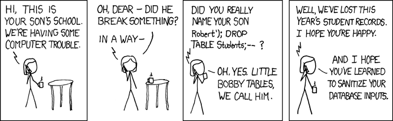

# pyscg-0010: Improper Neutralization of Special Elements used in an SQL Command ('SQL Injection')

To prevent SQL injections, use input sanitization and parameterized queries instead of `executescript()`.

Combining an SQL query with data from lesser trusted sources, such as fields from a web form used to sign up new clients, can allow an attacker to inject malicious SQL statements.

SQLs that allow running operating system commands as part of an SQL query are sensitive to Remote Code Execution (RCE) attacks such as `\system` or `\!`, in *MySQL Shell commands* [[Oracle 2024]](https://dev.mysql.com/doc/mysql-shell/8.0/en/mysql-shell-commands.html). SQL injections have been known for decades *ODBC and MS SQL server 6.5* [[Jeff Forristal 1998]](http://phrack.org/issues/54/8.html#article) and are still part of the most frequent top 10 attacks in CWE top 25 [[MITRE 2024]](https://cwe.mitre.org/top25/archive/2024/2024_cwe_top25.html) and 2021 [[OWASP 2021]](https://owasp.org/www-project-top-ten/).

Note that "Raw SQL is error prone, more labor intensive, and ugly." [Byrne 2021]

Exploits of a Mom [XKCD 2007](https://xkcd.com/327/)


Suppose a school has a webpage that allows parents to add the name of their child to a school trip themselves. The webpage is using an SQL back-end adding a new student `<NAME>` as follows:

```SQL
INSERT INTO Students(student) VALUES('<NAME>')
```

Suppose an attacker can substitute arbitrary strings for <NAME> and is allowed to extend it with any character

```SQL
<NAME>'); DROP TABLE students;--")
```

The attacker can then end and close the query himself with '); and extend the query with other SQL commands.

```SQL
INSERT INTO Students(student) VALUES('Robert'); DROP TABLE students;--');
```

`DROP TABLE students;` will delete the existing table with student names.

The `executescript()` method is typically used to initialize, create or do any  back-end work without front-end interaction and not intended to be used with a data from a lesser trusted source.

## Non-compliant Code Example - SQLite3

The `noncompliant01.py` code allows parents to add their Child by mixing the name with required SQL in an f-string and running both in `executescript()`.

[*noncompliant01.py:*](noncompliant01.py)

```python
# SPDX-FileCopyrightText: OpenSSF project contributors
# SPDX-License-Identifier: MIT
""" Non-compliant Code Example """
import logging
import sqlite3
from typing import Union

logging.basicConfig(level=logging.DEBUG)


class Records:
    """
    Non-compliant code.
    Possible SQL injection vector through string-based query construction
    """

    def __init__(self):
        self.connection = sqlite3.connect("school.db")
        self.cursor = self.connection.cursor()
        self.cursor.execute("CREATE TABLE IF NOT EXISTS Students(student TEXT)")
        self.connection.commit()

    def get_record(self, name: str = "") -> Union[list[tuple[str]], None]:
        """
        Fetches a student record from the table for given name
            Parameters:
                name (string): A string with the student name
            Returns:
                name (string): A string with the student name
                (None): if nothing was found
        """

        get_values = f"SELECT * FROM Students WHERE student = '{name}'"
        try:
            self.cursor.execute(get_values)
            return self.cursor.fetchall()[0][0]
        except sqlite3.OperationalError as operational_error:
            logging.error(operational_error)
        return None

    def add_record(self, name: str = ""):
        """
        Adds a student name to the table
            Parameters:
                name (string): A string with the student name
        """

        add_values = "INSERT INTO Students(student) VALUES('{name}');"
        logging.debug("Adding student %s", name)
        add_values_query = add_values.format(name=name)
        try:
            self.cursor.executescript(add_values_query)
            self.connection.commit()
        except sqlite3.OperationalError as operational_error:
            logging.error(operational_error)


#####################
# exploiting above code example
#####################
print("sqlite3.sqlite_version=" + sqlite3.sqlite_version)

records = Records()
records.add_record("Alice")
records.add_record("Robert'); DROP TABLE students;--")
records.add_record("Malorny")

print(records.get_record("Alice"))
# normal as "Robert" has not been added as "Robert":
print(records.get_record("Robert'); DROP TABLE students;--"))
print(records.get_record("Malorny"))

```

Adding a student name called `'); DROP TABLE students;--"` allows to drop/delete the table or run any other SQL command.

**Example `noncompliant01.py` output:**

```bash
sqlite3.sqlite_version=3.34.1
DEBUG:root:Adding student Alice
DEBUG:root:Adding student Robert'); DROP TABLE students;--
DEBUG:root:Adding student Malorny
ERROR:root:no such table: Students
ERROR:root:no such table: Students
None
ERROR:root:near ")": syntax error
None
ERROR:root:no such table: Students
None
```

Student `"Malorny"` will never be added because the table `Students` is dropped by the time her parents want to add her.

Static code analysis tools such as `bandit 1.7.4` can be used on the command line to discover or gatekeep vulnerable code anywhere in a product life-cycle:

**Example bandit 1.7.4 output:***

```bash
Test results:
>> Issue: [B608:hardcoded_sql_expressions] Possible SQL injection vector through string-based query construction.
   Severity: Medium   Confidence: Low
   CWE: CWE-89 (https://cwe.mitre.org/data/definitions/89.html)
   Location: .\noncompliant01.py:24:21
   More Info: https://bandit.readthedocs.io/en/1.7.4/plugins/b608_hardcoded_sql_expressions.html
23              '''
24              get_values = "SELECT * FROM Students WHERE student = '{name}'".format(name=name)
25              self.cursor.execute(get_values)
```

## Compliant Solution - sqlite3

The `compliant01.py` code example is using `sqlite3.cursor.execute(get_values, data_tuple)` that:

* Separates the query from the values to reduce injection attacks.

```python
data_tuple = (name,)`<br>
get_values = "SELECT * FROM Students WHERE student = ?"
self.cursor.execute(get_values, data_tuple)
```

* Is limited to a single-line query to protect against multi-line attacks.

The `compliant01.py` code is also providing variable type hints in its methods such as `name: str`. The `add_student` method is now storing the whole length of the string `"Robert'); DROP TABLE students;--"`. Input sanitation as described in separate rules would have to be added.

>[!NOTE]
>
> * Type hints do not prevent simple string injections at runtime. They only help prevent coding mistakes when used with a special linter at design time.
> * The `sqlite3.cursor.executescript()` method is specifically designed to prohibit printing the output. That is to prevent an attacker from exploring the database back-end layout.
> * Production code must use logging that avoids exposing sensitive data.
> * Input sanitation as described in separate rules would have to be added.

[*compliant01.py:*](compliant01.py)

```python
# SPDX-FileCopyrightText: OpenSSF project contributors
# SPDX-License-Identifier: MIT
""" Compliant Code Example """
import logging
import sqlite3
from typing import Union

logging.basicConfig(level=logging.DEBUG)


class Records:
    """
    Compliant code, providing protection against injection.
    Missing input sanitation as such.
    """

    # TODO: add input sanitation
    # TODO: add appropriate logging
    # TODO: add appropriate error handling

    def __init__(self):
        self.connection = sqlite3.connect("school.db")
        self.cursor = self.connection.cursor()
        self.cursor.execute("CREATE TABLE IF NOT EXISTS Students(student TEXT)")
        self.connection.commit()

    def get_record(self, name: str) -> Union[list[tuple[str]], None]:
        """
        Fetches a student record from the table for given name
            Parameters:
                name (string): A string with the student name
            Returns:
                name (string): A string with the student name
                (None): if nothing was found
        """

        data_tuple = (name,)
        get_values = "SELECT * FROM Students WHERE student = ?"
        try:
            self.cursor.execute(get_values, data_tuple)
            return self.cursor.fetchall()
        except sqlite3.OperationalError as operational_error:
            logging.warning(operational_error)
        return None

    def add_record(self, name: str):
        """
        Adds a student name to the table
            Parameters:
                name (string): A string with the student name
        """

        data_tuple = (name,)
        logging.debug("Adding student %s", name)
        add_values = """INSERT INTO Students VALUES (?)"""
        try:
            self.cursor.execute(add_values, data_tuple)
            self.connection.commit()
        except sqlite3.OperationalError as operational_error:
            logging.warning(operational_error)


#####################
# exploiting above code example
#####################
print("sqlite3.sqlite_version=" + sqlite3.sqlite_version)

records = Records()
records.add_record("Alice")
records.add_record("Robert'); DROP TABLE students;--")
records.add_record("Malorny")

print(records.get_record("Alice"))
# normal as "Robert" has not been added as "Robert":
print(records.get_record("Robert'); DROP TABLE students;--"))
print(records.get_record("Malorny"))
```

**Example `compliant01.py` output:**

```bash
sqlite3.sqlite_version=3.34.1
DEBUG:root:Adding student Alice
DEBUG:root:Adding student Robert'); DROP TABLE students;--
DEBUG:root:Adding student Malorny
[('Alice',)]
[("Robert'); DROP TABLE students;--",)]
[('Malorny',)]
```

## Automated Detection

|Tool|Version|Checker|Description|
|:---|:---|:---|:---|
|Bandit|1.7.3 on python 3.9.6|[B608](https://bandit.readthedocs.io/en/1.7.4/plugins/b608_hardcoded_sql_expressions.html)|bandit can detect a full SQL string assigned to a variable such as<br> `get_values = "SELECT * FROM Students WHERE student = '{name}'".format(name=name)`<br><br>bandit is unable to detect the same query assigned over multiple lines:<br>`get_values = "SELECT * FROM Students WHERE student = "`<br>`get_values += "'{name}'".format(name=name)`|

## Related Guidelines

|||
|:---|:---|
|[MITRE CWE](http://cwe.mitre.org/)|Pillar: [CWE-707: Improper Neutralization (4.12)](https://cwe.mitre.org/data/definitions/707.html)|
|[MITRE CWE](http://cwe.mitre.org/)|Base [CWE-89: Improper Neutralization of Special Elements used in an SQL Command ('SQL Injection')](https://cwe.mitre.org/data/definitions/89.html)|
|[SEI CERT Coding Standard for Java](https://wiki.sei.cmu.edu/confluence/display/java/SEI+CERT+Oracle+Coding+Standard+for+Java)|[IDS00-J. Prevent SQL injection](https://wiki.sei.cmu.edu/confluence/display/java/IDS00-J.+Prevent+SQL+injection)|
|[SEI CERT C Coding Standard](https://web.archive.org/web/20220511061752/https://wiki.sei.cmu.edu/confluence/display/c/SEI+CERT+C+Coding+Standard)|[STR02-C. Sanitize data passed to complex subsystems](https://wiki.sei.cmu.edu/confluence/display/c/STR02-C.+Sanitize+data+passed+to+complex+subsystems)|
|[SEI CERT C++ Coding Standard](https://wiki.sei.cmu.edu/confluence/pages/viewpage.action?pageId=88046682)|[VOID STR02-CPP. Sanitize data passed to complex subsystems](https://wiki.sei.cmu.edu/confluence/pages/viewpage.action?pageId=88046726)|
|[SEI CERT Perl Coding Standard](https://wiki.sei.cmu.edu/confluence/display/perl/SEI+CERT+Perl+Coding+Standard)|[IDS33-PL. Sanitize untrusted data passed across a trust boundary](https://wiki.sei.cmu.edu/confluence/display/perl/IDS33-PL.+Sanitize+untrusted+data+passed+across+a+trust+boundary)|
|[[OWASP 2005](https://wiki.sei.cmu.edu/confluence/display/java/Rule+AA.+References#RuleAA.References-OWASP05)]|[A Guide to Building Secure Web Applications and Web Services](http://sourceforge.net/projects/owasp/files/Guide/2.0.1/OWASPGuide2.0.1.pdf/download)|

## Bibliography

|||
|:---|:---|
|[XKCD 2007]|327 Exploits of a Mom, Available [online] from: [https://xkcd.com/327/](https://xkcd.com/327/), [Accessed 2024] |
|[Jeff Forristal 1998]|Phrack magazine. Batch commands in ODBC and MS SQL server 6.5, Available [online]  from: [http://phrack.org/issues/54/8.html#article](http://phrack.org/issues/54/8.html#article ) [accessed 11 November 2024] |
|[Oracle 2024]|Oracle MySQL Documentation. MySQL Shell commands, Available [online] from: [https://dev.mysql.com/doc/mysql-shell/8.0/en/mysql-shell-commands.html](https://dev.mysql.com/doc/mysql-shell/8.0/en/mysql-shell-commands.html]), [Accessed Nov 2024]|
|[OWASP 2005]|A Guide to Building Secure Web Applications and Web Services, Available from [http://sourceforge.net/projects/owasp/files/Guide/2.0.1/OWASPGuide2.0.1.pdf/download](http://sourceforge.net/projects/owasp/files/Guide/2.0.1/OWASPGuide2.0.1.pdf/download), [Accessed Nov 2024]|
|[MITRE 2024]|Top 25 2024, available from [https://cwe.mitre.org/top25/archive/2024/2024_cwe_top25.html](https://cwe.mitre.org/top25/archive/2024/2024_cwe_top25.html), [Accessed Nov 2024]|
|[Byrne 2021]|Byrne, D. (2021), Full Stack Python Security, ISBN 9781617298820, Manning, page 205|
