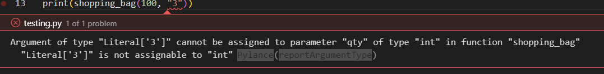

# pyscg-0011: Access of Resource Using Incompatible Type ('Type Confusion')

When operating on unsigned values coming from external sources, such as `C` or `C++` applications, they should be unpacked using variable types that can represent their entire value range.
This rule is related to [pyscg-0005: Control Rounding When Converting To Less Precise Numbers](../../03_numbers/pyscg-0005/README.md).

The scenario in `example01.py` demonstrates what can go wrong when Python needs to interact with `C` or `C++` data types using the `struct` module [[Python docs](https://docs.python.org/3/library/struct.html)]. This can be either over the network, via file, or an interaction with the operating system. A file or stream is simulated with `io.BytesIO`.

[*example01.py:*](example01.py)

```py
# SPDX-FileCopyrightText: OpenSSF project contributors
# SPDX-License-Identifier: MIT
""" Code Example """

# https://docs.python.org/3/library/struct.html#format-characters
# https://docs.python.org/3/library/ctypes.html

import io
from struct import pack, unpack


def read_from_stream(stream):
    value = unpack('>H', stream.getvalue())[0]
    return value


#####################
# attempting to exploit above code example
#####################
file_sim = io.BytesIO(pack("<H", 1))
print(read_from_stream(file_sim))

```

The `read_from_stream` method expects a `big-endian unsigned short` but is given a `little-endian unsigned short` instead. The original packaged `1` is read as a `256`. In some use cases, it might be enough to mask the data as shown in [[SEI CERT 2015](https://wiki.sei.cmu.edu/confluence/display/java/NUM03-J.+Use+integer+types+that+can+fully+represent+the+possible+range+of++unsigned+data)] but generally it's a question of data structure and integrity that is much harder to control in raw `ctype` data than in a language-independent data format such as `Json` or `Yaml`.

## Non-Compliant Code Example

The `noncompliant01.py` demonstrates that type hints for design documentation do not prevent type confusion at runtime.

*[noncompliant01.py](noncompliant01.py):*

```python
# SPDX-FileCopyrightText: OpenSSF project contributors
# SPDX-License-Identifier: MIT
""" Non-compliant Code Example """


def shopping_bag(price: int, qty: int) -> int:
    return price * qty


####################
# attempting to exploit above code example
#####################
print(shopping_bag(100, "3"))

```

The `noncompliant01.py` prints "`3333333333333333333333333333333333333333333333333333333333333333333333333333333333333333333333333333`" (number `3` 100 times) as opposed to multiplying the two numbers.

Pylance detects the incompatible types in the attack section during design time, however, this warning would not be of any use at runtime when an unexpected type can still be sent:


## Compliant Solution

The `compliant01.py` code ensures that both `price` and `qty` are interpreted as numeric types by explicitly casting them as `int`.

*[compliant01.py](compliant01.py):*

```python
# SPDX-FileCopyrightText: OpenSSF project contributors
# SPDX-License-Identifier: MIT
""" Compliant Code Example """


def shopping_bag(price: int, qty: int) -> int:
    return int(price) * int(qty)


####################
# attempting to exploit above code example
#####################
print(shopping_bag(100, "3"))

```

Depending on the use case, it can instead be safer to throw an exception when an incorrect data type is provided.

## Automated Detection

|Tool|Version|Checker|Description|
|:---|:---|:---|:---|
|Bandit|1.7.4 on Python 3.10.4|Not Available||
|Flake8|8-4.0.1 on Python 3.10.4|Not Available||

## Related Guidelines

|||
|:---|:---|
|[MITRE CWE](http://cwe.mitre.org/)|Pillar: [CWE-664: Improper Control of a Resource Through its Lifetime (4.13) (mitre.org)](https://cwe.mitre.org/data/definitions/664.html)|
|[MITRE CWE](http://cwe.mitre.org/)|Base: [CWE-843: Access of Resource Using Incompatible Type ('Type Confusion')](https://cwe.mitre.org/data/definitions/843.html)|
|[SEI CERT Coding Standard for Java](https://wiki.sei.cmu.edu/confluence/display/java/SEI+CERT+Oracle+Coding+Standard+for+Java)|[NUM03-J. Use integer types that can fully represent the possible range of unsigned data - SEI CERT Oracle Coding Standard for Java - Confluence (cmu.edu)](https://wiki.sei.cmu.edu/confluence/display/java/NUM03-J.+Use+integer+types+that+can+fully+represent+the+possible+range+of++unsigned+data)|

## Bibliography

|||
|:---|:---|
|[[Python docs](https://docs.python.org/3/library/struct.html)]|Python Software Foundation. (2025). struct — Interpret bytes as packed binary data [online]. Available from: [https://docs.python.org/3/library/struct.html](https://docs.python.org/3/library/struct.html) [accessed 12 May 2025]|
|[[SEI CERT 2015](https://wiki.sei.cmu.edu/confluence/display/java/NUM03-J.+Use+integer+types+that+can+fully+represent+the+possible+range+of++unsigned+data)]|Software Engineering Institute CERT Coordination Center. (2025). NUM03-J. Use integer types that can fully represent the possible range of unsigned data [online]. Available from: [https://wiki.sei.cmu.edu/confluence/display/java/NUM03-J.+Use+integer+types+that+can+fully+represent+the+possible+range+of++unsigned+data](https://wiki.sei.cmu.edu/confluence/display/java/NUM03-J.+Use+integer+types+that+can+fully+represent+the+possible+range+of++unsigned+data) [accessed 12 May 2025]|
