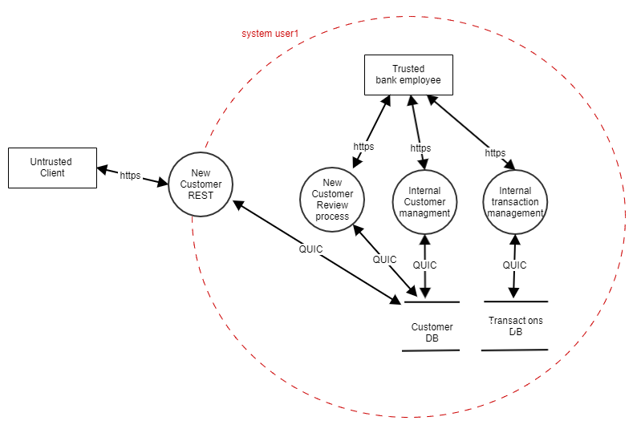

# CWE-501: Trust Boundary Violation

Python does not share the concept of different trust zones within the same runtime as explained in the *JAVA SEI CERT Rule 15 platform security (SEC)* [[SEI CERT 2022]](https://wiki.sei.cmu.edu/confluence/pages/viewpage.action?pageId=88487683) rules. Python neither has a security manager that can control access between trusted and untrusted code running on the same JVM. “Private” instance variables that cannot be accessed except from inside an object don’t exist in Python [Python 2023].

In Python we need to implement different trust zone's by starting  python runtime's with individual POSIX/Machine users. The POSIX/Machine user access rights must be set in accordance to level of trust per zone.

## Noncompliant STRIDE example - New User Sign-up Process

The example shows how new users sign up for a bank account. STRIDE illustrates trust boundaries in dotted red lines [[OWASP, Conklin,  Drake, 2023]](https://cwe.mitre.org/data/definitions/134.html). In the noncompliant example, we have all Python scripts running under the same POSIX user.

Breaking the outer perimeter allows the attacker to run commands under the same privileges as the rest of the system.

## Compliant STRIDE example - New User Sign-up Process

The compliant solution has multiple layers of trust zones creating defense in depth. Each zone running their runtime environment under a different user. Crossing the red-dotted borders requires authentication and authorization.

Layering security allows to secure the more sensitive parts of the system.

## Automated Detection

unknown

## Related Vulnerabilities

|Product|CVE|Description|CVSS Rating|Comment|
|:----|:----|:----|:----|:----|
|Zoom clients <= 5.13.5|[CVE-2023-28597](https://www.cvedetails.com/cve/CVE-2023-28597/)|v3.1:8.3|A Python format string issue leading to information disclosure and potentially remote code execution.||

## Related Guidelines

|||
|:---|:---|
|[MITRE CWE](http://cwe.mitre.org/)|Pillar [CWE-664: Improper Control of a Resource Through its Lifetime (4.13) (mitre.org)](https://cwe.mitre.org/data/definitions/664.html)|
|[MITRE CWE](http://cwe.mitre.org/)|Base [CWE - CWE-501: Trust Boundary Violation (4.12) (mitre.org)](https://cwe.mitre.org/data/definitions/501.html)|
|[MITRE CWE](http://cwe.mitre.org/)|Base [CWE - CWE-306: Missing Authentication for Critical Function (4.12) (mitre.org)](https://cwe.mitre.org/data/definitions/306.html)|
|[MITRE CWE](http://cwe.mitre.org/)|Class [CWE - CWE-269: Improper Privilege Management (4.12) (mitre.org)](https://cwe.mitre.org/data/definitions/269.html)|
|[OWASP Top 10:2021](https://owasp.org/Top10/A04_2021-Insecure_Design/)|[A04 Insecure Design - OWASP Top 10:2021](https://owasp.org/Top10/A04_2021-Insecure_Design/)|

## Bibliography

|||
|:---|:---|
|[[SEI CERT 2022]](https://wiki.sei.cmu.edu/confluence/pages/viewpage.action?pageId=88487683)|Rule 15. Platform Security (SEC). Available from: [SEI CERT](https://wiki.sei.cmu.edu/confluence/pages/viewpage.action?pageId=88487683) [accessed 07 May 2024]|
|[[Python 2023]](https://docs.python.org/3.9/tutorial/classes.html?highlight=private#private-variables)|Python Software Foundation. (2023). Classes - Private Variables. Available from: [Python Documentation](https://docs.python.org/3.9/tutorial/classes.html?highlight=private#private-variables) [accessed 13 September 2023]|
|[[OWASP, Conklin,  Drake, 2023]](https://cwe.mitre.org/data/definitions/134.html)|[CWE - CWE-134: Use of Externally-Controlled Format String (4.13) (mitre.org)](https://cwe.mitre.org/data/definitions/134.html)|
