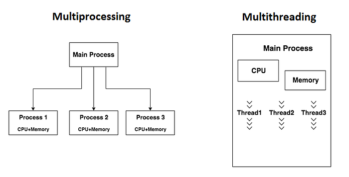
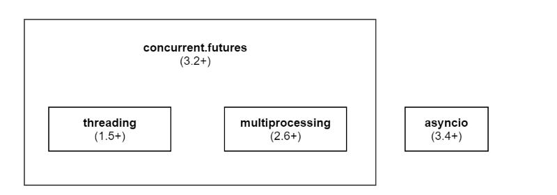

# Introduction to Multithreading and Multiprocessing in Python

This page aims to explain the concepts that could be found in the following rules:

- [CWE-410: Insufficient Resource Pool](../CWE-664/CWE-410/README.md)
- [CWE-833: Deadlock](../CWE-664/CWE-833/README.md)
- [CWE-400: Uncontrolled Resource Consumption](../CWE-664/CWE-400/README.md)
- [CWE-392: Missing Report of Error Condition](../CWE-703/CWE-392/README.md)
- [CWE-665: Improper Initialization](../CWE-664/CWE-665/README.md)
- [CWE-366: Race Condition within a Thread](../CWE-691/CWE-366/README.md)

## What is Multithreading in Python - Multithreading vs Multiprocessing



Source: Tug of War: MultiProcessing Vs MultiThreading [Zaman 2021](https://medium.com/@noueruzzaman/tug-of-war-multiprocessing-vs-multithreading-55341c1f2103)

**Multithreading** is the ability of a CPU to provide multiple threads of execution concurrently [Wikipedia 2024](https://en.wikipedia.org/wiki/Multithreading_(computer_architecture)). Usually, all instructions are performed sequentially in a single main thread. The multithreading approach allows the program to perform multiple tasks simultaneously. Multithreading should not be confused with **multiprocessing**. In multithreading, the threads share resources of a single or multiple cores - that includes the computing units, CPU caches, the translation lookaside buffer and memory space. Processes in the multiprocessing approach each have their own separate memory space and other resources.

In python:

- multithreading is handled by the `threading` module
- multiprocessing is handled by the `multiprocessing` module

## Locks

Sometimes we do not want multiple threads to reach the same part of the code at the same time. For instance, when threads share access to the same resource, we must ensure that said resource won't be edited by them at the same time in case one overwrites changes of the other (ex. when two threads write to the same file). Locks are a type of object that allows the programmer to mark a *critical section* of the code so that only the threads currently holding the lock can perform operations. It can be compared to passing around a microphone during a meeting so that only one person at a time can speak, thus preventing the conversation from becoming chaotic.
The example01.py code is depicting a simple use of a lock from the `threading` module:

*[example01.py](example01.py):*

```python
import threading


def critical_func(x: str, l: threading.Lock):
    print(f"{x}: performing regular operations")
    with l:
        print(f"{x}: entered critical section")
        i = 0
        for _ in range(100000):
            i += 1
        print(f"{x}: exiting critical section")
    print(f"{x}: finished")
 
 
lock = threading.Lock()
t1 = threading.Thread(target=critical_func, args=("A", lock))
t2 = threading.Thread(target=critical_func, args=("B", lock))
t1.start()
t2.start()
```

**Example output from `example01.py`:**

```bash
A: performing regular operations
A: entered critical section
B: performing regular operations
A: exiting critical section
A: finished
B: entered critical section
B: exiting critical section
B: finished
```

Whenever one thread enters the critical section, no other thread can enter it until the thread in the critical section leaves it and relieves the lock.
See also *CWE-667: Improper Locking* [[MITRE 2024](https://cwe.mitre.org/data/definitions/667)].

## Deadlock

A deadlock is a situation when one or more threads are waiting for a situation that will never occur, meaning that the program will run indefinitely unless it is forcefully closed by the user as demonstrated in `noncompliant01.py`.

>!INFO
>`Python 3.13` introduced an option to disable `GIL` when launching python via `PYTHON_GIL=0` or `-X gil=0` [[GitHub swtaarrs 2024](https://github.com/python/cpython/pull/116338)].

*[noncompliant01.py](noncompliant01.py):*

```python
""" Non-compliant Code Example """
import threading
 
 
def wait_for_other(x: str, other: threading.Thread):
    print(f"{x}: waiting for other")
    other.join()
    print(f"{x}: finished waiting")
 
 
t = threading.Thread(target=wait_for_other, args=("A", threading.current_thread()))
t.start()
print("B: waiting for other")
t.join()
print("B: finished waiting")

```

The `join()` is a method that makes it so that the thread where the method was called will wait for the thread on which the method was called to finish. The "finished waiting" prints will never happen.

## Global Interpreter Lock (GIL)

GIL is a specific type of mutex (lock) that allows only one thread to hold control of the Python interpreter. This means that only one thread can be executed at a time, even in a multi-threaded architecture with more than one CPU core as demonstrated in `noncompliant02.py`

*[noncompliant02.py](noncompliant02.py):*

```python
""" Non-compliant Code Example """
import time
from threading import Thread
 
 
def waste_time(t: int):
    for _ in range(t):
        _ += 1
 
 
BIG_NUMBER = 100000000
start = time.time()
waste_time(BIG_NUMBER)
end = time.time()
print(f"Time taken when executing sequentially (in seconds): {end - start}")
t1 = Thread(target=waste_time, args=(BIG_NUMBER // 2,))
t2 = Thread(target=waste_time, args=(BIG_NUMBER // 2,))
start = time.time()
t1.start()
t2.start()
t1.join()
t2.join()
end = time.time()
print(f"Time taken when executing in 2 threads (in seconds): {end - start}")

```

**Example output from `noncompliant02.py`:**

```bash
Time taken when executing sequentially (in seconds): 5.477974891662598
Time taken when executing in 2 threads (in seconds): 5.985692262649536
```

Using multiple threads, each going through half as many iterations ended up being slower than running all calculations in the main thread. The additional execution time comes from the thread overhead, that is the operations performed in order to create, run and end a new thread.
In order to avoid issues caused by GIL, one can use processes instead of threads, as each process, among other resources, has its own Python interpreter.

*[compliant01.py](compliant01.py):*

```python
""" Compliant Code Example """
import time
from multiprocessing import Process
 
 
def waste_time(t: int):
    for _ in range(t):
        _ += 1
 
 
BIG_NUMBER = 100000000
start = time.time()
waste_time(BIG_NUMBER)
end = time.time()
print(f"Time taken when executing sequentially (in seconds): {end - start}")
p1 = Process(target=waste_time, args=(BIG_NUMBER // 2,))
p2 = Process(target=waste_time, args=(BIG_NUMBER // 2,))
start = time.time()
p1.start()
p2.start()
p1.join()
p2.join()
end = time.time()
print(f"Time taken when executing in 2 processes (in seconds): {end - start}")
```

**Example output from `compliant01.py`:**

```bash
Time taken when executing sequentially (in seconds): 5.829047441482544
Time taken when executing in 2 processes (in seconds): 3.0721683502197266
```

## CPU bound vs I/O bound threads

Threads can be separated into two categories depending on which factors have the biggest impact on their performance:

- CPU bound - those threads are limited by the CPU performance (ex. doing complex calculations)
- I/O bound - those threads need to wait for Input/Output operations (ex. reading from a database

`GIL` has a significantly greater impact on CPU-bound threads. While the threads wait for I/O, no additional Python code needs to be executed and the GIL is passed to threads that actively perform operations.

We can simulate I/O bound threads by replacing calculations from the previous code example with `time.sleep`:

*[noncompliant03.py](noncompliant03.py):*

```python
""" Non-compliant Code Example """
import time
from threading import Thread
 
 
def waste_time(t: float):
    time.sleep(t)
 
 
WAIT_TIME = 4
start = time.time()
waste_time(WAIT_TIME)
end = time.time()
print(f"Time taken when executing sequentially (in seconds): {end - start}")
t1 = Thread(target=waste_time, args=(WAIT_TIME // 2,))
t2 = Thread(target=waste_time, args=(WAIT_TIME // 2,))
start = time.time()
t1.start()
t2.start()
t1.join()
t2.join()
end = time.time()
print(f"Time taken when executing in 2 threads (in seconds): {end - start}")
```

Now threads no longer hold the GIL and the split sleep time can be "run" concurrently

**Example output from `noncompliant03.py`:**

```bash
Time taken when executing sequentially (in seconds): 4.002594947814941
Time taken when executing in 2 threads (in seconds): 2.002474546432495
```

## Asynchronous I/O

Asynch IO is a form of input/output processing that allows achieving parallel code execution using a single thread. It uses the `async` and `await` Python keywords as well as the `asyncio` Python package. The main mechanism of asynch IO is **coroutines** - a function whose execution can be suspended before reaching return, which allows it to pass control to another coroutine. The `async`  keyword is used to define a coroutine and the `await` keyword suspends its execution, allowing a different routine to run. Objects that can be used with `await` are called *awaitables*. The `asyncio` package provides additional functions, such as creating and managing *event loops* - objects responsible for running asynchronous tasks and callbacks [Python docs - event loop 2024](https://docs.python.org/3/library/asyncio-eventloop.html) as shown in `compliant02.py`.

*[compliant02.py](compliant02.py):*

```python
""" Compliant Code Example """
import asyncio
 
 
async def func(x: int):
    print(f"{x} - start")
    await asyncio.sleep(1)
    print(f"{x} - end")
 
 
async def run_async():
    await asyncio.gather(func(1), func(2), func(3))
 
 
asyncio.run(run_async())
```

The `compliant02.py` example contains definitions of two coroutines - `func()` and `run_async()`. The `asyncio.run()` function starts an event loop and schedules the provided coroutine. The `asyncio.gather` groups given awaitables together. Grouped awaitables can be executed concurrently, awaited or canceled. The `await.sleep()` function allows us to sleep the current task for a given number of milliseconds, giving control to other coroutines in the group. Despite not using multiple threads or processes, the code example is executed concurrently, which can be seen in the console output:

**Example output from `compliant02.py`:**

```bash
1 - start
2 - start
3 - start
1 - end
2 - end
3 - end
```

More information about asyncio can be found in the python documentation [Python docs - asyncio 2024](https://docs.python.org/3/library/asyncio.html).

## Thread and Process Pools

The creation of new threads and processes is considered a computationally expensive operation that may cause performance issues. In order to alleviate those issues, we can use a **thread/process** pool. Those pools are defined as "a group of per-instantiated and idle threads, which stand ready to be given work" [Tutorialspoint 2024](https://www.tutorialspoint.com/concurrency_in_python/concurrency_in_python_pool_of_threads.htm). Threads in a thread pool are called **worker threads**. The advantage of using worker threads over regular threads is the fact that upon completing its execution, a worker thread can be reused, saving time and other resources.
Classes used for managing thread/process pools are called Executors. These classes provide methods for the creation of thread/process pools, defining their sizes, submitting tasks, and terminating the worker threads/processes. In Python, the `Executor` is an abstract class that is implemented in two concrete subclasses:

- `ThreadPoolExecutor`
- `ProcessPoolExecutot`

ThreadPoolExecutor is a part of the `concurrent.futures` package, which is a high-level interface used for both multithreading and multiprocessing.
The relationship between the concurrency-related packages mentioned on this page is shown in the diagram below:



Source: [[PluralSight Ojo 2022](https://www.pluralsight.com/courses/python-concurrency-getting-started)]

## Modules used for Multithreading/Multiprocessing

Here is a list of modules that are commonly used when writing applications using multithreading/multiprocessing:

- `threading`: allows for manual creation and handling of threads [Python docs - threading 2024](https://docs.python.org/3/library/threading.html)
- `concurrent.futures`: a higher-level threading management interface, that provides thread and process pools, Future class for obtaining results asynchronously etc. [Python docs - concurrent.futures 2024](https://docs.python.org/3/library/concurrent.futures.html#module-concurrent.futures)
- `queue`: provides a thread-safe interface for exchanging data between running threads [Python docs - queue 2024](https://docs.python.org/3/library/queue.html#module-queue)
- `multiprocessing`: allows for the spawning of processes in a similar way threading  is used for threads [Python docs - multiprocessing 2024](https://docs.python.org/3/library/multiprocessing.html#module-multiprocessing)

## Bibliography

|||
|:---|:---|
|[[Zaman 2021]](https://medium.com/@noueruzzaman/tug-of-war-multiprocessing-vs-multithreading-55341c1f2103)|Tug of War: MultiProcessing Vs MultiThreading. Available from: <https://medium.com/@noueruzzaman/tug-of-war-multiprocessing-vs-multithreading-55341c1f2103> \[Accessed 6 June 2024]|
|[[Wikipedia 2024]](https://en.wikipedia.org/wiki/Multithreading_(computer_architecture))|Multithreading (computer architecture). Available from: <https://en.wikipedia.org/wiki/Multithreading_(computer_architecture)> \[Accessed 6 June 2024]|
|[[MITRE 2024]](https://cwe.mitre.org/data/definitions/667)|CWE-667: Improper Locking. Available from: <https://cwe.mitre.org/data/definitions/667> \[Accessed 6 June 2024]|
|[[GitHub swtaarrs 2024]](https://github.com/python/cpython/pull/116338)|Allow disabling the `GIL` with `PYTHON_GIL=0` or `-X gil=0` GitHub pull request. Available from: <https://github.com/python/cpython/pull/116338> \[Accessed 6 June 2024]|
|[[Python docs - event loop 2024]](https://docs.python.org/3/library/asyncio-eventloop.html)|Python docs - event loop 2024. Available from: <https://docs.python.org/3/library/asyncio-eventloop.html> \[Accessed 6 June 2024]|
|[[Python docs - asyncio 2024]](https://docs.python.org/3/library/asyncio.html)|Python docs - asyncio 2024. Available from: <https://docs.python.org/3/library/asyncio.html> \[Accessed 6 June 2024]|
|[[Tutorialspoint 2024]](https://www.tutorialspoint.com/concurrency_in_python/concurrency_in_python_pool_of_threads.htm)|Concurrency in Python - Pool of Threads. Available from: <https://www.tutorialspoint.com/concurrency_in_python/concurrency_in_python_pool_of_threads.htm> \[Accessed 6 June 2024]|
|[[PluralSight Ojo 2022]](https://www.pluralsight.com/courses/python-concurrency-getting-started)|Getting Started with Python 3 Concurrency. Available from: <https://www.pluralsight.com/courses/python-concurrency-getting-started> \[Accessed 6 June 2024]|
|[[Python docs - threading 2024]](https://docs.python.org/3/library/threading.html)|threading — Thread-based parallelism. Available from: <https://docs.python.org/3/library/threading.html> \[Accessed 6 June 2024]|
|[[Python docs - concurrent.futures 2024]](https://docs.python.org/3/library/concurrent.futures.html#module-concurrent.futures)|concurrent.futures — Launching parallel tasks. Available from: <https://docs.python.org/3/library/concurrent.futures.html#module-concurrent.futures> \[Accessed 6 June 2024]|
|[[Python docs - queue 2024]](https://docs.python.org/3/library/queue.html#module-queue)|queue — A synchronized queue class. Available from: <https://docs.python.org/3/library/queue.html#module-queue> \[Accessed 6 June 2024]|
|[[Python docs - multiprocessing 2024]](https://docs.python.org/3/library/multiprocessing.html#module-multiprocessing)|multiprocessing — Process-based parallelism. Available from: <https://docs.python.org/3/library/multiprocessing.html#module-multiprocessing> \[Accessed 6 June 2024]|
