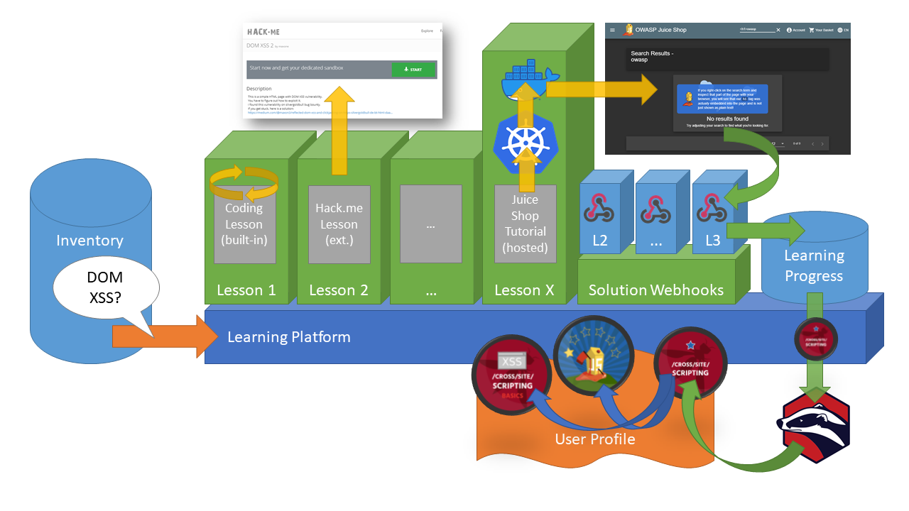

# Learning Platform

## User Stories

### Learner

* As an active learner I want to do coding exercises so that I can
  practice how to write secure code
* As a curious learner I want to do hacking exercises to that I can
  experience what effect vulnerabilities in my software could have
* As a more passive learner I want to watch videos explaining
  vulnerabilities so that I get an easily consumable overview of what
  the risk and impact is
* As an open source developer with little time to learn continuously
  about security, I want secure code practices to be automatically
  checked on my Pull Requests, in order to learn from this feedback “on
  the job” with a minimal process overhead
* As a newbie open source developer on a project, I want secure code
  practices to be automatically checked on my Pull Requests, in order to
  focus my learning on the practices that are relevant to the code (or
  framework, or language …) I am working on, thanks to this feedback.
* As an ambitious learner I want to see my previous learning
  achievements in my user profile so that I can brag about how many
  badges\* I’ve already earned

### Lesson Provider

* As a learner, I want the training platform\*\* or exercise
  application\*\*\* to be easily integrated into my existing workflow in
  order to jump into a hands-on exercise or lesson conveniently
* As a learner I want the training platform or exercise application to
  send me feedback in order to encourage me to come back to me for more
  exercises and lessons in the future

### Learning Platform Provider

* As a learner I want the learning platform to offer me achievement
  collections in order to be motivated to complete learning paths
  instead of just dipping my nose into a topic

---

* \* e.g. OWASP Security Pins, Badgr (fka Mozilla OpenBadges), dedicated
  GitHub orgs, ...
* \*\* e.g. OWASP Security Shepherd, OWASP WebGoat, Hack.me, GitHub
  Learning Lab, ...
* \*\*\* e.g. OWASP Juice Shop, Google Firing Range, DVWA, ...

## Platform Vision

[](docs/Learning-Platform-Architecture_Draft.pptx)

## Solution Webhook

The Learning Platform must provide **unique** webhooks per registered
learner _and_ lesson provider integrated with the platform. The webhook
URLs therefore act as a token to identify learners _and_ map their
solutions to the correct provider. Mapping to the correct exercise or
challenge of a provider will be mapped via the [Payload](#payload).

A benefit of this design is the simplicity of integration for the lesson
provider, who does not have to care about any mappings only relevant for
the learning platform.

### Payload

The minimum expected fields for the learning platform to trigger a
solved coding exercise or hacking challenge are:

```json
{ "solution":
  { "challenge": "Exercise identifier (assigned by lesson provider and unique within its scope)",
    "evidence": "Optional evidence for e.g. manual secondary assertion by the Learning Platform",
    "issuedOn": "yyyy-MM-ddThh:mm:ssZ"
  }
}
```

### Example

The following example shows the payload that a Juice Shop 11.x instance
would send when solving the challenge _DOM XSS_, using the `key` from
its own `challenges.yml` as the exercise `identifier`. It would also
send an additional field `issuer` which contains the software version,
configuration, internal application name and server OS hostname of the
issuing Juice Shop instance. Unexpected extra fields like this would by
default have to be ignored by the learning platform. The payload might
become configurable for each individual lesson provider at some later
point in time.

```json
{ "solution":
  { "challenge": "localXssChallenge",
    "evidence": null,
    "issuedOn": "2020-05-10T21:39:15.916Z"
  },
  "issuer": {
    "hostName": "661b2c39-4398-45b4-bfe5-5343096689d3",
    "appName": "OWASP Juice Shop",
    "config": "default",
    "version": "11.0.0-SNAPSHOT"
  }
}
```

The payload example above was created and submitted to a webhook URL
injected via environment variable with minimal implementation effort on
Juice Shop's end:
<https://github.com/bkimminich/juice-shop/blob/develop/lib/webhook.js>

### Open questions

* How to handle deprecated solutions, i.e. those for
  challenges/exercises that have been removed from the Learning
  Platform? _In the Juice Shop example above the software version from
  `issuer`_ would help identify legacy exercises, but other lesson
  providers might be hard to force onto a standard notation for their
  version._

## Possible Increments

Icons indicate assumed effort/complexity of implementation: 🟩=low /
🟨=medium / 🟥=high

* 🟩 **MVP**: Offer links to existing external trainings/exercises for
  each Inventory item (as illustrated for Lesson 2 above)
* 🟨 **Hosted lessons**: Offer the possibility to spin up lessons per
  user dynamically (e.g. using MultiJuicer for JuiceShop as illustrated
  for Lesson X above)
  * _(☑️: SKF can spin up Juice Shop instances)_
* 🟨 **Solution hooks**: Offer e.g. webhooks to allow lessons to report
  back when they have been completed successfully
  * _(🚧[#3](https://github.com/Open-Source-Security-Coalition/Best-Practices-for-OS-Developers/issues/3))_
* 🟨 **Achievements**: Issue badges for completed lessons (illustrated
  above via Badger using OWASP Security Pin graphics as badge icons)
* 🟨 **Collections**: Associate badges with a learning path and
  introduce progression badges (as illustrated above by the XSS Basic
  and Juice Shop One-Star badges)
* 🟥 **Built-in lessons**: Implement lessons as a platform feature
  itself (as illustrated for Lesson 1)
  * _(☑️: SKF has this feature out of the box)_
* 🟥 **Plugin Lessons**: Offer plugin mechanism for including new
  hosted lessons without needing to change the platform itself

