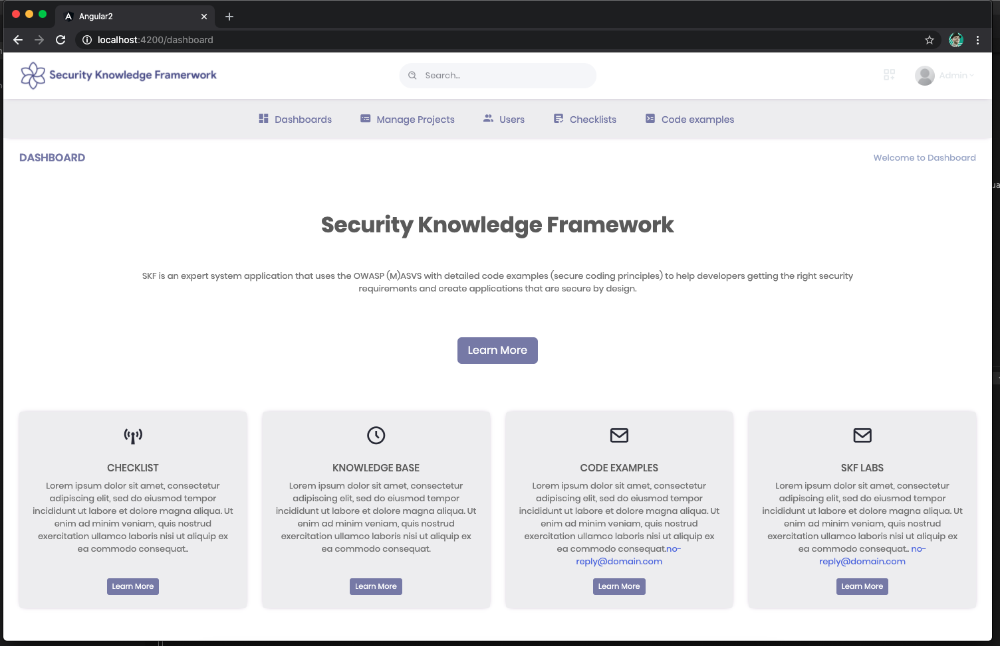

# Best Practices for Open Source developers Working Group - Meeting Minutes

Starting in June of 2021 the working group decided that we will move our meeting notes at one rolling gdoc that will be updated at each call. This should avoid document sprawl and let folks have one consistent spot to look at/update our notes.

[2021 Dev Best Practices WG Meeting Notes](https://docs.google.com/document/d/1sJhaZxG_9Wb2Sg6a4KxqnIvo_to5OkhMkbBk_7UqtEc/edit#)

Archived Notes
 
Regular meeting - June 8, 2021

## Live Meeting Notes

<https://docs.google.com/document/d/1uadzULCR-l9JGVPeFM8uGK0AMsAimBnlC9CGfA9s4Ww/edit>

## Intro

- New members on the call this week?

## New Meeting Day & time

We now meet every other Tuesday at 10 AM ET (2PM UTC) starting May 25, 2021. The calendar invite has been updated to reflect the new day/time.

## Quick status on in-flight projects - (~2min each)

### Fundamentals course

<https://courses.edx.org/courses/course-v1:LinuxFoundationX+LFD106x+3T2020/course/>

- course updates desired annually to 1.5 years
- desire to convert from gdoc to markdown (having some opportunities

### SKF

<https://www.securityknowledgeframework.org/>

### CII Best Practices badge project

<https://bestpractices.coreinfrastructure.org/en>

### Inventory project (CRE)

<https://owasp.org/www-project-integration-standards/>
<https://docs.google.com/presentation/d/16R84qeu9Lvvt4lrSG0dymHgTjqAEzB2XJIsDi4JCHr4/edit#slide=id.p>

-

### Scorecards

<https://github.com/ossf/scorecard>

## Synchronizing Group Efforts

Conversation around next projects

- Our opinionated list of good practices and tools for devs
- How can we provide advise to Maintainers on how to make upgrades easier

## Recording

TBD

Regular meeting - May 25, 2021

## Live Meeting Notes

<https://docs.google.com/document/d/1Nh4LjoqFYHAvB2xEKahYOD6zKUVmDN_NkpP8R2lIA7A/edit>#

## Intro

- New members on the call this week?

## New Meeting Day & time

We now meet every other Tuesday at 10 AM ET (2PM UTC) starting May 25, 2021. The calendar invite has been updated to reflect the new day/time.

## Quick status on in-flight projects - (~2min each)

### Fundamentals course

<https://courses.edx.org/courses/course-v1:LinuxFoundationX+LFD106x+3T2020/course/>

- course updates desired annually to 1.5 years
- desire to convert from gdoc to markdown (having some opportunities

### SKF

<https://www.securityknowledgeframework.org/>

### CII Best Practices badge project

<https://bestpractices.coreinfrastructure.org/en>

### Inventory project (CRE)

<https://owasp.org/www-project-integration-standards/>
<https://docs.google.com/presentation/d/16R84qeu9Lvvt4lrSG0dymHgTjqAEzB2XJIsDi4JCHr4/edit#slide=id.p>

-

### Scorecards

<https://github.com/ossf/scorecard>

## Synchronizing Group Efforts

Resources -

- <http://people.redhat.com/crrobins/DevBestPractice-RefArch.pdf>
- <https://jamboard.google.com/d/1rpCIykiwrjFG-wvvyVg4YyMwP4RZI6txOWu3ociTOXo/viewer?f=0>
- <http://people.redhat.com/crrobins/Dev_Best_Practices_Drawings.pdf>

Conversation around next projects

- Talked through desire of group to craft some actionable good practices
- How can we provide advise to Maintainers on how to make upgrades easier

## Recording

TBD

Regular meeting - May 10, 2021

## Live Meeting Notes

<https://docs.google.com/document/d/1c3HYr0ARjqK3qBCVBkkN-buZsD5KMpQc_dRhPa93Big/edit>#

## Intro

- New members on the call this week?

## Please Vote

Seeking to move meeting to a better time, please vote: <https://doodle.com/poll/xxh6ykwx23icqzrc>

## Quick status on in-flight projects - (~2min each)

### Fundamentals course

<https://courses.edx.org/courses/course-v1:LinuxFoundationX+LFD106x+3T2020/course/>

- course updates desired annually to 1.5 years
- desire to convert from gdoc to markdown (having some opportunities

### SKF

<https://www.securityknowledgeframework.org/>

### CII Best Practices badge project

<https://bestpractices.coreinfrastructure.org/en>

### Inventory project (CRE)

<https://owasp.org/www-project-integration-standards/>
<https://docs.google.com/presentation/d/16R84qeu9Lvvt4lrSG0dymHgTjqAEzB2XJIsDi4JCHr4/edit#slide=id.p>

-

### Scorecards

<https://github.com/ossf/scorecard>

## Synchronizing Group Efforts

Resources -

- <http://people.redhat.com/crrobins/DevBestPractice-RefArch.pdf>
- <https://jamboard.google.com/d/1rpCIykiwrjFG-wvvyVg4YyMwP4RZI6txOWu3ociTOXo/viewer?f=0>
- <http://people.redhat.com/crrobins/Dev_Best_Practices_Drawings.pdf>

Conversation around next projects

- Talked through desire of group to craft some actionable good practices
- How can we provide advise to Maintainers on how to make upgrades easier

## Recording

TBD

Regular meeting - April 12, 2021

## Live Meeting Notes

<https://docs.google.com/document/d/1P6TtTkbtSBLfdjlYWDS4c6EQi_1yTuxqEJyNcBHvrjY/edit#heading=h.f4s78jj8txih>

## Intro

- New members on the call this week?

## Quick status on in-flight projects - (~2min each)

### Fundamentals course

<https://courses.edx.org/courses/course-v1:LinuxFoundationX+LFD106x+3T2020/course/>

- course updates desired annually to 1.5 years
- desire to convert from gdoc to markdown (having some opportunities

### SKF

<https://www.securityknowledgeframework.org/>

### CII Best Practices badge project

<https://bestpractices.coreinfrastructure.org/en>

### Inventory project (CRE)

<https://owasp.org/www-project-integration-standards/>
<https://docs.google.com/presentation/d/16R84qeu9Lvvt4lrSG0dymHgTjqAEzB2XJIsDi4JCHr4/edit#slide=id.p>

-

### Scorecards

<https://github.com/ossf/scorecard>

## Synchronizing Group Efforts

Resources -

- <http://people.redhat.com/crrobins/DevBestPractice-RefArch.pdf>
- <https://jamboard.google.com/d/1rpCIykiwrjFG-wvvyVg4YyMwP4RZI6txOWu3ociTOXo/viewer?f=0>
- <http://people.redhat.com/crrobins/Dev_Best_Practices_Drawings.pdf>

Conversation around next projects

- Talked through desire of group to craft some actionable good practices
- How can we provide advise to Maintainers on how to make upgrades easier

## Recording

TBD

Regular meeting - March 29, 2021

## Live Meeting Notes

<https://docs.google.com/document/d/1yNd8n5edZARxZ2dRWSG-0Z03dEOKdLruiIJSvgMTou4/edit#heading=h.f4s78jj8txih>

## Intro

- New members on the call this week?

## Quick status on in-flight projects - (~2min each)

### Fundamentals course

<https://courses.edx.org/courses/course-v1:LinuxFoundationX+LFD106x+3T2020/course/>

- course updates desired annually to 1.5 years
- desire to convert from gdoc to markdown (having some opportunities

### SKF

<https://www.securityknowledgeframework.org/>

### CII Best Practices badge project

<https://bestpractices.coreinfrastructure.org/en>

### Inventory project (CRE)

<https://owasp.org/www-project-integration-standards/>
<https://docs.google.com/presentation/d/16R84qeu9Lvvt4lrSG0dymHgTjqAEzB2XJIsDi4JCHr4/edit#slide=id.p>

-

### Scorecards

<https://github.com/ossf/scorecard>

## Synchronizing Group Efforts

Resources -

- <http://people.redhat.com/crrobins/DevBestPractice-RefArch.pdf>
- <https://jamboard.google.com/d/1rpCIykiwrjFG-wvvyVg4YyMwP4RZI6txOWu3ociTOXo/viewer?f=0>
- <http://people.redhat.com/crrobins/Dev_Best_Practices_Drawings.pdf>

Conversation around next projects

- Talked through desire of group to craft some actionable good practices
- How can we provide advise to Maintainers on how to make upgrades easier

## Recording

TBD

 
Regular meeting - March 15, 2021 

## Live Meeting Notes

## Intro

- New members on the call this week?

## Quick status on in-flight projects - (~2min each)

### Fundamentals course

<https://courses.edx.org/courses/course-v1:LinuxFoundationX+LFD106x+3T2020/course/>

- course updates desired annually to 1.5 years
- desire to convert from gdoc to markdown (having some opportunities

### SKF

<https://www.securityknowledgeframework.org/>

### CII Best Practices badge project

<https://bestpractices.coreinfrastructure.org/en>

### Inventory project (CRE)

<https://owasp.org/www-project-integration-standards/>
<https://docs.google.com/presentation/d/16R84qeu9Lvvt4lrSG0dymHgTjqAEzB2XJIsDi4JCHr4/edit#slide=id.p>

-

### Scorecards

<https://github.com/ossf/scorecard>

## Synchronizing Group Efforts

Resources -

- <http://people.redhat.com/crrobins/DevBestPractice-RefArch.pdf>
- <https://jamboard.google.com/d/1rpCIykiwrjFG-wvvyVg4YyMwP4RZI6txOWu3ociTOXo/viewer?f=0>
- <http://people.redhat.com/crrobins/Dev_Best_Practices_Drawings.pdf>

Conversation around next projects

- Talked through desire of group to craft some actionable good practices
- How can we provide advise to Maintainers on how to make upgrades easier
- Could we take "Top X" from Stack Overflow and work on guidance to correct those things?

## Recording

TBD

 
Regular meeting - March 1, 2021 

## Live Meeting Notes

<https://docs.google.com/document/d/1rT6YPFb6LnL1EaCo97gFLcj_QanIoAt-f_q8V8SZqJM/edit>

## Intro

- New members on the call this week?
- Brandon Caldwell

## Quick status on in-flight projects - (~2min each)

### Fundamentals course

<https://courses.edx.org/courses/course-v1:LinuxFoundationX+LFD106x+3T2020/course/>

- course updates desired annually to 1.5 years
- desire to convert from gdoc to markdown (having some opportunities

### SKF

<https://www.securityknowledgeframework.org/>

### CII Best Practices badge project

<https://bestpractices.coreinfrastructure.org/en>

### Inventory project (CRE)

<https://owasp.org/www-project-integration-standards/>
<https://docs.google.com/presentation/d/16R84qeu9Lvvt4lrSG0dymHgTjqAEzB2XJIsDi4JCHr4/edit#slide=id.p>

-

### Scorecards

<https://github.com/ossf/scorecard>

## Synchronizing Group Efforts

Resources -

- <http://people.redhat.com/crrobins/DevBestPractice-RefArch.pdf>
- <https://jamboard.google.com/d/1rpCIykiwrjFG-wvvyVg4YyMwP4RZI6txOWu3ociTOXo/viewer?f=0>
- <http://people.redhat.com/crrobins/Dev_Best_Practices_Drawings.pdf>

Conversation around next projects

- Talked through desire of group to craft some actionable good practices
- How can we provide advise to MAintainers on how to make upgrades easier
- Could we take "Top X" from Stack Overflow and work on guidance to correct those things?

## Recording

<https://zoom.us/rec/share/jGRUSBtJ1Jv7IE8Vvn8xRjAtMzfHjUHUZjaDH2k_TTWzeXXRXZpK6J1UPpy0hdzF.v5AMc6yj9XNpHD-T?startTime=1614614696000>

 
Regular meeting - February 15, 2021 - Call Canceled

## Intro

- New members on the call this week?
-

## Quick status on in-flight projects - (~2min each)

### Fundamentals course

<https://courses.edx.org/courses/course-v1:LinuxFoundationX+LFD106x+3T2020/course/>

-

### SKF

<https://www.securityknowledgeframework.org/>

-

### CII Best Practices badge project

<https://bestpractices.coreinfrastructure.org/en>

-

### Inventory project (CRE)

<https://owasp.org/www-project-integration-standards/>
<https://docs.google.com/presentation/d/16R84qeu9Lvvt4lrSG0dymHgTjqAEzB2XJIsDi4JCHr4/edit#slide=id.p>

-

### Scorecards

<https://github.com/ossf/scorecard>

-

## Synchronizing Group Efforts

Resources -

- <http://people.redhat.com/crrobins/DevBestPractice-RefArch.pdf>
- <https://jamboard.google.com/d/1rpCIykiwrjFG-wvvyVg4YyMwP4RZI6txOWu3ociTOXo/viewer?f=0>
- <http://people.redhat.com/crrobins/Dev_Best_Practices_Drawings.pdf>

Conversation around diagrams

-
-
-

## Recording

N/A

 
Regular meeting - February 1, 2021

## Intro

- New members on the call this week?
- Vinnod Anadan

## Quick status on in-flight projects - (~2min each)

### Fundamentals course

<https://courses.edx.org/courses/course-v1:LinuxFoundationX+LFD106x+3T2020/course/>

- need to convert google docs to markdown format....someday
- Seeking to do annual update/every year and a half
- @CRob talk to david w about RH training (and any others that have interesting materials)

### SKF

<https://www.securityknowledgeframework.org/>

- building feature for secure code review (CVEs, code snippets, etc). will have real examples in the near future. Xav will ping Glen to continue collaborating.

### CII Best Practices badge project

<https://bestpractices.coreinfrastructure.org/en>

- David posted email about longer-term project. Website runs on Rails5 due to library incompatibilities with Rails6. Working on conversion. Testing framework currently does not work (but most of the rest does).
- David notes "making updates hard is a security problem. how do we fix this?"
- We may want to pick this up as a future work item (simpler updates). We can provide advice, tooling, etc to help devs avoid getting in this spot. Dependabot and other tricks, guidance docs per language maybe? How do we address this from an SCA-perspective
- Dan L has two recent posts two posts <https://medium.com/swlh/the-dependency-jungle-841bd1c7bce0> & <https://dlorenc.medium.com/zombie-dependencies-77c34740a7a8>

### Inventory project (CRE)

<https://owasp.org/www-project-integration-standards/>
<https://docs.google.com/presentation/d/16R84qeu9Lvvt4lrSG0dymHgTjqAEzB2XJIsDi4JCHr4/edit#slide=id.p>

Update from CRE team - -"We just finished mapping the CREs (based on ASVS checks) to NIST SP800-53!
After analysing the result we concluded we need an intermediate layer of concepts to make mapping and maintenance easier, but also to make the inventory more organized. See the slides for details and examples. We also specified the mapping data model, as promised.
Currently we are adding the conceptual layers to the CRE mapping and then we can work with Glenn and Riccardo on importing and frontend work. In case we won't have a working demo next time we definitely can show you examples in the data of what it will look like using source data and mockups. We look forward to that."

### Scorecards

<https://github.com/ossf/scorecard>

- working with Envoy project to eval dependencies.
- questions on how to address best practices have come up..."how we we do crypto validation?", for example

## Synchronizing Group Efforts

Resources -

- <http://people.redhat.com/crrobins/DevBestPractice-RefArch.pdf>
- <https://jamboard.google.com/d/1rpCIykiwrjFG-wvvyVg4YyMwP4RZI6txOWu3ociTOXo/viewer?f=0>
- <http://people.redhat.com/crrobins/Dev_Best_Practices_Drawings.pdf>

Conversation around diagrams

- Page 3 - Move SKF & CII into Venn overlap fully
- @CRob to test out a few colours for diagram
- Page 2 - remove Inputs/Output for now and ask project leads to flesh out project info for publication to WG landing page
- Future Work Item - review desired requirements to endorse for OSS Devs with group. Provide guidance for MFA/2FA for Devs
- Page 5 - Personas - @CRob share Vuln. Disclosure person PPT with group for review.
- @ALL - review page 5 androvide notes on personas relevant to this WG, make suggestions for items to combine/not focus on, and personas to expand

## Recording

TBD

 

 
Regular meeting - January 18, 2021 - Meeting Canceled

## Intro

- New members on the call this week?
-

## Quick status on in-flight projects - (~2min each)

### Fundamentals course

<https://courses.edx.org/courses/course-v1:LinuxFoundationX+LFD106x+3T2020/course/>

-

### SKF

<https://www.securityknowledgeframework.org/>

-

### CII Best Practices badge project

<https://bestpractices.coreinfrastructure.org/en>

- Rails 5->6 update. "Making updates hard is a security problem"

### Inventory project (CRE)

<https://owasp.org/www-project-integration-standards/>
<https://docs.google.com/presentation/d/16R84qeu9Lvvt4lrSG0dymHgTjqAEzB2XJIsDi4JCHr4/edit#slide=id.p>
\*Instantiated the first batch of low level common requirements, based on the ASVS checks
• Linked these to the OWASP top 10
•85% Linking these to NIST SP800-53 rev.5. – as a donation to the community by the Software Improvement Group
We regard this NIST publication as a good source as it is authoritative and provides useful additional content, like optional countermeasures
such as purging a mobile device in case of a lockout. Approach:
• Starting with ASVS since it generally is most detailed, then tracing the most relevant paragraphs in NIST-800-53.
• Ignoring second-order relations (Related controls in NIST), as it creates a jungle of (circular) references that we are trying to simplify.
• Starting up: Mapping WSTG - self maintaining!
We are in the process of making the CRE-links with the OWASP Web Security Testing Guide the first self-maintaining mapping. The plan is to
add tags to the WSTG sources that our parse will use to keep the CRE mapping up to date all the time.
• Soon: importing in SKF and building first use case: Show CRE page based on CRE-ID.
• After that:
• Adding intelligence to the CRE parser that finds new (cross-) relations if new data is added by the community.
• More use cases, e.g. search, coverage mapping from standard to standard
• Setting up structure for native CRE browsing, using perspectives

### Scorecards

<https://github.com/ossf/scorecard>

-

## Synchronizing Group Efforts

Resources -

- <http://people.redhat.com/crrobins/DevBestPractice-RefArch.pdf>
- <https://jamboard.google.com/d/1rpCIykiwrjFG-wvvyVg4YyMwP4RZI6txOWu3ociTOXo/viewer?f=0>
- <http://people.redhat.com/crrobins/Dev_Best_Practices_Drawings.pdf>

## Other subjects

-
-

## Recording

TBD

 
Regular meeting - January 4, 2021

## Intro

- New members on the call this week?
- Jon Zeolla

## Quick status on in-flight projects - (~2min each)

### Fundamentals course

<https://courses.edx.org/courses/course-v1:LinuxFoundationX+LFD106x+3T2020/course/>

-

### SKF

<https://www.securityknowledgeframework.org/>

- up to 18 pis running the lab environment
- toying with idea of adding code reading skill to SKF (wants to check with CodeQL guys) - provide snippet, have learner ID vuln/coding flaw. doesn't seem hard to integrate. (Xav will check to see what is available)
  Glenn will be updated site cert laster this week

### CII Best Practices badge project

<https://bestpractices.coreinfrastructure.org/en>

- Updated stack (docker updates, etc)
  added small tweaks to criteria that were proposed ~Dec8; any last minute comments, please speak up now so they can be merged Thursday
  rebranding from CII to OpenSSF Best Practices Badge (costs involved)? If we do it, we'd like to do it just once. - <https://github.com/coreinfrastructure/best-practices-badge/issues/1515>

### Inventory project (CRE)

<https://docs.google.com/presentation/d/16R84qeu9Lvvt4lrSG0dymHgTjqAEzB2XJIsDi4JCHr4/edit#slide=id.p>

- Working on NIST 800-53 mappings
- OWASP testing guide up next
  Working with SKF to import to work to build the 1st use case
  DW - CRE needs a homepage (CRob agrees!!)

### Scorecards

<https://github.com/ossf/scorecard>

-

## Synchronizing Group Efforts

<http://people.redhat.com/crrobins/DevBestPractice-RefArch.pdf>
<https://jamboard.google.com/d/1rpCIykiwrjFG-wvvyVg4YyMwP4RZI6txOWu3ociTOXo/viewer?f=0>

- Review first draft of RefArch with whole WG
- Good round of comments, will continue to add information to diagram and refine. Artifact will be useful in explaining our group to ourselves and outsiders to help encourage participation in our projects and help developers get value out of our output.

## Other subjects

-
-

## Recording

TBD

Special meeting - December 15, 2020

Whiteboard diagram - <http://people.redhat.com/crrobins/DevBestPractice-RefArch.pdf>

## Attendees: CRob, David, Xav, Altaz

## Meeting Notes

Hit the record button? -- YUP
WG purpose - educate people, give training (hands on/how-to apply), consistent community-curated requirements list, leverage community initiatives to achieve these goals
Xav notes that reporting helps with adoption
WG README - <https://github.com/ossf/wg-best-practices-os-developers/blob/main/README.md>
Identify (CRE, standards), Learn (Fundamentals, OWASP SKF), Adopt (Badge (+Identify), Scorecards)
Next steps - gap assessment - what are we missing to hit our mission/vision, what technical gaps do we have, what requirement/standards are we missing?

## Recording

<http://people.redhat.com/crrobins/OpenSSF%20Dev%20Best%20Practices%20Reference%20Architecture%20JAD%20(2020-12-15%20at%2011_33%20GMT-8).mp4>

 
Regular meeting - December 7, 2020

## Intro

- New members on the call this week?
- avalani (Altaz Valani)
- Magnus
- Todd Collum (Red Hat)
- Mark Bestavros (Red Hat)
- Ryan Ware (Intel)

## Quick status on in-flight projects - (~2min each)

### Fundamentals course

<https://courses.edx.org/courses/course-v1:LinuxFoundationX+LFD106x+3T2020/course/>

- Stats for Fundamentals of Developing Secure Software (as of 12/01) Courses:
- Secure Software Development: Requirements, Design, and Reuse (LFD104x) 508 registrants
- Secure Software Development: Implementation (LFD105x) 279 registrants
- Secure Software Development: Verification and More Specialized Topics (LFD106x) 253 registrants

### SKF

<https://www.securityknowledgeframework.org/>

- busy upgrading Docker environment - projects perhaps up to 200 simultaneous users spinning up labs
- using machine learning to automatically generate security requirements
- looking to work on editing next - "easy editor" mode to practice exploits & implementation of controls within labs
- Dan L asks if there are any estimates on potential on-going costs (Glenn is/will investigate

### CII Best Practices badge project

<https://bestpractices.coreinfrastructure.org/en>

- CII Best Practices Badge: 3526 Projects are now enrolled. For stats over time, see: <https://bestpractices.coreinfrastructure.org/en/project_stats>

### Inventory project

<https://docs.google.com/presentation/d/16R84qeu9Lvvt4lrSG0dymHgTjqAEzB2XJIsDi4JCHr4/edit#slide=id.p>

- Possible demo to WG
-

### Scorecards

<https://github.com/ossf/scorecard>

- daily cron file running each night with results published in json format.

## Synchronizing Group Efforts

- Group "Walking Around" Deck aka the Elevator Pitch (Slide 13 for diagram)
  <https://docs.google.com/presentation/d/16R84qeu9Lvvt4lrSG0dymHgTjqAEzB2XJIsDi4JCHr4/>
  Dan's Diagram -
  <https://docs.google.com/presentation/d/17ByjVMRWLg5_d3ICRLNC6bqQEkFX8_7xpQVkl7D8Q-0/edit#slide=id.p>

- Group Brainstorm on Connectivity of projects
  -- Altaz - how can we automate regs/frameworks
  -- DW - looking at badges/fundamentals do offer assurance/certification of practices
  -- SKF - can "attest" project/person completed labs
  -- DW - add to flow diagram (what is/should be moving between the elements)..not only add the WHAT, but add the HOW to it
  -- Glenn - "You are the whole circus, but it is only one clown" - would be good it ID where data is best hosted/created and source from there - reduces redundancy, allows focus on
  -- will create WG Reference Architecture - Dave W, Altaz, Dan L, CRob, and others to start to put the picture together of how all our parts interact

## Other subjects

-
-

## Recording

<https://github.zoom.us/recording/detail?meeting_id=32ZBQPHQShGrbxmmsX4uvg%3D%3D>

 
Regular meeting - November 23rd, 2020

## Intro

- New members on the call this week?
- Frederico De Meo
- Rob van der Veer (CRE project)
- Sylvan Rigal (CRE project)

## Quick status on in-flight projects

### Fundamentals course

- Lots of interest & sign ups (100s of folks). DW will get #s for next time.
- DW can give access to the source google docs for anyone interested in "auditing" the class and seeing the materials

### SKF

- Improving labs (with help from a colleague). Trimming size down in size to make them quicker and more reliable.
- Working on github integration (next year task)
- Adding MOAR raspberry pis to improve capacity/performance. Curious to see Foundation's ability to finance tasks like this @CRob talk to TAC.
  - Dan L - plan for quarterly press releases. PR team locks doc ~2wks ahead.
    - @Glenn get "press release" text prepped and over to CRob to pass to PR team
- Ricco working on mapping user stories to SKF. Making a machine-learning model to perform the mapping & recommend requirements for ASGS reqs. Looking at 30-50 most used user stories for ASGS reqs.

### CII Best Practices badge project: which working group of the OSSF?

- TAC met and agreed with discussion between leads for Metrics & this working group. Dev Best Practices working group is cleared to assist curating/augmenting/improving the current CII Best Practices Badge project best practices. We'll coordinate with the Metrics team as they are ready to start advertising the badges as part of their reporting.
- Group discussion:

### Inventory project

- Working towards further integration with CRE & SKF. Has design that supports it. Will extend current SKF mappings with new standard.
- What is a good technical control to use (in email suggested PCI-DSS?) - NIST SSDF (<https://csrc.nist.gov/publications/detail/white-paper/2020/04/23/mitigating-risk-of-software-vulnerabilities-with-ssdf/final>), OWASP ASVS (<https://csrc.nist.gov/publications/detail/white-paper/2020/04/23/mitigating-risk-of-software-vulnerabilities-with-ssdf/final>), OWASP Project Proactive Controls (<https://owasp.org/www-project-proactive-controls/>), NIST 800-53 ( , NIST CSF (
- What are priority use cases for for interactions with database (ex url with cre id and get links to sources) DW - if I met criteria X, what other criteria might I also meet?
- hope to demonstrate to group next meeting

### Scorecards

- <https://github.com/ossf/scorecard>
- makes pass/fail binary decisions across these projects o assist in automation.
- setup to run cron jobs across an assortment of projects to watch trends over time (suggestions for additional projects or better detections welcome)
- hitting a boggle with github rate-limiting (would welcome suggestions to improve performance) - DW suggests splitting up jobs to run serially

## Synchronizing Group Efforts

- How do we want to move forward participating in the currently listed projects?
  -- DW what is missing in the best practices badge? would love feedback. how can we integrate the Scorecard with Badges?
  -- @CRob setup brainstorming doc to collect ideas on increasing awareness
  -- Attending calls with projects to walk through SFK/CRE/Badges
  -- assemble Conference list & assemble stock deck for presenting
  ---<https://docs.google.com/spreadsheets/d/1L_wvZlwgr3vEiaHDG31U4NnUq6IeIGDVrkIzhGlL0FQ/edit#gid=0>
  -- get Fredrico access to Slack
  -- Federico - have we considered approaching academia/researchers. how can we map human factors or computer functions to a mathematical function? (google "Science of Security" to see if this lines up with possibilities). There are some things that can be mathematically proven.
  -- how can this group help in looking at research/the cbk to assist in improving that research off

- How best can we serve the OSS developer community?
  -- Awareness of these projects?
  -- Synching of standards/requirements between projects?
  -- Documenting persons/user stories
  -- Other thoughts

## Other subjects

- DW met with Hyperledger Avalon project last week. They are in good shape and got a badge!! They will be providing some git issues for improvement
-

## Recording

Sadly, no one on call had perms to allow it - @CRob get that fixed for DW & myself

 
Regular meeting - October 26th, 2020

## Intro

- New members on the call this week?
  Rob, Spyros, & Dan stopped by to talk about their projects

## Quick status on in-flight projects

### Fundamentals course

- in-flight for public release - STAY TUNED!
- wants to move to github in markdown post-release

### SKF

- major release out now! (yay!)
- glenn will be adding more network/compute capacity
- labs improvement in-flight (design secure coding function)
- needs help with github how it can ingest scoring data

### CII Best Practices badge project: which working group of the OSSF?

- no decision from TAC yet
- more projects getting badges
- some capacity issues around folks downloading data, implementing rate limit to help manage
- assurance case in badge app - why do we think this is secure - MITRE has reviewed recently and posted comments; they'd like the app to swap to MITRE notation

### Inventory project

- Common Requirement Enumerator (CRE)
  <https://owasp.org/www-project-integration-standards/>
- david expressed interest
- glenn invited them to our call - Rob & Spyros
- OWASP integration standard project - -create inventory to link standards together
- Setup meeting next week to talk about data formats (SKF & CRE has mutual interest). envision a service/url that can be used to route content linked to particular topic
- Spryos working on POC
- Currently maintaining links in spreadsheet & using python script to convert to YAML to validate vs. JSON schema & puts valid items into github. github action links PR & provides basic REST API
- David W ? - what about standard overlap/relations but not exactly the same? how will that be handled? DW - we should assume they are related, but not subsets/supersets of each other. Rob - want to learn about requirements at this point & provide data - future item to work on

(Rob is co-lead of this and also works on SAMM)

## Other subjects

- Dan Lorenc to present on [Open Source Scorecards](https://github.com/dlorenc/scorecard) if it makes sense to work on as part of this group.
  <https://github.com/dlorenc/scorecard>

- wants to distill CII best practices & dashboards project to find requirements that can be defined and automated
- understands some items are not automatable
- using cii api to check/validate data
- desires a place to talk about what best practice are & discuss (sounds like Dan found the place!)
- Glenn ? - where can this be run - cli for now, can be run ...daily..and save results or done on the fly
- Daveid W ? - are queries in parallel - yes & caches github queries for rate limiting
- Daveid W ? - badges has some tools and are collecting some of this info, think about where best places to run checks would be
- Dan L -wants to make it finer-grain in the future and focus on specific languages
- David W ? - we should setup a subset meeting to go over checking/tests of each tools to see overlap & opportunities
- David W ? - is this github only? gitlab, etc? - Dan L- is open to the idea in the future
- David W ? - suggests talking to the Chaos folks...they have some tooling in this space too. He can help broker convo

## Recording

[Meeting recording](https://github.zoom.us/rec/play/Dw-FA9xZotcX09hSBp-EfLCna3Yi5raNgHThv6VmSXISmsJlBSXjyE2FGN1XgmEx0FBAWoXVonL21aG3.CRLFuuL-NQeO9STQ?continueMode=true)

 

 
Regular meeting - October 12th, 2020

## Intro

- No new members on the call this week

## Quick status on in-flight projects

### Fundamentals course

- 3 classes have been converted to EdX (content being broken up to smaller pieces)
- David reviewing & has taken all 3 classes
  -- minor formatting/typo changes being corrected
- Email david to get into beta test (goes live in one week)
- Could create github repo to collect feedback on future classes & submit issues
- Desire not to have constant stream of new content, desire for some form of period updates/review

### SKF

- Met with xavier on codeql integrations & how to coordinate requirements & how to add codeql into labs. Xavier hope to have an update on status later today
- Team is fixing last bugs. can use skf as an anonymous user, now working on polishing
- Planning on release later this week (has generic codeql template or if xav's efforts get integrated)
- Feedback, questions, gitter channel for feedback
- For RFEs - create fork (all content is in markdown) & pr
  -- now that app is decoupled, even easier/fasater for updates (if WG wants to add prior to big release, look at dev branch) [currently big backlog, but going forward will be a smaller delta]
- Badging/scoring will be in future sprints
- Labs fixing vulns in editor & testing against labs, in-browser http-interceptor

### CII Best Practices badge project: which working group of the OSSF?

- David gave preso to TAC last week(since there are two groups interested in badges)
- WG's need to refine scope & present to TAC that hopefully will make things more clear.

### Inventory project

- Common Requirement Enumerator (CRE)
- OWASP has already been active in promoting it
- OWASP is working on MVP on structure of MVP
- Will add/replace with skf dataset
- Looking for requirements coverage (ASF, PCI, FedRAMP, etc)
- Gibson can report back with progress next WG call

## Other subjects

- Gibson - what timing should they consider for their release?
  -- Conversation about how end-user could actually get and deploy update
  -- David - would this be good to get into the press release that is coming out this week?
  ---David, Xavier, CRob agree this would be good to add in
  --- Press release should be frozen by oct15 (note to lindsay) to go out on oct28
  ---- @CRob contact lindsay to see if we can get into press release. @ Gibson to propose a few sentences for the release & provide access links

## Recording

[Meeting recording](https://github.zoom.us/rec/play/ryLKINNE83bMavNA_mYNfAjkQFcWUyNNk_D-Yc-Oh7EPchxxedABvHzNyL55KiVfS3Ry4R-jwwkABWsA.tCGvkrb6HeGiKoNK?continueMode=true&_x_zm_rtaid=adj_Bf8bSz2PFTsAxn_qbg.1603127971136.cef4507fbbd7e934ff492b003b76eeca&_x_zm_rhtaid=116)

 
Regular meeting - September 28th, 2020

## Intro

- Rob Cuddy, from HCL Technologies

## Quick status on in-flight projects

### Fundamentals course

Things are on track. Content is frozen, conversion to EDX is in progress.
ETA is still end of October, it would be awesome, though November is more realistic.
We should have the sign up by the end of October.

**Early access possible?**

Certainly possible, David will ask: Yes, beta access 1w before the release.

**Cost?**

Free for taking the course. Fee for the certification? David will ask

### SKF

- UI: All the pages done.
- TODO: Design patterns
- TODO: CodeQL queries - Xavier to touch base with Glenn / Riccardo

## CII Best Practices badge project: which working group of the OSSF?

See <https://github.com/ossf/wg-best-practices-oss-developers/issues/23>

It doesn't easily fit into just one group. Focused on measuring projects, which fits perhaps better into the "Security threat" group. There should be one home, as a working group, but it's important to set up a collaboration between the 2 groups. Whichever WG is the home, both groups should be involved.

- Crob: feels strongly that it should be part of this group, to focus all developer-focused activities in one group.
- Bjorn agrees with Crob. It's def about the best practices. Fair point that the name confusion could be a problem if the CII Best Practices goes into another group than the Best Practices WG
- Dave + Pavel + Rob Cuddy votes for this group
- Xavier: Not a strong opinion but thinks it should belong to the other group. This WG is focused on the individual, that other is focused on the projects.
- Rob: Anything that can bring visibility on best practices to individuals is valuable

David will bring that to the other WG, and eventually bring it to the TAC

## Organization: Nominate new lead / co-lead?

CRob is volunteering

## Inventory project: Should we start?

<https://github.com/ossf/wg-best-practices-oss-developers/blob/main/docs/inventory.md>

- CRob: This group should have these resources. The integration part will def be more challenging and could come in a later phase.
- Rob: Connection to other tooling and categorization make a big difference. About ranking: loves that it comes from the actual user's perspective.
- When the inventory integrates with SAST tools within the IDE, do you get remediation advice associated? Depends on the tool itself, but yes.
- SKF intended also to consume the inventory. In the meantime, SKF can add other sources, waiting for the inventory to be live.

## Other subjects

- Xavier's zoom virtual background is from [Miyazakis's Spirited away](https://en.wikipedia.org/wiki/Spirited_Away), awesome movie highly recommended by this group.

 
Regular meeting - September 14th, 2020

## Introduction of newcomers

## OWASP SKF Demo

Glenn made a demo of the Security Knowledge Framework. Comments and questions:

- The framework is open to external contributions. One can create new design patterns and enrich the framework
- **Can the entries be mapped to other requirements than ASVS / MASVS?** This working group intended to also deliver a unified requirements definition (The _Inventory_ project). Once done, this unified list would have been used for the mapping. This project has been paused because of lack of resources.
- Demo of the upcoming version available at <https://beta.securityknowledgeframework.org/>. Credentials are the same as for the current demo version
- **Do you have plans to add compliance requirements (e.g. NIST)** No plan, but the platform makes it easy to add requirements, and we want people to contribute.
- **Concrete next steps**:
- Login with ID providers (GitHub, GitLab, Google, Facebook, Twitter ...)
- Infrastructure for public instance
  - Remarks: this is not blocking the next release. We can release it with the current local deployment solution
- For the OSSF public announcement: Announce release, and announce plan to provide a public, community-powered instance.

## (Discussion of) proposal from David A. Wheeler

David A. Wheeler made the following proposal:

The OpenSSF is expected to have a press release at the end of October.
It would be very good to have a few concrete results to announce then.
If we want to meet that deadline, some things must happen quickly!

Several people have reviewed the course “Fundamentals of Developing Secure Software”,
with generally very positive comments. I have tried to respond to all
feedback (e.g., there's more about privacy, CORS, etc.).
If this course is to be released by the end of October,
the course content has to be frozen Sep 15, and this WG needs to
approve it as an OpenSSF result within a few days (final approval must
be known by the end of September, and the TAC and GB may need/want to weigh in).

On 2020-09-11 Glenn Ten Cate & David A. Wheeler spent considerable time discussing
OWASP SKF & the "Fundamentals..." course. They are very different;
the "Fundamentals" course covers basic fundamentals, while OWASP SKF includes
mechanisms to identify requirements & a set of labs. We discussed options for
integrating them more closely in the future, and have some ideas for doing that
long-term, but it would be risky to try to integrate them into a single
by the end of October. However, Glenn Ten Cate believes they can have a useful
capability by the end of October. Both agreed that the SKF labs, for example,
are an excellent complement to the "Fundamentals" material.

I propose that:

- This WG vote whether or not to approve releasing the
  “Fundamentals of Developing Secure Software” course as an OpenSSF course.
  The vote can be electronic; if desired here's a Doodle poll to do it:
  <https://doodle.com/poll/wkwgpzmbhmmgdy3f> . I propose a deadline of
  2020-09-17 23:00 Eastern Time (this upcoming Thursday).

  I also propose that:

- The OWASP SKF work be encouraged to be developed so that there will be
  a releasable version at the end of October (e.g., with enough
  labs that people can clearly see its utility). The WG would vote later
  (say in early October) on whether or not it's ready at that time.
  Of course this work could continue to be refined after that time.

## Actions

- [ ] All: Vote on the course
- [ ] Glenn: Cost estimation for the SKF public infra

 
Regular meeting - August 31th, 2020

## Round table

We welcomed new members and made a quick round of introductions
Attendees: Bjoern Kimminich, Crob, Dave Russo, David Wheeler, Glenn Ten Cate, Riccardo Ten Cate, Dan Lorenc, Pavel Malinov, Xavier René-Corail

## Presentation of the working group

- Overview of the mission
- Overview of the 3 initial projects, and status
  - Inventory and community paused
  - Learning platform

## Presentation of the learning platform / SKF

Glenn and Riccardo presented the learning platform, the vision around it, the current status and the upcoming planned features.
We decided to run a 30min demo and Q&A during next meeting

## CII Best practices badge

David gave a presentation of the [CII Best practices badge](https://github.com/coreinfrastructure/best-practices-badge/blob/master/doc/cii-bp-badge-intro.pptx)

## Course draft

David is working on a course to be published on edx. Freeze date is middle of next month. Should be ready for Nov 3rd for an announcement of new releases from the OSSF.
Feedback welcome, send him an email to get access.

## Actions

- Glenn / Riccardo: Prepare a demo + walk through SKF (please no demo while driving the car Glenn)
- Glenn / David: Think about how the edx course (or similar others) can be "integrated" into the learning platform, contribute to the learning path, etc.
- All: reflect about the CII best practices badge and how it could help our projects. It was not originally in our vision to score the projects, but a badge could obviously contribute to the community effort. Another idea could be that the criteria could link to the respective entries in the learning platform?
- All: propose other ideas for next meeting's agenda

 
Regular meeting - August 17th, 2020

## What happened since last meeting?

- Demo of the new SKF, with UI improvements.
  - On track to release a MVP end of this month

- Request for resources for the SKF cloud formally [documented](https://docs.google.com/spreadsheets/d/18hkrbXcDMpbrzAyFJCqXm0jKG9mZ4bQchf1RP9pCBOQ/edit#gid=361723822)
  - 120 dev hours for SKF
  - 180 dev hours for SKF-Labs
  - 8h / week for operations
- 2 candidates reached out to join the working group - intro discussions planned

## Coming next

- API endpoint that can be called for example from GitHub to get the learner achievement and display something on the GitHub profile
- Better structure the Juice shop labs: limit to the ones that have a tutorial
  - Adding tutorials to the ones without was discussed, but in some case it doesn't make sense, and there are not so many where it would make sense
- Add the possibility for the learner to contribute to the labs by opening a PR on the community instance

## Questions

- For the TAC:
  - Resources (see above)
  - Cloud provider preference for the hosting?
  - Should the project move under the OSSF GitHub org or can it stay under Glenn's personal ownership?
    - OWASP didn't previously force it to be under OWASP
  - So far SKF is an [OWASP project](https://owasp.org/www-project-security-knowledge-framework/). How will the OSSF promotion happen?
    - Logo, text on the SKF page?
    - Referencing the SKF project on the OSSF page?

## Actions

- [x] Raise these questions to the TAC (Maya) <https://github.com/ossf/tac/issues/19>

 
Regular meeting - August 3rd, 2020

## What happened since last meeting?

### Organization

- Migration of the old OSSC repo to the new OSSF repo
- Who is the next group leader?
  - Elie originally volunteered but is no longer available
  - Rotating leader?

### Learning platform

- Good progress on the UI revamping: 99% of the UI is ready
- The API work is started
- Still on track for end of August
- There is already a placeholder for the CodeQL section of the labs

## Concerns / discussions

- When the project is not originated by the OSSF, but is an existing project that the OSSF contributes to, promotes ... will there be an ownership / license transfer of this project?
- Decide the preference for the deployment of the learning platform: k8s? on what cloud service?

## Actions

- [ ] Glenn: Prepare demo of the learning platform for next call
- [ ] Xavier: Invite members to the org and give appropriate permissions to the repo
- [ ] Glenn: Draft a plan for explaining resources needs (development and operations)
- [ ] Xavier: Raise the deployment question to the TAC
- [ ] Xavier: Keep the lead of the group for the coming weeks, until a better solution is found

 
Regular meeting - June 1st, 2020

## What happened since last meeting?
**From last meeting**
- Glenn / Riccardo: Implementation of the Webhook solution in SKF, to see what is missing, what is working
- Sara: work on a list of tools easy to use for open source developers
- Xavier: Ping the GitHub learning lab team for a follow-up of the SKF discussion
  - They are ready to resume the discussions. Next steps: Xavier sets up a meeting.

 
Regular meeting - May 18th, 2020

## What happened since last meeting?

- Glenn and Riccardo: Working on integrating SKF with Identity providers ==> possibility to sign up with GitHub.
- Progress on the Inventory format
- Learning Platform: Demo of a webhook for exercise providers to notify the learning platform that the learner has completed an exercise

## Concerns / discussions

### Learning Platform

- ❓ Decision on [Solution webhook](https://github.com/Open-Source-Security-Coalition/Best-Practices-for-OS-Developers/blob/master/learning-platform.md#solution-webhook) payload specification of the Learning Platform
  - ℹ️ Show/demo [implementation of webhook call in OWASP Juice Shop](https://github.com/bkimminich/pwning-juice-shop/blob/develop/appendix/integration.md#challenge-solution-webhook) for MVP
  - ❓ Discuss [MVP implementation idea on OWASP SKF side](https://github.com/Open-Source-Security-Coalition/Best-Practices-for-OS-Developers/issues/3) for MVP

**Decision for next steps:** Finish the MVP (sign-up with GitHub, webhook callback, and perhaps integration with GitHub user profile) before making a full demo to the other working groups.

### List of tools to re-use for the inventory

- Sara just received the SANS-curated list of tools for security and forwarded it, as it could serve as input within the inventory.
  - Seems to us very Network-oriented, and perhaps not for the Open Source developers who are learning how to write secure code
  - But they can be interesting to put in the inventory anyway as ways to test that your application is secure
- F5 is also preparing a list of tools
- OSS User stories for implementation of ASVS requirements <https://twitter.com/madplatt/status/1259874312846282754>

## Actions

- Glenn / Riccardo: Implementation of the Webhook solution in SKF, to see what is missing, what is working
- Sara: work on a list of tools easy to use for open source developers
- Xavier: Ping the GitHub learning lab team for a follow-up of the SKF discussion

  
Regular meeting - May 4th, 2020

## What happened since last meeting?

- **Elie:** Deeper discussions wrt Inventory. Possibility to merge with a current OWASP project "Integration Standards". 2 meetings (on functional requirements, and on technical archi). First MVP could come in 1 month / 2 months.
- **Bjorn:** Proposal of payload that could be sent from an exercise to the learning platform, for the central progress tracking. Request for feedback sent. With the goal of get to a unified payload.
- **Xavier / Riccardo / Glenn:** Preliminary discussions with GitHub Learning Lab - They'll get back to us

## Concerns / discussions

- Discuss with other working groups.
- Sara / F5 willing to contribute to some projects. For example pulling vuln data and mapping to the inventory.
- What is the status on funding? We need money to fund projects, but also to hire people (community manager, operations for the learning platform ...)
- If we have this money right now, would it help progress on the learning platform?
  - Yes, we could definitely hire 1-2 more developers to build the features
- Community framework could also benefit from money?
  - We need to first build the 2 other projects
  - Also, we could leverage on the existing communities (SKF...) to build our community

## Actions

- [ ] Come up with a concrete list of questions to ask the other working groups
- [ ] Elie / Sara to have a call on the inventory to define collaboration opportunities
- [ ] Sara to sync with Hauwa about funding status

  
Regular meeting - April 21, 2020

## What happened since the last meeting?

- Xavier: Started filling this repository and organizing.
  - ATTENTION POINT: The OKRs we discussed together were until June 2020. In order to put OKRs for end of 2020, I just extrapolated the ones we had, but we need to revisit them together to make sure we all agree with them
  - There is also a [project board](https://github.com/Open-Source-Security-Coalition/Best-Practices-for-OS-Developers/projects/1) where we can all track tasks and progress. You can either create a card on the fly, or create an issue and reference it in the project board.
- Xavier: :snail: I am late on setting up discussions with the GitHub Learning Lab team re: the integration in SKF.

## Discussion items

### OKRs

As indicated above, Xavier took the liberty to extend the OKRs to the end of the year. Let's review them

### SKF Checklist

Discussion around the [SKF checklist feature](https://www.youtube.com/watch?v=D5ExXEr-x-U) and its integration with GitHub projects

### Inventory User Stories

Discuss the User stories proposed by Elie

## Concerns

- **Working group leadership**. With the current COVID-19 situation, we are all struggling to sustain our normal productivity level, and it can be difficult to work on this group in addition to our normal duties. I recommend a more flexible approach than relying on a unique "leader / co-pilot" pair, for example at each meeting, the members who feel comfortable to lead the group during the 2 coming weeks volunteer.
- On the other hand, the group is actually delivering, and working well. Others are more interested in content, not in admin stuff. Proposal: Xavier and Elie are pilot / co-pilot for the time being.

## Actions

- Everyone: Flesh the OKRs with more concrete success measures
- Elie / Riccardo: Flesh the inventory user stories
- Elie: Give details about the Requirement id project and how it helps the inventory project
- Xavier: Set-up meeting with GH Learning Lab for the integration into SKF
- Xavier: (Once the inventory user stories are more detailed) Set up a meeting with the relevant GH experts to discuss chatbot integration

## Next meeting?

- Not possible at this time for Sara. Can we move it 1h later? Or same hour on Wednesday?
  - Decision: Go back to Mondays

  
Regular meeting - April 06, 2020

## What happened since the last meeting?

- Xavier: Raised to the steering committee the concerns that we discussed last week. No solution yet, but just the acknowledgement that it’s being worked on
  - Neutrality wrt commercial tools: This is currently being worked on by the steering committee. They intend to write bylaws for the coalition.
  - We need contributors to develop, maintain and operate the learning platform.
    - The committee is also working on funding (which would allow us to hire)
    - Several members would like to allocate collaborators to work for the coalition
- Xavier: didn’t have time to work on the group collaboration tools as promised but a GitHub organisation has been created for the coalition, and for next meeting we’ll have a repo where we can store all our docs, and a board to follow-up on our tasks.
- Riccardo: Integration of OWASP Juice Shop into SKF
  - With SKF we basically have the MVP we want
  - We have a demo of integrating a new course platform
  - **Next:** Try to integrate the GitHub learning platform into SKF
- Bjorn:
  - Learning path demo in Juice shop - levels are unblocked one after the other
  - **Idea**: link the badges / progress report to projects / users on GitHub
    - Add a disclaimer that these badges just mean that you spent time on learning security, that you are “aware”, not that your project is more secure than another, or that you’re an expert.

## Concerns

- Do we have enough people / time in this working group to achieve our objectives?

## Actions

- Setup the Inventory user stories - _Elie_
  - _[https://docs.google.com/document/d/1GndQuUOUAARc7RmAH0oXmbcLb1vZw2g8cAznICAK3oc/edit#heading=h.tqyztji4w9if](https://docs.google.com/document/d/1GndQuUOUAARc7RmAH0oXmbcLb1vZw2g8cAznICAK3oc/edit#heading=h.tqyztji4w9if)_
- Understand other WG’s needs to be tackled in the Learning Platform and Inventory
- Assess what is missing in the community as information and knowledge, which shouldn’t be a deliverable for next meeting (this is a goal by itself)
- Meeting between GH and SKF in order to identify how the integration could be done -_Xavier, Riccardo_
- Discuss possible metrics to be linked to users in the learning platform - _Team_

## Next meeting?

- Some members from other working groups would like to contribute to this one too, and all meetings are at the same time. Can we find a slot on Tuesdays?
  - Tuesday same time works for everyone

  
Regular meeting - March 23, 2020

## What happened since the last meeting?

- Xavier: Alignment with the Tooling Working Group
  - In our inventory project, there will be resources but also potentially tools. Once we start building this inventory, we’ll make sure to also get inputs from the Tooling WG.
  - As part of our learning platform, we value the tools that automatically run checks of the secure code practices in the Pull Requests, as they provide a “learning on the job” approach. This is a criteria that the Tooling WG will take into account when they create their tools inventory and decide which one to focus on.
- Björn: Learning Platform Ideas
  - see [https://docs.google.com/document/d/1KQ8bT87A0X2wJ9GNwSOz7nJwSK70symA4hs-nFLw8dE/edit](https://docs.google.com/document/d/1KQ8bT87A0X2wJ9GNwSOz7nJwSK70symA4hs-nFLw8dE/edit)
  - Who will build the platform?
    - Take advantage of existing platforms?
      - Plug-in the existing courses (Juice, SKF labs, GitHub Learning Lab ...)
    - But it’s gonna be really hard to incorporate any course into an existing platform - It needs changing the API of the existing ones to match the contract that we need for the courses we want to plug in
    - Building the platform ourselves from scratch give us flexibility
  - Riccardo can contribute on the platform with the experience of SKF (reusable knowledge about deployment of the courses into Kubernetes cluster)
    - Not reuse the complete platform, but the core functionality can be reused. Good starting point for the platform.
  - **We need a dedicated development / ops resource to build and maintain this platform**
    - Open source projects with enough contributors.
    - The coalition companies could take up the challenge to contribute and maintain this project
    - We should also reach out to the open source community
    - Start with a core (from coalition companies) and then reach out to the community
    - Or we get funds and hire
    - And who will be the owner organisation of the project?
  - Liked the badge system, gives incentives to learner
    - Post MVP: integrate learning badges with security assessment badges on projects committed (something to signify learning vs real world application)
- Elie: Vulnerability Disclosure Cheat Sheet - Shared with the Vulnerability Disclosure WG, waiting for feedback from their side.

## Concerns

- Involvement of “Companies” - Why commercial product focus and not Open Source?
  - Commercial products can work against us
  - We don’t want to compete with other companies, who will see us as a threat
  - Best case is that we can instead give visibility to these other companies if we integrate their tools into our offer
  - It would be easier if we focus on the open source projects - There are many of them
  - If we focus only on the integration of existing courses, then we won’t be seen as competition.
  - No commercial should be interested in building a meta-platform integrating the courses of their competitors, so the threat is not that big.
  - The platform must not be an OWASP project, and serve as a lead generator
  - It makes sense to start with only open source projects as part of the courses we plug in
- Neutrality of this working group - Leftover from last meeting
  - We don’t want to push forward or resell any type of product
  - At best open source, at least free for open source projects
  - Being discussed in Steering committee

## Actions

- Setup the collaboration environment (Drive Folder, Trello Board, anything else?) - _Xavier, Elie_
- Brainstorm the possible learning platform architecture
- Adapt the Learning platform stories and MVP to address the feedback and concerns discussed above (integration of only open source courses, start with integration of existing courses, ...)
- User stories for inventory
- Reach out plan (through students, social media, etc.)

## Next meeting?

- 2 weeks, this slot or 1h later

  
Regular meeting - March 09, 2020

## Intro

- Welcome our newcomers - introductions
- FYI: the WG group leads will be convened towards the end of the week or early next week to share readouts from initial meetings, progress, and areas for improvement
- Anything else to add to the agenda?

## Working group story

I tried to recap the discussions from the kickoff meeting into a story that we could easily communicate to others, and to the outside world as part of the future coalition website. I would love your feedback to make it final.

[Powerpoint pres](https://github.com/Open-Source-Security-Coalition/Best-Practices-for-OS-Developers/blob/master/docs/Best-Practices-for-Open-Source-Developers-Story.pptx)

Feedback:

- How do we make this widely distributed? → The community project: Highlight this a bit more in the message
- This is more than the next awesome list, there is the community aspect and the learning path aspects

## Needs

_Discuss needs for each project (People, money, other working groups ...)_

- General
  - ...
- Inventory
  - **Community feedback and validation**
    - What is the inventory? Aggregation or references?
    - How do we make sure that it’s accepted by the community
  - **Prioritization criteria definition**
  - **Stepping back from the existing and create our own inventory with the important categories**
  - **Strong domain that others can reference**
  - **UX, Design and Marketing**
- Community
  - Community manager
  - Weekly content: technical writers
  - Community strategy
    - Increasing the overlap of existing communities (sec, dev)
    - Identify champions
- Learning platform
  - Alignment with Tooling working group to provide enforcement at the level of Pull Requests
  - Make sure to be integrated into the workflow people already have (IDE, Source control)
  - The rules should be available in one place as testing data for the tools
  - Different options for different learners (exercises, videos …)

## What companies should we invite?

Parties that I think should somewhat be involved:

1. Atlassian: <https://www.atlassian.com/software-development>
2. Portswigger
3. Redhat - They have blogs and documents everywhere
4. Unity: <https://github.com/UnityTech/unity-ssdlc>
5. Cisco
6. Veracode
7. Checkmarx
8. SecureCodeWarrior
9. Manicode
10. Security Journey

## What project(s) should we focus on?

- Inventory should start first -- Prioritize the content and tackle them step by step (agile?)
  - Learning platform can go hand in hand
  - Community should come later, once we have some material - But community strategy needs to start now

## Define OKRs

_What are our OKRs (end of June)?_

- MVP of the inventory
  - One collection of existing - prioritized
  - Gap analysis
- Community strategy is proposed
- Scoreboard
- Learning paths are proposed
  - One full example is ready

## Concerns

- Neutrality of this working group - Leave for next meeting

## Actions

- Define how this group is going to work together - _Xavier RC, Elie S_
- Define key players for the needs of this project - Everyone
- Create user stories for Inventory
- Create user stories for Learning Platform - _Björn, Glenn & Riccardo_
- Initiate conversation with the tooling WG and the Security of open source projects WG, at this stage to give them a heads-up about our on-going discussions and future needs. - _Xavier RC_
- Inventory of existing communities and of their strategies (e.g. OWASP, GitHub)

## Next meeting?

- In 2 weeks - Monday 23, March

  
Coalition Kick-off meeting - Best practices for Open Source developers - February 26, 2020

## Background

For each working group you’re interested in, consider these questions in advance of the meeting. Please come to the meeting prepared to discuss with your respective working groups.

During the meeting, please use this as a tool to jumpstart your discussion and keep notes so that remote participants have visibility into discussions. This shared document lives in the Open Source Security Coalition Google drive for each working group.

Please note that at the end of this exercise, we will ask each working group to determine a group lead along with a designated co-pilot to help support the lead. Working groups can choose to rotate the group lead and co-pilot roles on a quarterly basis.

## Working Group Members

- Sara Boddy; F5 Labs [s.boddy@f5.com](mailto:s.boddy@f5.com)
- Mary Gardner; F5, CISO (to join periodically)
- Elie Saad [eliesaad7@gmail.com](mailto:eliesaad7@gmail.com) -- OWASP
- Xavier Rene-Corail xcorail@github.com
- Jennifer Fernick (to join future meetings) [jennifer.fernick@nccgroup.com](mailto:jennifer.fernick@nccgroup.com)
- Maya Kaczorowski (please add me to future meetings) [mayakacz@github.com](mailto:mayakacz@github.com)

## Questions

- What should be the overall objective for this working group? In other words, think of the objective as what do you hope this group will accomplish? Provide three specific objectives for this working group. What problem is this working group trying to solve?
  - Research to figure out what are the worst issues and write best practices for recommendations
    - Find the BHAGs + low hanging fruit, prioritize
  - Resources already available, but how to approach the OS developers? The problem is with the delivery of these resources to the developers
  - Secure coding and awareness training
    - Find luminaries in the community
      - Give them a voice
      - Let’s bring in Manicode
    - Continual update process to best practices
      - Where is this content going to live?
    - Others who are doing this @elie
      - Various OWASP projects
      - Unity
      - NCC
  - **Enforcement?**
    - Validation / testing tools ran on pull request?
      - **Recommended Tools:**
      -
      - Incentive / Gamification ideas (focused on learning)
    - Insecure flags on webpage?
  - JF: I would be interested in contributing to guidance documents and ideally integrating these with some kind of tooling (such as your mention of validation upon a PR)
  - JF: I think it can also be valuable to make recommendations on libraries to depend upon (and which are unvalidated/can pose upstream risk) - especially cryptographically
- What type of project work would help support this group’s objective? Provide three project ideas.
  - _Gamify, badging systems?_
    - _Needs a complete community strategy_
      - _Sara@F5 going to grab format from F5 DevCentral badging and VIP system_
    - _Our companies’ marketing resources should help_
    - Release schedule badges - code that’s updated is good!!!
    - Code signing?
  - _Run continuously in the PRs the security checks → allow developers to learn by example; regularly as well (weekly, monthly) to showcase the security level of the project._
  - _Learning platform to walk developers through secure code_
    - E.g. _[https://trendmicro.github.io/SecureCodingDojo/codereview101/](https://trendmicro.github.io/SecureCodingDojo/codereview101/)_
    -
  - _We need to go through the existing documents and knowledge and figure out how we combine that_
  - _We should talk to the tooling working group in order to use these tools in our enforcement / learning process_
  - _How do we bring attention?_
  - _Reach out to companies that are already working on building these resources, and merge into one_
- Think about the objectives the group identified above. Illustrate each objective with a concrete outcome or key result.
  - **_Inventory open source security problems (discovery and analysis), tools training that exists, etc. by June?_**
    - _[Trend Micro Secure Coding Dojo](https://owasp.trendmicro.com/public/index.html)_
  - _Best practices, recommended tools, etc._
    - _Inventory, know what people are using?_
      - _Community source this_
    - _By expertise level - something for newbies!_
    - _Get involved in early EDU, Girls Who Code, STEM schools, UW Cyber School?_
  - _Community & Gamification - **what by June?**_
    - Best practices for gamification and community within the open source community - what will work?!
      - Security score
      - Integration with enterprise tools
      - Managed/updated/not a garage project
      - Trusted Dev? Community voted expert?
      - Level of Expertise
      - VIP Program? (what value do they get out of this? Recognition value)
    - What tech do we need? Community platform? Auth? How much open source vs
      - Ops requirements and staff? Investment?
  - _Enforcement_
    - Tooling? “learning by example” process
    - Influence the tooling WG to include the requirements re: learning process
      - Feedback loops?
- Is there anything else to address?
- Who is your group leader? Who will serve as co-pilot?
  - Leader: Mary Gardner
  - CoPilot: Sara Boddy
    - Best practices and testing: Elie Saad
    - Community and gamification: Sara Boddy
  -
- When will this working group meet next? Please aim for dates within the next week.
  - Ops board? Kanban board. Trello?
    - Mary has resource that might help manage us (scrum master)
  - Sprint? Meet Monthly? (Sprinting might be too much structure for the OpenSource community)
  - **Always meet 1 week before steering committee.**

## Notes

Pull Request Template:

[ ] Parametrized query

[ ] Proper input sanitization occurred

Etc.

For requirements: ASVS -> Applications in general; MASVS -> Mobile

For threat modeling: PyTM, ThreatSpec

For code best practices: Proactive Controls, CheatSheet Series

For testing: WSTG -> Web; MSTG -> Mobile

- Community manager for animating the OS maintainers community should be dedicated
  - By June we’ll have the plan and strategy ready by June, and then we’ll derive the needs in terms of money, people, etc.
- Guidance for owners of packages, different from a standard contributor
  - Different according to the packages (those who are used in prod)
  - → these are different personas in the community strategy

